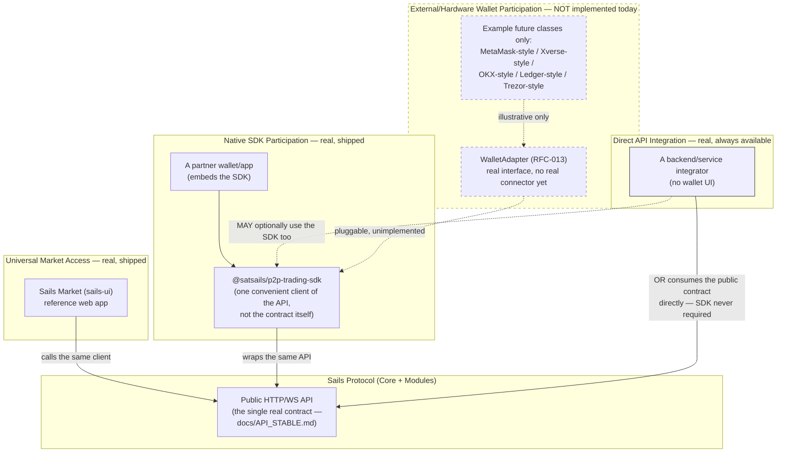
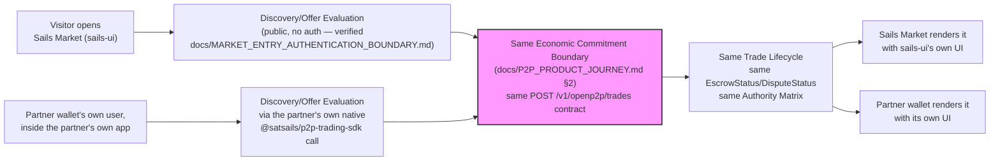
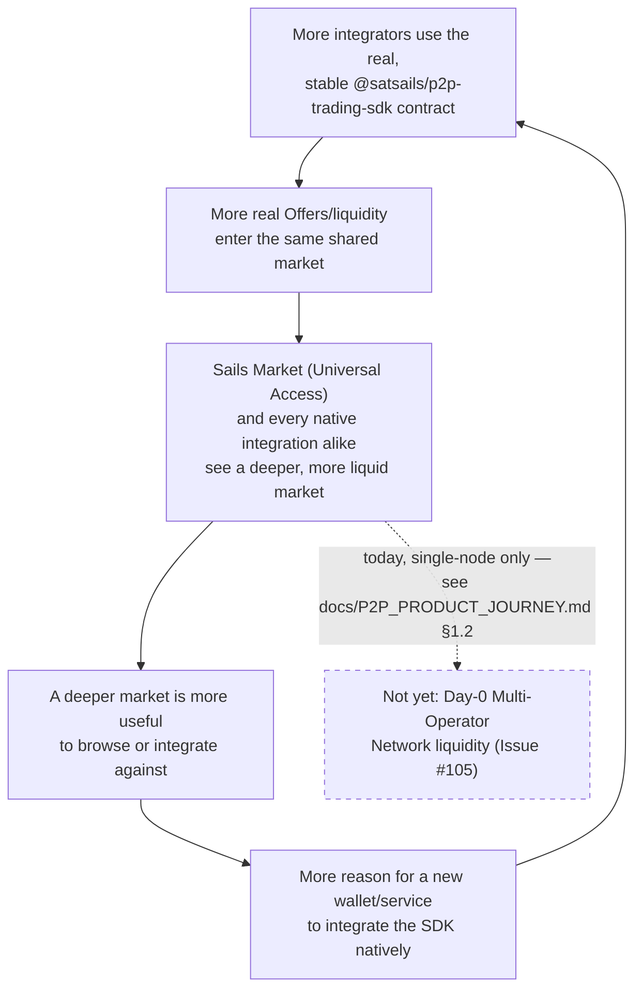
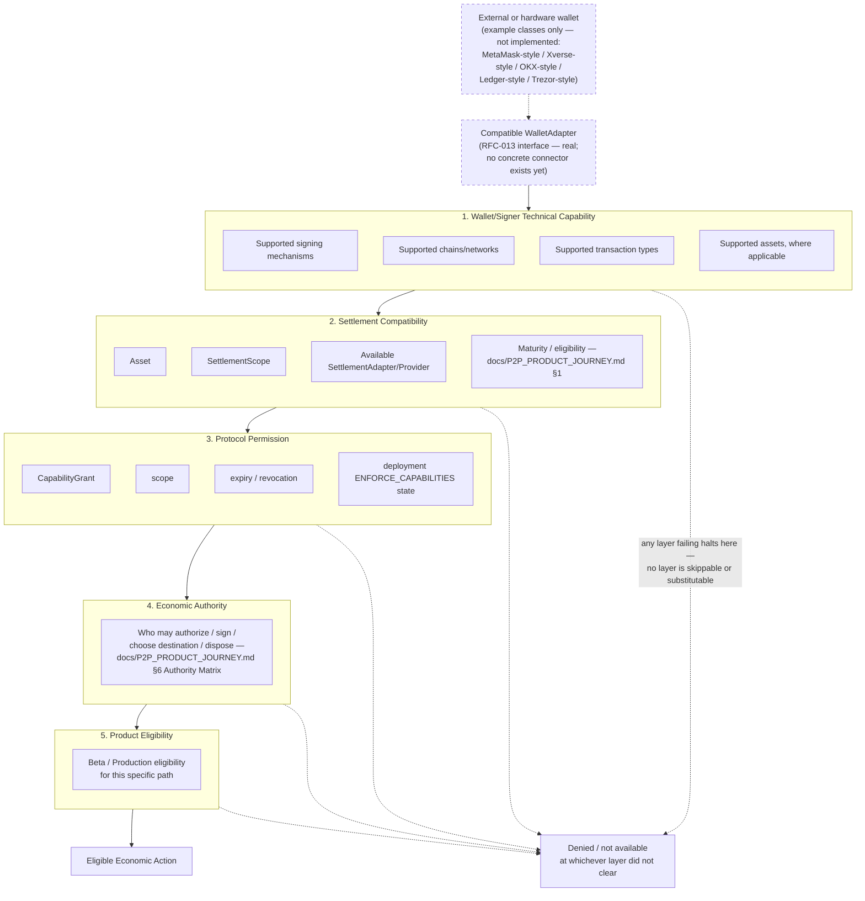

# Sails Market Distribution & Network Flywheel (`P2P-JOURNEY-GATE-R1`, 2026-09-13)

**Status:** Product/Distribution model. Institutionalizes how Sails
Market (the reference `sails-ui`) relates to native SDK integration and
to external/hardware wallet participation — as a distribution surface
over one shared protocol, not a parent the protocol depends on. **No
new protocol truth, no new authority, no wallet connector implemented,
no UI change.** Every real/not-real claim below is stated explicitly;
diagrams distinguish real, shipped mechanisms from future-compatible
possibilities.

**North star:** *One market. Many interfaces. Many wallet stacks.
Shared economic meaning.*

---

## 1. The Four Access Paths — What Is Real Today

**Corrected (`MARKET-FLYWHEEL-R2`, 2026-09-13): a fourth, distinct path
is named explicitly below** — the original three-path framing implied
every non-Sails-Market integrator embeds the SDK, which is not a real
constraint. `SDK adoption ≠ protocol membership`, and **a conforming
integrator may consume the public contract without embedding the SDK
at all.**

| Path | What it is | Real today? |
|---|---|---|
| **Sails Market (Universal Access)** | The reference `sails-ui` web app — anyone can open it, browse, and (per `docs/MARKET_ENTRY_AUTHENTICATION_BOUNDARY.md`) discover offers with zero setup | **Real** — this is the actual, shipped reference implementation |
| **Native SDK Participation** | A partner wallet/app embeds `@satsails/p2p-trading-sdk` directly into its own product, never touching `sails-ui` at all | **Real, supported, evidenced** — `SailsClient` is the same client `sails-ui` itself uses (`packages/sails-ui/src/lib/sailsClient.ts`); nothing in it is Sails-Market-specific. `docs/PRODUCT_INTERACTION_MODEL.md` §7's Wallet Integrator path |
| **Direct API Integration** | A backend/service integrator (no wallet UI) consumes the public HTTP/WS contract directly — the SDK is a convenience wrapper over that same contract, not a requirement to reach it | **Real** — `docs/PRODUCT_INTERACTION_MODEL.md` §7's own Service/Backend Integrator split already states this path needs no `WalletAdapter` at all; the same holds one layer up for the SDK itself — the public API is the actual contract (`docs/API_STABLE.md`), and the SDK is one, optional, convenient client of it, the same way `sails-ui` is |
| **External/Hardware Wallet Participation** | A visitor connects an existing wallet (software or hardware) via a compatible `WalletAdapter`, instead of the reference UI's own demo `LocalKeypairWalletAdapter` | **Not implemented today.** RFC-013's `WalletAdapter` interface is real and the extension point exists; no MetaMask/Xverse/OKX/Ledger/Trezor (or any other external/hardware) adapter exists in this codebase. These names are cited **only as example classes of a future-compatible possibility**, per this mission's own explicit instruction — not as current or planned support |

**Preserved, verified against real code:** `WalletAdapter ≠
SettlementProvider` (Issue #86 — a wallet integration never makes that
wallet a `SettlementProvider`, confirmed unchanged in
`docs/P2P_PRODUCT_JOURNEY.md` §6's Authority Matrix). `Access through
Sails Market ≠ native adoption` — opening `sails-ui` in a browser is
consuming the reference interface, not integrating the SDK; only the
second and third paths are "adoption" in the SDK/protocol-distribution
sense, and adopting the protocol (path 3) does not require adopting the
SDK (path 2). `Better integration ≠ privileged semantics` — this is not
a new rule; it restates `docs/PROJECT_CONTEXT.md` §2D item 7 ("Access
does not imply authority") and `docs/PRODUCT_INTERACTION_MODEL.md` §6's
own frozen row ("Interface depth implies authority depth: **False**"),
applied here to distribution channel specifically: a wallet with a
deep, native SDK integration gets no more protocol authority than a
visitor using Sails Market's own UI, or a backend calling the raw API
directly, to reach the identical capability through the identical
public contract.

---

## 2. Access Topology

**Corrected (`MARKET-FLYWHEEL-R2`, 2026-09-13):** the original version
of this diagram routed every non-Sails-Market integrator through the
SDK, which wrongly suggested a Backend/Service Integrator must embed
`@satsails/p2p-trading-sdk` to participate. Corrected below: a
Backend/Service Integrator reaches the same public contract directly —
the SDK is one convenient client of that contract, never the contract
itself.

**Reading this diagram:** solid lines are real, shipped call paths.
`PartnerB`'s two outgoing edges show a genuine choice, not a fallback —
going through the SDK is optional convenience, going straight to the
API is equally conforming and equally real. Dashed lines/boxes
(`Future`) are the pluggable extension point that exists structurally
(RFC-013) but has no real implementation — named here so a future
Wallet Partner Journey mission has the shape without this document
overclaiming it is built. **Preserved:** `SDK adoption ≠ protocol
membership`; a conforming integrator may consume the public contract
without embedding the SDK.

---

## 3. SDK-vs-Universal-Access Convergence

The point of this diagram: two participants who started completely
differently land in the *same* economic reality, with no interface
gaining extra authority for having a "deeper" integration.

**No privileged path exists at `C`.** Both participants hit the
identical backend contract, the identical Authority Matrix, and the
identical maturity/eligibility rules (`docs/P2P_PRODUCT_JOURNEY.md`
§1). What differs is only presentation — exactly the *"one economic
reality, multiple actor-specific experiences"* north star already
frozen in `docs/PRODUCT_INTERACTION_MODEL.md`.

---

## 4. Network Flywheel

**Framed carefully, as a product hypothesis grounded in real,
already-existing mechanisms — not a claim that adoption has already
happened.**

**What is real about this loop today:** the SDK contract itself is real
and stable (`docs/API_STABLE.md`); every integrator — Sails Market
included — draws from the same real `Offer`/liquidity data
(`docs/PRODUCT_INTERACTION_MODEL.md` §7's Wallet vs. Service/Backend
split already frozen). **What is not yet real:** actual multi-integrator
adoption, and the Day-0 Multi-Operator Network liquidity layer this loop
would need to scale past a single node — both named as open, not
claimed as achieved (consistent with `docs/P2P_PRODUCT_JOURNEY.md`
§1.2's own correction). This diagram documents the *mechanism* the
flywheel would run on, not a claim that it is already spinning.

---

## 5. Capability-Gated Wallet Participation

**Corrected (`MARKET-FLYWHEEL-R2`, 2026-09-13):** the original version
of this diagram routed straight from "wallet connected" to a single
`CapabilityDiscovery` node labeled `CapabilityGrant / Capability
Registry`, which wrongly used `CapabilityGrant` as a stand-in for
*wallet technical capability* — collapsing two genuinely independent
questions ("can this signer technically sign a BTC PSBT?" vs. "is this
signer permitted to?") into one node. Corrected below into five
explicit, non-interchangeable layers, only the last of which yields an
eligible action:

**Preserved, verified — the exact collapse this correction removes:**

> `Technical Capability ≠ Protocol Permission ≠ Economic Authority ≠
> Settlement Eligibility.`
>
> `Wallet connected ≠ all capabilities supported` — a connected signer
> may support BTC PSBT signing (Layer 1) but have no compatible
> `SettlementAdapter` for a given rail (Layer 2), independent of
> whether it holds any `CapabilityGrant` at all (Layer 3).
>
> `CapabilityGrant does not manufacture wallet/network/rail support` —
> a real, unrevoked, in-scope grant (Layer 3) is meaningless if the
> connected signer never had the technical capability (Layer 1) or the
> settlement rail was never compatible (Layer 2) in the first place;
> `RFC-005/013/014`'s Capability Registry answers *"is this actor
> permitted,"* never *"can this signer technically do this,"* and
> never *"does a compatible settlement path exist."*

`ENFORCE_CAPABILITIES` still defaults `false` in this reference
deployment (`docs/PRODUCT_INTERACTION_MODEL.md`, item 28's own
finding) — Layer 3's own "deployment enforcement state" node names this
explicitly, so no future wallet-adapter UI may assume enforcement is
universal without checking the actual per-deployment flag. This diagram
names the *shape* capability-gated participation would take across five
independent questions; it authorizes no connector, no new enforcement
default, and no collapse of any one layer into another.

---

## 6. Sails Market as Distribution Surface, Not Protocol Parent

**The relationship, stated precisely:** the Sails Protocol (Core +
modules) defines the economic reality and its contract. Sails Market
(`sails-ui`) is **one interface** consuming that contract — the
reference one, and today's only Universal-Access one — not something
the protocol is built to serve. A native SDK integrator does not need
Sails Market to exist, is not routed through it, and gains no lesser
(or greater) protocol standing for integrating "around" it rather than
"through" it. This is the same distinction `docs/PRODUCT_INTERACTION_MODEL.md`
§7 already draws between a Wallet Integrator and a Service/Backend
Integrator, generalized one level up: **Sails Market itself is a third
kind of consumer of the same public contract**, not a layer either of
the other two depends on.

---

## 7. Non-Goals (this document does not authorize)

Per `P2P-JOURNEY-GATE-R1`'s own explicit instruction: no external
wallet connector (MetaMask/Xverse/OKX/Ledger/Trezor or any other) is
implemented, planned on a timeline, or claimed supported. No passkey or
Breez Auth mechanism is implemented. No `FundingInstruction`/
`SigningRequest` runtime is implemented. No new authority role is
created. No UI is redesigned. This document names a distribution model
and its real vs. not-yet-real mechanisms; it authorizes none of the
above.

---

## Closing confirmations

No protocol, SDK, Core, or Semantic Kernel change. No wallet connector,
no passkey/Breez Auth, no `FundingInstruction`/`SigningRequest`, no new
authority, no UI change. `MetaMask`/`Xverse`/`OKX`/`Ledger`/`Trezor` are
cited exclusively as illustrative example classes of a future-compatible
possibility, never as current or committed support. This document
institutionalizes a distribution/access model built entirely from
already-real mechanisms (the shared SDK contract, RFC-013's
`WalletAdapter` interface, RFC-005/013/014's Capability Registry) plus
one explicitly-labeled, not-yet-validated product hypothesis (the
network flywheel, §4).
