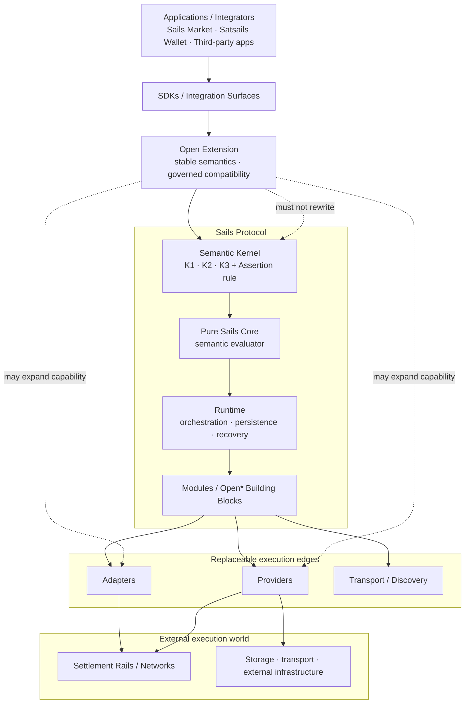
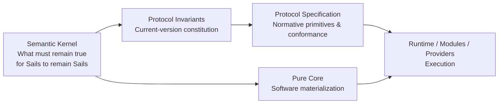
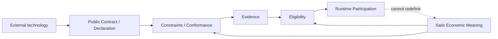
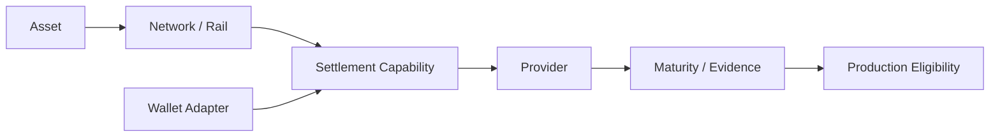
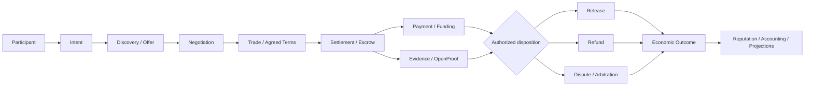
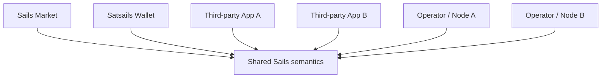
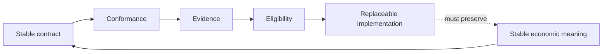

# Sails Protocol — Anatomy

> **Status:** Draft / CTO-owned consolidated anatomy map.  
> **Purpose:** Explain what composes Sails, where each part belongs, how the parts relate, and where each concept is governed.  
> **Authority rule:** This document is a map, not a replacement for its governing sources. If a summary here conflicts with a canonical source, the canonical source wins.
>
> **Constitutional reading:** **New technologies should expand capability, not rewrite semantics.**

---

## 1. Purpose & Scope

Sails Protocol is an [Economic Coordination Protocol](PROJECT_CONTEXT.md) whose V1 focus is open infrastructure for interoperable P2P financial marketplaces.

This document answers a different question from [SYSTEM_DESIGN.md](SYSTEM_DESIGN.md):

- **System Design** explains the current technical architecture and how the system operates.
- **Anatomy** explains the complete body of Sails: its semantic constitution, software organs, extension surfaces, execution edges, economic boundaries, products, and the canonical source that governs each part.

The Anatomy is intended to be the consolidated source from which explanatory material — articles, website copy, diagrams, presentations, educational material and social content — can be derived without flattening architectural distinctions.

### 1.1 Governing-source rule

Every material concept in this document links to its deeper source. Anatomy summarizes and connects; it does not silently redefine.

Primary authorities include the [Semantic Kernel](SEMANTIC_KERNEL.md), [Protocol Invariants](PROTOCOL_INVARIANTS.md), [Protocol Specification](PROTOCOL_SPECIFICATION.md), [Core Architecture](CORE_ARCHITECTURE.md), accepted [ADRs](adr/), accepted [RFCs](rfcs/), and current implementation/evidence sources such as [BACKLOG.md](BACKLOG.md).

---

## 2. Architectural Thesis

Sails is organized around a simple architectural discipline:

> **Stable semantics, replaceable edges. Simple at center, open at edges.**

The [Semantic Kernel](SEMANTIC_KERNEL.md) defines what must remain true for something to remain Sails. The [Pure Core](CORE_ARCHITECTURE.md) materializes those semantics as deterministic evaluation. Runtime, Modules, Providers and Adapters surround that stable center without acquiring permission to redefine its economic meaning.

A useful adoption expression from the repository is:

> **Keep your wallet stack; plug into Sails.**

The broader extension principle is documented by [External Extensibility Precedent Consolidation](EXTERNAL_EXTENSIBILITY_PRECEDENT_CONSOLIDATION.md):

> **Open extension. Stable semantics. Governed compatibility.**

### 2.1 Whole-body map



**Governing sources:** [SEMANTIC_KERNEL.md](SEMANTIC_KERNEL.md) · [CORE_ARCHITECTURE.md](CORE_ARCHITECTURE.md) · [SYSTEM_DESIGN.md](SYSTEM_DESIGN.md) · [EXTERNAL_EXTENSIBILITY_PRECEDENT_CONSOLIDATION.md](EXTERNAL_EXTENSIBILITY_PRECEDENT_CONSOLIDATION.md)

---

## 3. Protocol Constitution

### 3.1 Semantic Kernel

The [Semantic Kernel](SEMANTIC_KERNEL.md) is semantic identity, not a package. It contains exactly three frozen identity properties plus the supporting Assertion rule:

- **K1 — Valid Transition:** economic state changes only through a satisfied and economically valid condition under the interaction's bound ruleset.
- **K2 — Attributed Discretion:** discretionary judgment must be attributable to a specific actor and bound to the exact interaction and transition.
- **K3 — Semantic Settlement Independence:** execution may translate an authorized outcome into a mechanism, but may not alter its economic meaning.
- **Assertion rule:** an assertion is an attributable, interaction-bound statement; it is never truth by itself.

### 3.2 Constitution and invariants

The current-version constitutional rules are broader than semantic identity. They are governed by [PROTOCOL_INVARIANTS.md](PROTOCOL_INVARIANTS.md) and the normative [PROTOCOL_SPECIFICATION.md](PROTOCOL_SPECIFICATION.md).



**Governing sources:** [SEMANTIC_KERNEL.md](SEMANTIC_KERNEL.md) · [PROTOCOL_INVARIANTS.md](PROTOCOL_INVARIANTS.md) · [PROTOCOL_SPECIFICATION.md](PROTOCOL_SPECIFICATION.md) · [CORE_ARCHITECTURE.md](CORE_ARCHITECTURE.md)

---

## 4. Integration Freedom — Where Protocol Meaning Begins

Integration freedom ends where protocol meaning begins.

An application, wallet, provider, adapter, transport, AI system, operator or external marketplace may contribute capability. None acquires economic authority merely by being integrated.

This boundary is developed in [External Extensibility Precedent Consolidation](EXTERNAL_EXTENSIBILITY_PRECEDENT_CONSOLIDATION.md), [Adaptive Execution / Capability Routing](ADAPTIVE_EXECUTION_CAPABILITY_ROUTING.md), and the authority ADRs.



The governed extension lifecycle is:

**External Capability → Public Contract → Capability Declaration → Constraints → Conformance → Evidence → Eligibility → Runtime Participation**

**Governing sources:** [EXTERNAL_EXTENSIBILITY_PRECEDENT_CONSOLIDATION.md](EXTERNAL_EXTENSIBILITY_PRECEDENT_CONSOLIDATION.md) · [ADAPTIVE_EXECUTION_CAPABILITY_ROUTING.md](ADAPTIVE_EXECUTION_CAPABILITY_ROUTING.md)

---

## 5. Open* Building Blocks

The current reference organization includes:

- **OpenP2P** — P2P trade coordination and lifecycle.
- **OpenSettlement** — settlement and escrow coordination across eligible mechanisms.
- **OpenIdentity** — identity-related protocol responsibilities.
- **OpenReputation** — portable economic reputation/fact interpretation responsibilities.
- **OpenProof** — evidence/proof responsibilities.
- **OpenLiquidity** — liquidity-related coordination.
- **OpenAgents** — agent/delegation-related capability surfaces.
- **OpenFinance** — roadmap-scoped future module where explicitly applicable.

These Modules are an organization of domain responsibilities. They are **not** the Semantic Kernel and are not individually protocol identity.

**Governing sources:** [SYSTEM_DESIGN.md](SYSTEM_DESIGN.md) · [SEMANTIC_KERNEL.md](SEMANTIC_KERNEL.md) · [ROADMAP.md](ROADMAP.md)

### 5.1 Open Extension is not another Open* module

**Open Extension** is the cross-cutting extensibility principle under which new technologies can participate without rewriting Core meaning. It is not being classified here as an eighth/ninth peer module.

**Governing source:** [EXTERNAL_EXTENSIBILITY_PRECEDENT_CONSOLIDATION.md](EXTERNAL_EXTENSIBILITY_PRECEDENT_CONSOLIDATION.md)

---

## 6. Primitives

Protocol primitives belong to the technology-independent contract and are governed normatively by [PROTOCOL_SPECIFICATION.md](PROTOCOL_SPECIFICATION.md). Anatomy does not redefine their list or semantics.

The important anatomical distinction is:

**Primitive ≠ Module ≠ Provider ≠ Product.**

A primitive is protocol meaning. A Module organizes domain responsibility. A Provider executes or supplies an external mechanism. A Product exposes or consumes protocol behavior.

**Governing source:** [PROTOCOL_SPECIFICATION.md](PROTOCOL_SPECIFICATION.md)

---

## 7. Capabilities & Authority

Capability describes what an actor/component can participate in; authority determines whether a particular action is authorized.

Mandatory separations include:

**Authentication ≠ Authorization**  
**Identity ≠ Authority**  
**Execution Authority ≠ Economic Disposition Authority**  
**Recommendation ≠ Authority**

Temporal capability authority is governed by [ADR-004](adr/ADR-004-capability-grant-temporal-authority.md). Economic disposition after rulings/appeals is governed by [ADR-005](adr/ADR-005-ruling-generation-economic-disposition-authority.md). Broader authority discovery is recorded in [AUTHORITY_MODEL_DISCOVERY.md](AUTHORITY_MODEL_DISCOVERY.md).

---

## 8. SDKs & Integration Surface

The first concrete developer product is the **Sails P2P Trading SDK**. SDKs expose integration surfaces; they do not own protocol semantics.

The current developer path and contract are documented in [SDK_GUIDE.md](SDK_GUIDE.md), [API_STABLE.md](API_STABLE.md), [API_REFERENCE.md](API_REFERENCE.md), and [SDK Family Release Governance](SDK_FAMILY_RELEASE_GOVERNANCE.md).

**SDK convenience ≠ protocol truth.**

---

## 9. Adapters

Adapters translate between Sails-facing contracts and external implementation stacks. Wallet adapters are a key example.

**WalletAdapter ≠ SettlementProvider ≠ External Wallet Connector.**

A wallet SDK/package existing in the ecosystem does not itself establish Sails support, maturity or production eligibility.

**Governing sources:** [SYSTEM_DESIGN.md](SYSTEM_DESIGN.md) · [ROADMAP.md](ROADMAP.md) · [EXTERNAL_EXTENSIBILITY_PRECEDENT_CONSOLIDATION.md](EXTERNAL_EXTENSIBILITY_PRECEDENT_CONSOLIDATION.md)

---

## 10. Rails

An Asset, Network/Rail, Wallet Adapter, Settlement Capability, Provider and Production Eligibility are distinct dimensions.



A shared SDK or implementation does not collapse distinct rails into one capability or one maturity state.

**Governing sources:** [ADR-002](adr/ADR-002-asset-settlement-rail-adapter-provider-architecture.md) · [Asset / Settlement Rail Architecture Discovery](ASSET_SETTLEMENT_RAIL_ARCHITECTURE_DISCOVERY_2026-09-12.md) · [ROADMAP.md](ROADMAP.md)

---

## 11. Providers & Nodes

Providers are replaceable execution mechanisms. A provider may execute or report; it may not redefine the authorized economic outcome.

A Sails node/runtime instance is an operator surface, not protocol identity. Multiple conformant operators may participate without making one operator the owner of shared semantics.

**Provider implementation ≠ Provider maturity ≠ Production eligibility.**

**Governing sources:** [CORE_ARCHITECTURE.md](CORE_ARCHITECTURE.md) · [SYSTEM_DESIGN.md](SYSTEM_DESIGN.md) · [ADR-001](adr/ADR-001-day0-multi-operator-network.md) · [Day-0 Multi-Operator Network Architecture Discovery](DAY0_MULTI_OPERATOR_NETWORK_ARCHITECTURE_DISCOVERY.md)

---

## 12. Identity, Proof & Reputation

Identity establishes attributable participants and interoperability context; it does not automatically grant authority.

OpenProof handles evidence/proof concerns under explicit authorization and provenance boundaries. Evidence bytes are not truth, storage is not protocol authority, and availability is not integrity.

Reputation is downstream interpretation of attributable economic facts/evidence, not an alternate source of protocol truth.

**Governing sources:** [SYSTEM_DESIGN.md](SYSTEM_DESIGN.md) · [AUTHORITY_MODEL_DISCOVERY.md](AUTHORITY_MODEL_DISCOVERY.md) · [CRYPTOGRAPHIC_MODEL.md](CRYPTOGRAPHIC_MODEL.md) · [TRUST_BOUNDARY.md](TRUST_BOUNDARY.md)

---

## 13. Discovery & Transport

Discovery answers how participants/markets find relevant objects or peers. Transport answers how messages move.

Neither transport nor discovery owns economic state.

**Economic state ≠ transport state.**  
**Connected ≠ Responsive ≠ Synchronized ≠ Economically Current.**

Pears/HyperDHT or another transport may be used by a reference implementation without becoming protocol identity.

**Governing sources:** [SYSTEM_DESIGN.md](SYSTEM_DESIGN.md) · [ARCHITECTURE.md](ARCHITECTURE.md) · [DAY0_MULTI_OPERATOR_NETWORK_ARCHITECTURE_DISCOVERY.md](DAY0_MULTI_OPERATOR_NETWORK_ARCHITECTURE_DISCOVERY.md)

---

## 14. Trade Lifecycle & State Machines

A useful end-to-end economic journey is:



State transition semantics are governed, not inferred from message arrival order or transport state.

**Governing sources:** [STATE_LIFECYCLE_DISCOVERY.md](STATE_LIFECYCLE_DISCOVERY.md) · [TRANSACTION_WALKTHROUGH.md](TRANSACTION_WALKTHROUGH.md) · [PROTOCOL_SPECIFICATION.md](PROTOCOL_SPECIFICATION.md)

---

## 15. Public & Private Markets

Sails can support shared/open markets and restricted/private market contexts without changing economic semantics.

**Market admission policy ≠ protocol truth.**  
**Private market ≠ different economic semantics.**  
**Private visibility ≠ public identity requirement.**

**Governing sources:** [ADR-001](adr/ADR-001-day0-multi-operator-network.md) · [DAY0_MULTI_OPERATOR_NETWORK_ARCHITECTURE_DISCOVERY.md](DAY0_MULTI_OPERATOR_NETWORK_ARCHITECTURE_DISCOVERY.md)

---

## 16. Cross-App Coordination

Sails is designed so multiple applications can coordinate around shared protocol semantics without one reference application becoming a mandatory gateway.



Reference application control does not imply protocol control.

**Governing sources:** [README](../README.md) · [PROJECT_CONTEXT.md](PROJECT_CONTEXT.md) · [SYSTEM_DESIGN.md](SYSTEM_DESIGN.md) · [ADR-001](adr/ADR-001-day0-multi-operator-network.md)

---

## 17. Trust & Failure Boundaries

Sails treats failure semantics as part of correctness.

Examples of required distinctions include:

**UNKNOWN ≠ FAILED**  
**UNAVAILABLE ≠ INVALID**  
**Missing evidence bytes ≠ evidence never existed**  
**State snapshot ≠ complete economic truth**

Trust boundaries and security assumptions are governed by [TRUST_BOUNDARY.md](TRUST_BOUNDARY.md), [SECURITY_MODEL.md](SECURITY_MODEL.md), [THREAT_MODEL.md](THREAT_MODEL.md), and specialized evidence/recovery documents.

---

## 18. Economic Safety

Economic safety requires authority, state, persistence and external side effects to preserve the authorized meaning across concurrency, retries, crashes and recovery.

A retry does not create new authority. A provider does not acquire authority because it can execute. A later mechanism does not get to reinterpret an earlier authorized outcome.

**Governing sources:** [CORE_ARCHITECTURE.md](CORE_ARCHITECTURE.md) · [ADR-004](adr/ADR-004-capability-grant-temporal-authority.md) · [ADR-005](adr/ADR-005-ruling-generation-economic-disposition-authority.md) · [SECURITY_MODEL.md](SECURITY_MODEL.md)

---

## 19. Conformance & Replaceability

Replaceability is safe only when semantic compatibility is governed.



**Compatible code ≠ trusted code.**  
**Protocol-representable ≠ Product/Deployment-eligible.**  
**Implementation existence ≠ production evidence.**

**Governing sources:** [EXTERNAL_EXTENSIBILITY_PRECEDENT_CONSOLIDATION.md](EXTERNAL_EXTENSIBILITY_PRECEDENT_CONSOLIDATION.md) · [ENGINEERING_GOVERNANCE.md](ENGINEERING_GOVERNANCE.md) · [TEST_HARNESS_RELIABILITY.md](TEST_HARNESS_RELIABILITY.md)

---

## 20. Protocol vs Product

Sails Protocol, Sails Market and Satsails Wallet are different things.

- **Sails Protocol** owns shared economic coordination semantics.
- **Sails P2P Trading SDK** is the first concrete developer product/integration surface.
- **Sails Market** is a first-party/reference market application.
- **Satsails Wallet** is a first-party/reference integrator and validation environment.
- **Third-party applications** may consume Sails without surrendering product ownership or becoming subordinate to a first-party UI.

**No interface or reference implementation owns protocol semantics.**

**Governing sources:** [README](../README.md) · [PROJECT_CONTEXT.md](PROJECT_CONTEXT.md) · [SYSTEM_DESIGN.md](SYSTEM_DESIGN.md)

---

## 21. End-to-End Examples

Concrete developer and transaction examples should remain derived from verified public surfaces rather than duplicated here.

Start with:

- [Getting Started](GETTING_STARTED.md)
- [Simple Wallet example](../examples/simple-wallet/)
- [SDK Guide](SDK_GUIDE.md)
- [Transaction Walkthrough](TRANSACTION_WALKTHROUGH.md)
- [API Reference](API_REFERENCE.md)

Future Anatomy revisions may add short explanatory examples only when they can remain traceable to these verified paths.

---

## 22. Architecture Diagrams

This document intentionally embeds explanatory Mermaid diagrams next to the concepts they explain. Rendered system-level architecture remains available through the repository's architecture-diagram surface.

Every Anatomy diagram is a **reading aid**, never independent protocol truth. Its governing sources are listed immediately below it.

See also [SYSTEM_DESIGN.md](SYSTEM_DESIGN.md) and [ARCHITECTURE.md](ARCHITECTURE.md).

---

## 23. Implementation Status Matrix

Anatomical existence and implementation maturity are separate claims.

| Anatomical area | Meaning/source status | Implementation/maturity source |
|---|---|---|
| Semantic Kernel | Frozen semantic identity | [SEMANTIC_KERNEL.md](SEMANTIC_KERNEL.md) |
| Pure Core | Frozen architecture; implementation surface exists | [CORE_ARCHITECTURE.md](CORE_ARCHITECTURE.md), [CORE_IMPLEMENTATION_ARCHITECTURE.md](CORE_IMPLEMENTATION_ARCHITECTURE.md) |
| Runtime | Current reference execution layer | [SYSTEM_DESIGN.md](SYSTEM_DESIGN.md), [BACKLOG.md](BACKLOG.md) |
| Open* Modules | Mixed current/roadmap maturity | [SYSTEM_DESIGN.md](SYSTEM_DESIGN.md), [ROADMAP.md](ROADMAP.md), [BACKLOG.md](BACKLOG.md) |
| SDK / API | Published/developer-facing surfaces with explicit release governance | [SDK_GUIDE.md](SDK_GUIDE.md), [API_STABLE.md](API_STABLE.md), [SDK_RELEASE.md](SDK_RELEASE.md) |
| Adapters / Providers | Per-capability maturity; never infer eligibility from existence | [ROADMAP.md](ROADMAP.md), [BACKLOG.md](BACKLOG.md) |
| Multi-operator network | Architecture defined; Day-0 evidence gated | [ADR-001](adr/ADR-001-day0-multi-operator-network.md), [BACKLOG.md](BACKLOG.md) |
| Production-open | **Not yet production-open** | [ROADMAP.md](ROADMAP.md), [BACKLOG.md](BACKLOG.md) |

This table is orientation. Current operational truth belongs to the live backlog/issues/evidence, not to a static Anatomy snapshot.

---

## 24. ADR / Evidence Map

| Question | Governing source |
|---|---|
| What must remain true for Sails to remain Sails? | [Semantic Kernel](SEMANTIC_KERNEL.md) |
| What software architecture materializes the Kernel? | [Core Architecture](CORE_ARCHITECTURE.md) |
| What must a conformant implementation respect? | [Protocol Specification](PROTOCOL_SPECIFICATION.md) |
| What are the current constitutional invariants? | [Protocol Invariants](PROTOCOL_INVARIANTS.md) |
| How do multiple operators share a Sails network? | [ADR-001](adr/ADR-001-day0-multi-operator-network.md) |
| How are asset, rail, adapter and provider separated? | [ADR-002](adr/ADR-002-asset-settlement-rail-adapter-provider-architecture.md) |
| How is arbitration scoped to rails? | [ADR-003](adr/ADR-003-rail-scoped-arbitration-policy.md) |
| How does CapabilityGrant temporal authority work? | [ADR-004](adr/ADR-004-capability-grant-temporal-authority.md) |
| How does ruling-generation economic disposition authority work? | [ADR-005](adr/ADR-005-ruling-generation-economic-disposition-authority.md) |
| How may external capabilities enter without rewriting semantics? | [External Extensibility](EXTERNAL_EXTENSIBILITY_PRECEDENT_CONSOLIDATION.md) |
| How does adaptive execution/capability routing fit? | [Adaptive Execution](ADAPTIVE_EXECUTION_CAPABILITY_ROUTING.md) |
| Where is current unresolved implementation reality? | [Backlog](BACKLOG.md) |
| What is the current system-level technical entry point? | [System Design](SYSTEM_DESIGN.md) |

---

## Closing Mental Model

```text
Sails identity
    Semantic Kernel
          ↓
Sails meaning in software
    Pure Core
          ↓
Sails execution
    Runtime + Modules
          ↓
Replaceable capability
    Adapters + Providers + Transport
          ↓
External mechanisms
    Rails + Networks + Infrastructure
          ↓
User-facing realization
    SDKs + Sails Market + Satsails Wallet + Third-party applications

Across every layer:
Open Extension may expand capability.
It may not rewrite economic meaning.
```

> **New technologies should expand capability, not rewrite semantics.**
