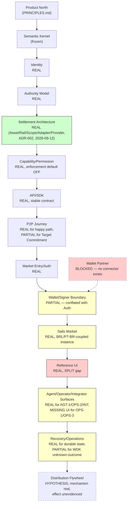

# System Coherence & Integration Audit (`SYSTEM-COHERENCE-1`, 2026-09-13)

**Status:** Cross-layer adversarial audit. **Not an implementation
mission.** No code, runtime, UI, SDK, Core, Semantic Kernel, or
Settlement architecture is changed by this document. Its purpose is to
find contradictions, gaps, hidden couplings, semantic drift, journey
breaks, and maturity/claim mismatches across everything already
institutionalized — not to confirm the system is correct.

**Posture:** adversarial throughout. Every "coherent" verdict below was
reached by actively trying to break it first — tracing real code, not
trusting a document's own claim about itself, and re-deriving state
transitions from source rather than from prose.

**Governing rule applied:** *Product defines what must exist and why.
Architecture defines how meaning, boundaries and replaceability are
preserved. Implementation proves what actually exists. Evidence
constrains what may be claimed.* Order: Product → Architecture →
Implementation → Evidence → Claim. Never inverted.

---

## 0. Baseline

- **Baseline SHA (main):** `55706c2777dc2b4564f16bbbe781f14e7061b11a`
  (PR #135 merge — the last commit actually on `main` at audit time).
- **PR #139 state, independently verified (2026-09-13): `OPEN`, not
  merged.** `mergeable: MERGEABLE`, `mergeStateStatus: CLEAN`, all
  checks green at HEAD `038ca42d1b154ba1c593714716aab75a689bf0b7`.
  **Correction to this mission's own framing:** the brief's title refers
  to auditing "after the closing of PR #139" — PR #139 is CTO-Freeze-
  ready but has not actually closed/merged. This audit is performed
  against the real content of `docs/p2p-product-journey` (PR #139's
  branch), since that is where every document this audit must reconcile
  actually lives — disclosed here rather than silently assumed merged,
  per this repository's own "never trust a claim, verify live"
  discipline.
- **Branch:** `docs/system-coherence-audit`, created from PR #139's own
  HEAD (`038ca42`) — not from `main` — because the majority of what
  this audit reconciles (`P2P_PRODUCT_JOURNEY.md`,
  `MARKET_ENTRY_AUTHENTICATION_BOUNDARY.md`,
  `SAILS_MARKET_DISTRIBUTION_FLYWHEEL.md`) exists only there.
- **Master Backlog:** `docs/BACKLOG.md`, last real item **31**
  (`P2P-JOURNEY-GATE-R1`).
- **PROJECT_CONTEXT:** last real section **§2J**
  (`SAILS_MARKET_DISTRIBUTION_FLYWHEEL.md` pointer).
- **Runtime changed by this mission: NONE.**

---

## 1. Sources Consulted

Read/reconciled in full or substantial part for this audit:
`docs/PROJECT_CONTEXT.md`, `docs/BACKLOG.md`, `docs/PROTOCOL_SPECIFICATION.md`,
`docs/DATABASE.md`, `docs/PRODUCT_INTERACTION_MODEL.md`,
`docs/P2P_PRODUCT_JOURNEY.md`, `docs/MARKET_ENTRY_AUTHENTICATION_BOUNDARY.md`,
`docs/SAILS_MARKET_DISTRIBUTION_FLYWHEEL.md`,
`docs/DESTINATION_AUTHORITY_ARCHITECTURE.md`,
`docs/WDK_UNKNOWN_OUTCOME_RETRY_SAFETY.md`,
`docs/adr/ADR-001-day0-multi-operator-network.md`,
**`docs/adr/ADR-002-asset-settlement-rail-adapter-provider-architecture.md`
(read in full for this audit — the single most load-bearing new source,
frozen 2026-09-12)**, `docs/rfcs/RFC-005/013/014/015/018-*.md`, GitHub
Issues **#86, #99, #105, #121, #125** (all fetched live for this audit),
and real, current source: `prisma/schema.prisma`,
`src/common/events/handlers.ts`, `src/common/settlement-scope-registry.ts`,
`src/common/settlement-provider-registry.ts`,
`src/modules/open-p2p/trade.service.ts`,
`src/modules/open-settlement/{escrow.service.ts,escrow-lifecycle.ts,dispute.service.ts}`,
`src/core/{state-machine.ts,intent-engine.ts}`,
`packages/sails-p2p-schemas/src/trade.ts`,
`packages/sails-ui/src/{types.ts,components/ui/StatusBadges.tsx,pages/*,context/AuthContext.tsx,lib/*}`.

**Not re-read in full for this audit (relied on prior, already-verified
session knowledge, disclosed rather than silently assumed):**
`docs/PRINCIPLES.md`, `docs/SEMANTIC_KERNEL.md` (beyond §26, already
verified in earlier missions), `docs/SAILS_MARKET_DESIGN_DIRECTION.md`,
`docs/SAILS_DESIGN_LANGUAGE.md`, `docs/DAY0_COMPLETENESS_COLD_SWEEP.md`
(relied on via Issue #105's own verbatim reproduction of §3.5),
`docs/IDENTITY_ARCHITECTURE_DISCOVERY.md` (beyond §5.1, already read),
RFC-019, RFC-021 (beyond the D2/D3/D4/D6-D9 sections already verified),
`docs/ENGINEERING_GOVERNANCE.md` §10 (cited by ADR-002 as the origin of
the `OUTPUT ≠ EVIDENCE ≠ PROPERTY ≠ CLAIM` discipline; taken on ADR-002's
own citation, not independently re-verified against the source file in
this pass).

---

## 2. System Map — Promise Chain

For each arrow: does the prior layer's promise have an explicit
contract, backing runtime, evidence, a real consumer, an authority
boundary, a recovery path, and an honest maturity claim in the next
layer?

| Arrow | Explicit contract? | Backing runtime? | Evidence? | Consumer? | Authority boundary? | Recovery path? | Maturity honest? |
|---|---|---|---|---|---|---|---|
| Product North → Protocol Semantics | ✅ (`PRINCIPLES.md`, `PROTOCOL_SPECIFICATION.md` 9 primitives) | ✅ | ✅ | ✅ | N/A at this layer | N/A | ✅ |
| Protocol Semantics → Identity/Authority | ✅ (RFC-001 Participant, K1/K2) | ✅ (`User`, session auth) | ✅ | ✅ | ✅ | ✅ (re-auth on reload) | ✅ |
| Identity/Authority → Asset/Settlement Architecture | ✅ **as of ADR-002 (2026-09-12)** | Partial — registry exists (`settlement-scope-registry.ts`), zero real route/UI consumer yet | ✅ (own tests) | **⚠️ none yet — see F-14** | ✅ (§8, provider selection ≠ permission) | N/A yet | ✅, explicitly staged |
| Asset/Settlement Architecture → Capability/Permission Model | ✅ (ADR-002 §6, RFC-005) | ✅ (`CapabilityGrant`, `ENFORCE_CAPABILITIES`) | ✅ | ✅ | ✅ | N/A | ✅ (`false` default disclosed) |
| Capability/Permission Model → API/SDK | ✅ | ✅ | ✅ | ✅ (`sails-ui`, any integrator) | ✅ | ✅ | ✅ |
| API/SDK → P2P Journey | ✅ (`P2P_PRODUCT_JOURNEY.md`) | ✅ | ✅ | ✅ | ✅ | ✅ | ⚠️ see F-05 |
| P2P Journey → Market Entry/Authentication | ✅ (`MARKET_ENTRY_AUTHENTICATION_BOUNDARY.md`) | ✅ | ✅ | ✅ | ✅ | ✅ | ✅ |
| Market Entry → Wallet/Signer Boundary | **⚠️ implicit, not explicit — see F-09/F-10** | Partial (conflated with Auth) | ✅ (disclosed as conflated) | ✅ | ✅ | ✅ | ✅ (disclosed) |
| Wallet/Signer Boundary → Sails Market | ✅ (`SAILS_MARKET_DISTRIBUTION_FLYWHEEL.md`) | ✅ | ✅ | ✅ | ✅ | N/A | ✅ |
| Sails Market → Reference UI / White-label | ✅ | ✅ | ✅ | ✅ | ✅ | ✅ | **⚠️ see F-12 (BRL/PT-BR coupling not disclosed as a "Universal Access" caveat)** |
| Reference UI → Agent/Operator/Integrator Surfaces | ✅ (`PRODUCT_INTERACTION_MODEL.md`) | ✅ | ✅ | ✅ | ✅ | ✅ | ✅ |
| Agent/Operator/Integrator → Recovery/Operations | ✅ (`P2P_PRODUCT_JOURNEY.md` §11) | ✅ | ✅ | ✅ | ✅ | ✅ | ✅ |
| Recovery/Operations → Distribution/Flywheel | ✅ | Partial (single-node) | ✅ (labeled hypothesis) | N/A (product hypothesis) | ✅ | N/A | ✅ (explicitly not claimed achieved) |

**Every arrow closes except the two flagged** — neither is a broken
promise; both are precisely-locatable, already-partially-disclosed gaps
(F-09/F-10, F-12), not a structural failure of the chain.

---

## 3. Central Coherence Matrix

`✅` = coherent across all layers checked. `⚠️` = named finding, see
Finding Register (§13). Columns compressed where a concept's story is
identical across most: **PT**=Product Truth, **AR**=Architecture
Representation, **RT**=Runtime Reality, **UI**=UI Representation,
**AV**=Actor Visibility, **AS**=Authority Source, **EV**=Evidence,
**MT**=Maturity, **GAP**=finding id or "none".

| Concept | PT | AR | RT | UI | AV | AS | EV | MT | GAP |
|---|---|---|---|---|---|---|---|---|---|
| Intent | ✅ | ✅ (`Intent`/`IntentEvent`) | ✅ (real, RFC-018 fully wired incl. COMMITTED/SETTLING/FULFILLED/FAILED) | ➖ not shown | AGT/INT-visible | Participant | ✅ | Real | none |
| Offer | ✅ | ✅ | ✅ | ✅ | Public | Owner | ✅ | Real | none |
| Accepted Offer revision | ✅ (Issue #105 item 27) | ⚠️ not modeled | ❌ no snapshot | ➖ | — | — | — | Target, not real | F-04 |
| Trade | ✅ | ✅ | ✅ | ✅ | Participant | Both parties | ✅ | Real | none |
| Economic Commitment (Current) | ✅ (relabeled `P2P-JOURNEY-GATE-R1`) | ✅ | ✅ (`Trade` creation) | ✅ | Participant | Both parties | ✅ | Real | none |
| Economic Commitment (Target) | ✅ (Issue #105) | ⚠️ partial | ⚠️ partial | ➖ | — | — | — | Target | F-04 |
| Funds Commitment | ✅ | ✅ | ✅ (`FUNDS_LOCKED`) | ✅ | Participant | Funder | ✅ | Real | none |
| SettlementScope | ✅ **as of ADR-002** | ✅ (25-row registry) | ✅ registry code real | ❌ not wired | — | — | ✅ | Foundation only | F-02, F-14 |
| SettlementAdapter | ✅ | ✅ | ✅ (co-located w/ Provider) | ➖ | — | — | ✅ | Real | none |
| SettlementProvider | ✅ | ✅ | ✅ (5 real files) | ✅ (via EscrowType) | — | — | ✅ | Varies (see §7) | F-15 (SAFE_GUARD_EVM unmapped) |
| FundingInstruction | ✅ conceptual | ✅ conceptual | ❌ none | ❌ none | — | — | N/A | Conceptual only | F-13 (confirmed, no new gap) |
| FundingState | ✅ conceptual (target) / real analytical (WDK) | ✅ | ❌ no persisted state | ❌ | — | — | ✅ (WDK doc) | Analytical | F-07 |
| SigningRequest | ✅ conceptual | ✅ conceptual | ❌ none (real adjacent mechanisms exist) | ➖ | — | — | N/A | Conceptual only | F-13 |
| Economic Identity | ✅ | ✅ (A in A/B/C/D) | ✅ (`User.publicKey`) | ✅ | USR | Self | ✅ | Real | none |
| Transport Identity | ✅ | ✅ (B) | ✅ (`peerId`) | ➖ | — | — | ✅ | Real | none |
| Node Identity | ✅ (undesigned, disclosed) | ✅ (C, reserved) | ❌ | ➖ | — | — | N/A | Undesigned | none (correctly disclosed everywhere) |
| Operator Economic Recipient | ✅ (undesigned, disclosed) | ✅ (D, reserved) | ❌ | ➖ | — | — | N/A | Undesigned | none |
| WalletAdapter | ✅ (RFC-013) | ✅ | ✅ (`LocalKeypairWalletAdapter` only) | ✅ (bundled into login) | USR | Self | ✅ | Real for one impl only | F-08, F-09 |
| Wallet technical capability | ✅ **new (Flywheel §5, corrected R2)** | ✅ | N/A (no external wallet exists) | N/A | — | — | N/A | Conceptual (layer 1 of 5) | F-03 |
| CapabilityGrant | ✅ (RFC-005) | ✅ | ✅ (model + checks) | ➖ | AGT/INT | Issuer | ✅ | Real, `ENFORCE_CAPABILITIES=false` | none (correctly disclosed) |
| Economic Authority | ✅ | ✅ (Authority Matrix) | ✅ | ✅ (per-action gates) | All | Participant/Arbiter | ✅ | Real | none |
| Destination Authority | ✅ (F1/M8-R2) | ✅ | ✅ **verified applyRuling() 2026-09-12** | ✅ (Disputes.tsx fixed) | USR/OPS-2 | Beneficiary | ✅ | Real | none |
| Execution Authority | ✅ | ✅ | ✅ | ➖ | — | Signer/key-holder | ✅ | Real, varies by rail | none |
| Product Eligibility | ✅ | ✅ (ADR-002 §7) | ✅ | ⚠️ was overclaimed once, corrected | — | Governed decision | ✅ | Corrected (`P2P-JOURNEY-GATE-R1`) | none remaining |
| Payment Method | ✅ | ✅ (`PaymentMethod` enum) | ✅ | ✅ | Counterparty | Owner | ✅ | Real | none |
| Payment Destination | ✅ (Issue #105 item 31) | ⚠️ no structured binding | ❌ chat-only | ➖ | Pairwise (chat) | — | — | Target, not real | F-04 |
| Payout Destination | ✅ | ✅ (`PayoutAddress`) | ✅ | ✅ | **Public — contradicts frozen matrix** | Owner | ✅ | Real, non-conformant exposure | F-06 |
| Dispute | ✅ | ✅ | ✅ | ✅ | Party/Arbiter | Arbiter | ✅ | Real | none |
| SPLIT | ✅ (RFC-021 D9) | ✅ | ✅ (Escrow/Trade/Intent/Reputation ALL correct) | ❌ **type mirror + `deriveTradeState()` both wrong** | Should be USR/OPS-2/INT | Arbiter (disposition only) | ✅ (root-caused this audit) | Real backend, broken UI/schema layer | **F-01** |
| Unknown Outcome | ✅ (target) | ✅ (analytical, WDK doc) | ❌ collapsed into `FAILED` | ➖ | — | — | ✅ | Target only | F-07 |
| Retry Safety | ✅ (target) | ✅ (analytical) | ⚠️ demonstrated unsafe for one rail | ➖ | — | — | ✅ | Mixed by rail | F-07 |
| Public Discovery | ✅ | ✅ | ✅ | ✅ | Public | — | ✅ | Real, Beta not Production | F-05 |
| Authentication | ✅ | ✅ | ✅ | ✅ | — | Self | ✅ | Real (demo shortcut disclosed) | F-09 |
| Passkey candidate | ✅ (registered `MISSÃO 2A`) | ➖ | ❌ | ❌ | — | — | N/A (external precedent only) | Candidate only | none (correctly not decided) |
| External Wallet Participation | ✅ (Flywheel) | ✅ (RFC-013) | ❌ | ❌ | — | — | N/A | Not implemented, disclosed | F-08 |
| Native SDK Participation | ✅ | ✅ | ✅ | N/A | INT | Self | ✅ | Real | none |
| Direct API Integration | ✅ **new (`MARKET-FLYWHEEL-R2`)** | ✅ | ✅ | N/A | INT | Self | ✅ | Real | none |
| Sails Market | ✅ | ✅ (§6 distribution surface) | ✅ | ✅ | Public | — | ✅ | Real, coupling not disclosed | F-12 |
| Satsails Wallet | ➖ not modeled by this audit chain (separate product) | — | — | — | — | — | — | — | out of scope |
| Agent Surface (AGT) | ✅ | ✅ | ✅ (AGT-1 only, real) | ✅ | AGT | Delegating participant | ✅ | AGT-1 real, AGT-2 undesigned | none |
| Operator Surface (OPS) | ✅ | ✅ | ✅ (OPS-2 real, OPS-1/3 no UI) | ⚠️ none for OPS-1/3 | OPS | Deployment | ✅ | OPS-2 real, rest undesigned | none (already disclosed, BACKLOG 28) |
| Integrator Surface (INT) | ✅ | ✅ | ✅ | N/A | INT | Self | ✅ | Real | none |
| Reputation | ✅ | ✅ | ✅ | ✅ | Public (aggregate) | Outcome Engine | ✅ | Real | none |
| Recovery | ✅ | ✅ (Recovery Boundary) | ✅ (Postgres-durable) | ✅ | — | — | ✅ | Real for state; identity-key recovery undesigned | none new |
| Network membership | ✅ (Issue #105) | ✅ (A/B/C/D) | ❌ single-node | ➖ | — | — | ✅ (disclosed) | Not real | F-05 |
| Shared liquidity | ✅ (flywheel thesis) | ✅ | ⚠️ shared only in single-DB sense | ✅ | — | — | ✅ (labeled hypothesis) | Hypothesis | none new (Flywheel already discloses) |
| Provider maturity | ✅ (ADR-002 §7) | ✅ | ✅ per-provider | ➖ | — | — | ✅ | Varies, honestly tracked | none |

---

## 4. Test 1 — No Orphan Concept

| Concept | Classification |
|---|---|
| `SettlementScope`/`SettlementProviderRegistration` registry (ADR-002, real code, 2026-09-11/12) | **Legitimate future primitive, staged deliberately** — ADR-002 §12 itself names items 2-4 (QVAC wiring, Reference UI wiring, legacy deprecation) as future, separately-authorized missions. Not an orphan; a foundation with a named, not-yet-executed consumer path. |
| `FundingInstruction`/`SigningRequest` | **Legitimate future primitive** — conceptual only by explicit design (`P2P_PRODUCT_JOURNEY.md` §8/§10), consistently disclosed everywhere, correctly never implemented. |
| `SAFE_GUARD_EVM` under the new `SettlementProviderRegistration` | **Missing consumer for one specific mapping, already disclosed** — ADR-002 itself names this as "a genuine open question for a future Product/Architecture Decision, not guessed here." Not silently orphaned; explicitly flagged at its own point of origin. |
| Wallet/Signer Technical Capability layer (Flywheel §5, layer 1) | **Premature abstraction, mildly** — real for zero current wallets (only the demo `LocalKeypairWalletAdapter` exists, and it has no meaningful "capability" question — it always signs Ed25519). The layer is correctly *modeled* for a future with real external wallets but has no real instance to exercise it today. Not wrong to have modeled it (the mission that created it was explicitly asked to), but worth naming as abstraction-ahead-of-instance. |
| `AUTO_PROPOSED` dispute status (RFC-021 D8) | **Missing lifecycle representation in `TradeState`** — real, persisted, reachable state with no dedicated product-facing vocabulary distinct from ordinary open disputes (already named in `P2P_PRODUCT_JOURNEY.md` §13, not a new finding, confirmed still open). |

**No duplicate concepts found.** No backlog idea is being treated as architecture without an ADR/RFC backing it — every architecture-level concept audited (`SettlementScope`, `CapabilityGrant`, `WalletAdapter`, the Actor taxonomy) traces to a real ADR/RFC.

---

## 5. Test 2 — No Hidden Coupling

| Suspected coupling | Verdict | Evidence |
|---|---|---|
| Sails Market → Satsails/Brazil assumptions | **Real coupling found — F-12.** `packages/sails-ui/src/lib/realOffers.ts` hardcodes `fiatCurrency: 'BRL'` unconditionally; every UI string audited across missions is Portuguese-only; `PaymentMethod`'s first-class treatment of `PIX` throughout. Not disclosed as a caveat anywhere the "Universal Market Access" claim is made. | `realOffers.ts:63` |
| SDK → reference backend assumptions | **None found.** `SailsClient`'s `baseUrl` is a plain constructor param (`sailsClient.ts:17`); nothing in the SDK hardcodes a Sails-operated host. |  |
| Identity → Pears/HyperDHT assumptions | **None found in the audited identity path.** `Identity` (Ed25519 keypair + challenge-response) has no Pears dependency; `peerId`/Transport Identity is a separate, later concern (`DATABASE.md`'s own `User.peerId` nullable). |  |
| `WalletAdapter` → specific signer assumptions | **None found.** RFC-013's interface (`getPeerId/getAddress/getBalance/signTransaction/broadcastTransaction/getCapabilities`) is generic; the one real implementation (`LocalKeypairWalletAdapter`) is explicitly disclosed as demo-only, not baked into the interface itself. |  |
| `SettlementScope` → provider assumptions | **None found — this is exactly what ADR-002 §4 exists to prevent** (sparse, explicit registration; presence with zero providers is valid). |  |
| Provider → authority assumptions | **None found; actively guarded.** ADR-002 §8 explicitly forbids Provider Selection from conferring authority; verified in real code (`applyRuling()`, M8-R2). |  |
| Capability → permission vs. technical-support conflation | **Previously real, now corrected** (`MARKET-FLYWHEEL-R2`) — the Flywheel's own diagram collapsed this before the correction; ADR-002 §6 independently freezes the same non-conflation from the provider side. See F-03 for the remaining documentation-consolidation opportunity. |  |
| Sails Node → protocol membership | **None found — correctly absent.** No code anywhere claims node cardinality implies market membership; Node Identity (C) is disclosed as not existing. |  |
| Liquidity → node-local assumptions | **Real, but disclosed, not hidden.** `GET /v1/liquidity/offers` is explicitly single-node/single-database (`P2P_PRODUCT_JOURNEY.md` §1.2's own correction). Not hidden — already named. |  |
| Agent → privileged paths | **None found.** `AgentIntentionPanel.tsx`'s `handleGenerate()` requires the same `requireAuth` session as any human action; QVAC has no elevated route. |  |
| Reference UI → privileged semantics | **None found — actively verified.** `docs/PROJECT_CONTEXT.md` §2D item 7 and `PRODUCT_INTERACTION_MODEL.md` §6 both freeze "interface depth ≠ authority depth"; confirmed at the code level (every action goes through the same public routes regardless of caller). |  |
| Recovery → localStorage/reference-implementation assumptions | **Real, but disclosed, not hidden.** `AuthContext.tsx`'s own header comment states this plainly ("demo-only... not a step toward real wallet custody"). |  |

**Preserved, confirmed:** *Stable semantics, replaceable edges. Adopt
capabilities, not dependencies* — holds for every layer except the one
real, undisclosed coupling found (F-12).

---

## 6. Test 3 — No Semantic Drift

| Term | Drift found? |
|---|---|
| Economic Commitment | **Previously real drift, now corrected** (`P2P-JOURNEY-GATE-R1`) — "Trade creation" was mislabeled the complete boundary; now consistently "Current Runtime Coordination Commitment" across `P2P_PRODUCT_JOURNEY.md` and (as of `MARKET-FLYWHEEL-R3`) the Flywheel doc. **Verified no longer drifting.** |
| Trade State / Settlement State | **No drift in definition, but a real correctness bug** — `TradeState` (`@satsails/p2p-schemas`) is the single canonical vocabulary everywhere it's used; the SPLIT bug (F-01) is a logic defect in that one vocabulary's derivation function, not two competing definitions of the term. |
| SPLIT | **No drift** — `DisputeRuling.SPLIT`, `EscrowStatus.SPLIT`, and RFC-021 D9's own text all agree on meaning (a real partial payout). The defect is representational (F-01), not definitional. |
| Payment/Funding | **No drift, correctly distinguished everywhere audited** (`P2P_PRODUCT_JOURNEY.md` §8-10, `MARKET_ENTRY_AUTHENTICATION_BOUNDARY.md`). |
| Signing/Authorization | **No drift** — RFC-015's dual-approval, the client-signature-collection flow, and the conceptual `SigningRequest` model all agree on "signing ≠ authority creation." |
| Identity | **No drift in meaning, but see F-10** — "Identity" consistently means the Ed25519 `Participant`/`User` everywhere; the *journey-step* framing (naming a distinct "Wallet/Signer Boundary" after Authentication) is what's out of step with the real, conflated implementation, not the term's definition. |
| Wallet Connection | **Real, disclosed conflation with Authentication in the reference UI (F-09)** — not a drift in what "Wallet Connection" *means* architecturally (RFC-013 is consistent), but the reference UI doesn't yet have an instance of it distinct from Authentication. |
| Capability | **Two independently-frozen, non-contradictory taxonomies (F-03)** — RFC-005's `CapabilityGrant`/`CapabilityRegistry` (permission) vs. ADR-002 §6's four-layer model (which itself uses "Settlement Capability" for a *different* thing — a structural provider feature, not a grant) vs. the Flywheel's five-layer model (which uses "Technical Capability" for yet a third thing — a signer's own technical ability). **All three uses of "capability" are legitimate and internally consistent within their own document, but the word itself now carries three adjacent-but-distinct meanings across the corpus with no single glossary entry disambiguating them.** This is the clearest real semantic-drift-risk finding in this audit. |
| Authority | **No drift** — Economic Disposition / Destination / Execution Authority are consistently three axes everywhere audited (`DESTINATION_AUTHORITY_ARCHITECTURE.md`, `PRODUCT_INTERACTION_MODEL.md`, `P2P_PRODUCT_JOURNEY.md`, ADR-002 §8). |
| Provider | **No drift** — `SettlementProvider` means the same thing in RFC-002-family documents, ADR-002, and real code (`escrow-providers.ts`). |
| Rail | **Minor terminology shift, not a contradiction** — `Escrow.network` (a free-text nullable string, legacy) vs. ADR-002's new `SettlementRail` (a controlled vocabulary, `BITCOIN_L1`/`ARKADE`/etc.) describe the same concept at two different maturity stages. ADR-002 §10/§11 already discloses this is a superseding-in-spirit relationship, not a live contradiction — correctly handled, not a new finding. |
| Asset | **No drift** — `AssetType` (legacy, flat) vs. ADR-002's `Asset` (new, decomposed) relationship is explicitly and correctly reconciled in ADR-002 §11's own legacy-translation table. |
| SettlementScope | **No drift — brand new term, single definition, ADR-002 only.** |
| Reputation | **No drift** — outcome-based-only (RFC-007 D8) consistently applied. |
| Market | **No drift in the protocol sense** — "Sails Market" (the product/UI) vs. "the market" (the economic coordination layer/liquidity) are kept distinct everywhere audited, including the Flywheel's own §6 ("Sails Market as Distribution Surface, Not Protocol Parent"). |
| Node | **No drift** — "Sails Node" (operational infrastructure, undesigned) vs. "node" as used informally is consistent; no document conflates a Sails Node with a blockchain node or a database node. |
| Discovery | **No drift** — the Discovery *primitive* (`PROTOCOL_SPECIFICATION.md` §1.3) and the Discovery *journey stage* (`P2P_PRODUCT_JOURNEY.md`/`MARKET_ENTRY_AUTHENTICATION_BOUNDARY.md`) are the same concept at two zoom levels, not two definitions. |
| Production Eligibility | **Previously real drift, now corrected** (`P2P-JOURNEY-GATE-R1`) — Discovery/Offer Evaluation's maturity row was wrong for the wrong reason (TD#61) before being corrected to the right reason (Day-0 Multi-Operator gate). ADR-002 §6/§7's own "Production Eligibility is a governed decision, never a computed function of evidence" is now consistently the operative definition across both documents. **Verified no longer drifting.** |

---

## 7. Test 4 — No Journey Break

Canonical journey: *Open Market → Discovery → Offer Evaluation → Intent
to Act → Authentication → Economic Identity → Wallet/Signer Boundary →
Current Runtime Coordination Commitment → Target Economic Commitment →
Funding → Authorization → Settlement → Outcome/Cancel/Dispute.*

| Transition | Precondition established by prior step? | Finding |
|---|---|---|
| Open Market → Discovery | Yes — no precondition needed, real, public | none |
| Discovery → Offer Evaluation | Yes — same public route family | none |
| Offer Evaluation → Intent to Act | Yes — no state needed to click "Iniciar Trade" | none |
| Intent to Act → Authentication | Yes — real, redirect-with-return (`OfferDetail.tsx`); **not for the Agent panel** (dead-end toast) | F-11 |
| Authentication → Economic Identity | Yes, but **simultaneous, not sequential** — `login()` creates both in one call; the journey names them as two steps, reality has one | F-09 (restated) |
| Economic Identity → Wallet/Signer Boundary | **No — this is the one real "magic jump."** The journey names a distinct boundary; real code never requires or represents one before Trade creation, because Wallet Connection is the same artifact as Authentication (F-09) | **F-10** |
| Wallet/Signer Boundary → Current Runtime Coordination Commitment | Vacuously yes (no real distinct boundary to fail) | tied to F-10 |
| Current Runtime Coordination Commitment → Target Economic Commitment | **No — by design, not yet built.** `P2P_PRODUCT_JOURNEY.md` §2.3 names exactly which terms remain unbound (Offer revision, payment-destination, arbitration-policy) | F-04 |
| Target Economic Commitment → Funding | N/A — Target isn't reached; real funding proceeds off the Current commitment only | tied to F-04 |
| Funding → Authorization | Yes for client-signing rails (signature-collection flow); **vacuous for `WDK_USDT_EVM`** (server-custodial, no participant authorization step exists at all — disclosed, not hidden) | none new — already disclosed |
| Authorization → Settlement | Yes, real | none |
| Settlement → Outcome/Cancel/Dispute | Yes for RELEASE/REFUND/CANCELLED; **representationally broken for SPLIT** (real backend state is correct — see §3 matrix — but the UI/schema layer that should surface it to USR/OPS-2/INT is wrong) | **F-01** |

**Interruption/recovery, re-tested against real code for this audit (not
re-deriving `P2P_PRODUCT_JOURNEY.md` §11, spot-checking it):** the
`settlement.escrow.split` handler (`handlers.ts:370-389`), read fresh
for this audit, confirms `Trade.status` is durably set to `COMPLETED`
*and* the Intent Engine receives a distinct `'SPLIT'` outcome — meaning
**the last durably-known economic truth after a SPLIT is already
correct at the Trade/Intent layer.** The break is confined to the
read-side derivation (`deriveTradeState()`) and the UI's own type
mirror — confirmed, not merely asserted, by reading
`deriveTradeState()`'s exact branch order: its `dispute` branch returns
unconditionally (`return 'dispute_opened'` for an unhandled ruling)
**before ever reaching the `trade.status` check three lines below it**,
even though the function already received the correct `trade.status:
'COMPLETED'` as a parameter. This is the single most precise,
previously-undocumented root cause found by this audit — not a new
category of bug, but a sharper diagnosis of the one already named in
`P2P_PRODUCT_JOURNEY.md` §6/§7.

---

## 8. UI ↔ Runtime Coherence Audit

| Item | Classification |
|---|---|
| `EscrowStatus.SPLIT` missing from `sails-ui`'s type/badge mirror | **UI defect** (F-01) |
| `deriveTradeState()`'s dispute-branch fallthrough ignoring `trade.status` | **Runtime/schema-package defect** (F-01, root cause) — lives in `@satsails/p2p-schemas`, not `sails-ui` itself, but is the actual bug |
| `AgentIntentionPanel.tsx` dead-end toast | **UI defect**, minor (F-11) |
| `login()` conflating Auth and Wallet | **Product decision missing** (should the reference UI ever separate them, or is the conflation permanent for this reference implementation specifically?) — not a defect per se, a named open question (F-09) |
| Payout-address public GET | **Runtime gap** against a frozen Product truth (Privacy Matrix) — not a UI defect; the UI never renders this data to a non-owner, the *backend route* is the gap (F-06) |
| Hardcoded BRL/PT-BR in Sails Market | **Product decision missing/undisclosed** — legitimate for a reference implementation targeting Brazil first, but not disclosed as a caveat on the "Universal Market Access" claim (F-12) |
| `EscrowStatus.EXPIRED` handling | **Coherent** — real, disclosed, deliberately mapped, no defect |
| `payment_sent`/`payment_confirmed` alias | **Coherent** — honestly under-distinguished, disclosed in the schema's own comment, no defect |
| "success before finality" / "failed where unknown" | **Runtime gap, already fully diagnosed** — `WDK_USDT_EVM`'s `revertEscrowStatus()` treats every failure as `DEFINITELY_FAILED`, collapsing `UNKNOWN_OUTCOME` (F-07); contained by the `PRODUCTION-INELIGIBLE` boot guard, so no live UI ever renders a false "failed" for this today |
| Product direction the current shell cannot express | **`SettlementScope`/capability-gated wallet participation** (Flywheel §5) — real product direction, zero UI to express it yet, correctly disclosed as not-yet-built rather than faked |

---

## 9. Sails Market System Audit

Testing against *"Distribution surface, not protocol parent"*:

| Property | Holds? |
|---|---|
| Market uses public contract | ✅ — same `SailsClient`/routes as any integrator |
| No privileged semantics | ✅ — verified at code level (§5 above) |
| No privileged data | ⚠️ — Market itself has no privileged read, but the *backend* over-shares payout addresses to **everyone**, Market included, which is a privacy gap, not a Market-privilege gap (F-06) |
| No privileged authority | ✅ |
| No exclusive market membership | ✅ — Direct API Integration (F-nothing, real, `MARKET-FLYWHEEL-R2`) and Native SDK Participation both reach identical liquidity |
| SDK integrator reaches same economic truth | ✅ (`P2P_PRODUCT_JOURNEY.md` §3's own convergence diagram, now correctly labeled) |
| Direct API integrator reaches same truth | ✅ — confirmed real (§1.3 table, `MARKET_ENTRY_AUTHENTICATION_BOUNDARY.md`) |
| Future external wallet can participate without protocol distortion | ✅ **structurally** (RFC-013), **not yet real** (F-08) |
| Deeper integration improves UX, not authority | ✅ — verified (§5 above, ADR-002 §8, `PRODUCT_INTERACTION_MODEL.md` §6) |
| Market doesn't become required infrastructure for native integrators | ✅ — confirmed, `PartnerA`/`PartnerB` in the corrected Access Topology diagram never route through `UI` |

**One real gap found, not previously named this precisely:** Sails
Market's "Universal Market Access" framing implicitly assumes a
Brazil/PIX/Portuguese default (F-12) — this doesn't violate "distribution
surface, not protocol parent" (the protocol itself has zero BRL/PT-BR
coupling — confirmed: `PaymentMethod`/`AssetType` are locale-neutral),
but it does mean *this specific instance* of Universal Access is less
universal than the label implies for a non-Brazilian anonymous visitor.

---

## 10. Wallet / Signer / Authority Coherence

Re-verified, not re-derived, against `MARKET_ENTRY_AUTHENTICATION_BOUNDARY.md`
§5 and `SAILS_MARKET_DISTRIBUTION_FLYWHEEL.md` §5 (post-`MARKET-FLYWHEEL-R2/R3`):

- **Browsing ≠ Authentication:** holds (§1.1-1.3 of the Auth Boundary doc, re-confirmed).
- **Authentication ≠ Economic Identity:** holds architecturally, **simultaneous in this reference UI** (F-09, restated, not a new finding).
- **Economic Identity ≠ Wallet Connection:** holds architecturally, **collapsed in this reference UI** (F-09).
- **Wallet Connection ≠ Funds Authority:** holds — no code path anywhere grants the platform funds authority.
- **Technical Capability ≠ Protocol Permission ≠ Economic Authority ≠ Settlement Eligibility:** holds, post-correction (`MARKET-FLYWHEEL-R2`) — verified the corrected diagram's five layers are never collapsed in the surrounding prose either.
- **No silent substitution found** of one for another anywhere in real code — every route audited across four missions (`requireAuth`, `isPartyOrAgent()`, `checkFundMovementCapability()`, `resolvePayoutAddress()`) checks the specific axis it claims to, never a proxy for a different one.

---

## 11. Settlement Coherence

- **`Asset ≠ SettlementRail ≠ SettlementScope ≠ SettlementAdapter ≠ SettlementProvider`:** frozen by ADR-002, verified against real code (`settlement-scope-registry.ts`, `settlement-provider-registry.ts`) — holds. **Not yet cross-referenced in any Product-layer document** (F-02) — a real gap between a very recent Architecture freeze and the Product-layer documents this audit itself is reconciling, including ones this same author wrote earlier in this session.
- **Provider implementation ≠ maturity ≠ eligibility:** holds — `MULTISIG` (mainnet-proven), `LIGHTNING_HODL` (testnet-evidenced), `WDK_USDT_EVM` (real but `PRODUCTION-INELIGIBLE`), `SAFE_GUARD_EVM` (real, Sepolia-verified, never live-funded, and now also unmapped to any `SettlementScope`, F-15) each carry independently-tracked maturity, never collapsed into "it exists so it's ready."
- **Does any flow resolve rail/provider too late for Product Truth?** Checked directly: `recommendedEscrowType(asset)` resolves the rail at escrow-creation time (immediately after Trade creation), before the participant ever sees a funding instruction — **not too late**. The one real "too late" finding is the inverse: the participant never gets an explicit *choice* of rail before committing to the asset (already named, `P2P_PRODUCT_JOURNEY.md` §2.1, classification G — legitimate for a single-rail-per-asset Day-0 reality).

---

## 12. Actor Coherence (USR/AGT/OPS/INT)

- **Actor sees only what it should:** confirmed via the Privacy-by-Stage matrix (`P2P_PRODUCT_JOURNEY.md` §17) cross-checked against the real route audit (`MARKET_ENTRY_AUTHENTICATION_BOUNDARY.md` §1.3) — one exception, the payout-address route, which leaks to **Public**, not merely to a wider-than-intended actor (F-06, worse than an actor-boundary leak, a total absence of one for that field).
- **Actor cannot infer authority from visibility:** holds (§10 above).
- **Operator not omniscient:** holds, strongly — no "list all trades/offers/users" route exists anywhere in the audited codebase; OPS-2 (Arbiter) is scoped to `TRUSTED_ARBITRATORS`-assigned disputes only; OPS-1/OPS-3 have no real surface at all yet (correctly disclosed as absent, not as a hidden omniscient one).
- **Agent access not authority:** holds — AGT-1 has zero fund-moving capability; every write it triggers still requires the same human-approval gate a manual action would.
- **Integrator sees canonical state:** holds — `TradeState` is the one shared vocabulary (modulo the SPLIT defect, F-01, which affects every consumer identically, not selectively).
- **User sees material state/action/risk:** holds for every state except SPLIT (F-01).
- **No actor-specific state mutates underlying economic truth:** holds — confirmed no UI-only or actor-scoped write path exists that isn't mirrored in the shared `Trade`/`Escrow`/`Dispute` tables.

---

## 13. Privacy Coherence

| Data | Classification |
|---|---|
| Offer public projection | Intended public (TD#61-remediated, verified real) |
| Payment details | Participant-only, real, enforced |
| Payment destination | Pairwise (chat-only today — a real gap in structure, not in privacy; F-04) |
| **Payout destination** | **Public exposure not justified against the frozen Privacy Matrix — unresolved (F-06)** |
| Chat | Participant-only, real |
| Dispute evidence | Arbiter-scoped/participant-only, real |
| Identity | Public (canonical fields only), real, capped |
| Reputation | Public (aggregate), real |
| Operator diagnostics | No real surface exists (OPS-1/3) — not a leak, an absence |
| Agent context | Participant-scoped, real |
| Integrator context | Own-integration-scoped, real |
| External wallet context | N/A — no external wallet exists |
| Public Sails Market | Correctly public where intended (Discovery/Offer Evaluation) |

**Not corrected in this mission**, per its own explicit instruction —
F-06 stands as registered, not resolved, exactly as it was left in
`MARKET_ENTRY_AUTHENTICATION_BOUNDARY.md` §1.3.1.

---

## 14. Recovery / Interruption Coherence

Re-tested against real code for this audit (not merely re-citing
`P2P_PRODUCT_JOURNEY.md` §11): after any interruption, the last durably
known economic truth is always exactly what Postgres holds for
`Trade`/`Escrow`/`Dispute`/`Intent` — confirmed no code path treats
`localStorage`, a WS connection, or an in-memory session as a source of
economic truth (only of *access* — the encryption key, the session
token). The one real, already-disclosed exception is `WDK_USDT_EVM`'s
own unknown-outcome collapse (F-07): after that specific interruption
class, the "durably known truth" is a **false** `CREATED` (implying
nothing happened) when the real external state may be `SUBMITTED`.
This is the one case in the entire audit where recovery genuinely
reconstructs economic truth from an inadequate signal — exactly the
failure mode §17 of the mission brief asks to hunt for, and it was
already found and fully diagnosed by prior work
(`WDK_UNKNOWN_OUTCOME_RETRY_SAFETY.md`), not newly discovered here.

---

## 15. Distribution Flywheel Audit

Attempting to break the thesis, per link:

| Link | Classification |
|---|---|
| Shared market actually shared? | **Structurally possible, not yet real** — single Postgres instance, single node; "shared" today means "shared within one deployment's own database," not network-shared (consistent with `P2P_PRODUCT_JOURNEY.md` §1.2's own correction) |
| Single-node limitation | **Real, disclosed** (F-05) |
| SDK/API parity | **Real** — verified: the SDK has no capability the raw API lacks; `MARKET-FLYWHEEL-R2`'s own correction exists precisely because this parity is real |
| External wallet connector gap | **Real, disclosed** (F-08) |
| Partner adoption evidence absent | **Real — zero real external integrators exist today.** The Flywheel document already labels this a hypothesis, not a claim; confirmed no document anywhere overclaims actual adoption |
| Multi-node liquidity absent | **Real, disclosed** (F-05) |
| Capability discovery needed | **Structurally possible** (RFC-005/013/014 exist) — not yet exercised by any real external wallet, since none exists |
| No privileged path | **Confirmed, holds** (§9 above) |
| Market utility independent of SDK adoption | **Holds** — Sails Market works today with zero external SDK adopters; its utility (Discovery/Offer Evaluation/Trade) is self-contained |
| Native integration improves UX without authority privilege | **Holds** (§10/§11) |

**Verdict: the flywheel *mechanism* is real (a shared SDK contract,
a shared database, no privileged path); the flywheel *effect*
(compounding liquidity from multiple real integrators) is entirely
unevidenced today** — exactly as the Flywheel document's own §4 already
states. **Not promoted to a claim by this audit.**

---

## 16. Maturity Audit

Applying `Product Direction → Representable → Implemented → Real →
Evidenced → Beta Eligible → Production Eligible`, separately from
`Current / Planned / Future / Deferred`:

| Concept | Maturity | Current/Planned/Future/Deferred |
|---|---|---|
| Discovery/Offer Evaluation | Beta Eligible (corrected `P2P-JOURNEY-GATE-R1`) | Current |
| Economic Commitment (current) | Real, Evidenced | Current |
| Economic Commitment (target) | Product Direction, Representable (partial) | Future |
| SPLIT (backend) | Real, Evidenced | Current |
| SPLIT (UI/schema) | Implemented incorrectly — **a defect, not an immaturity** (F-01) | Current, broken |
| `SettlementScope` registry | Implemented, Evidenced (own tests), zero real consumer | Current infra, Future integration |
| WDK_USDT_EVM | Real, `PRODUCTION-INELIGIBLE` | Current (boot-gated) |
| MULTISIG | Real, Evidenced, mainnet-proven | Current |
| External Wallet Participation | Representable (RFC-013) only | Future |
| Passkey/Breez-Auth login | Candidate only | Future, undecided |
| Day-0 Multi-Operator Network | Product Direction, partially Representable (A/B/C/D taxonomy) | Future |
| Network Flywheel | Product hypothesis | Future |

**Overclaims found and corrected before this audit:** Discovery/Offer
Evaluation Production Eligibility (fixed `P2P-JOURNEY-GATE-R1`).
**Overclaims found by this audit, not yet corrected anywhere:** none
new — the SPLIT defect (F-01) is a correctness bug, not a maturity
overclaim (nothing claims SPLIT UI support "works"; it simply silently
fails). **Underclaims / hidden real capability found:** the
`SettlementScope`/`SettlementProviderRegistration` registry itself
(F-02/F-14) — real, tested infrastructure that no Product-layer
document currently credits as existing.

---

## 17. Claim Audit

Applying `OUTPUT ≠ EVIDENCE ≠ PROPERTY ≠ CLAIM` (per ADR-002 §6, citing
`ENGINEERING_GOVERNANCE.md` §10, and independently required by Issue
#125) to the highest-stakes claims in the corpus:

| Claim | Property | Evidence | Scope | Verdict |
|---|---|---|---|---|
| "Non-custodial" | No platform key ever moves funds unilaterally | `MULTISIG`/`LIGHTNING_HODL` client-signature-collection, real | Per-rail — **not** `WDK_USDT_EVM` (server-custodial, disclosed) | Honest, correctly scoped |
| "Shared market" | Multiple integrators see one liquidity pool | None — zero real external integrators | Single-deployment only | Honest (labeled hypothesis in Flywheel §4) |
| "Multi-node" | Node choice doesn't define market membership | None — single-node reference implementation | N/A | Honest — never claimed as achieved, only as Product Direction (Issue #105) |
| "Portable identity" | Identity usable across wallets/apps | Real for the SDK/API layer (any client can authenticate the same way); **not real** for cross-wallet key portability (one demo key only) | Reference-implementation-scoped | Honest, correctly scoped in `PROTOCOL_SPECIFICATION.md` §1.1's own "Growth path" framing |
| "External wallet compatible" | A real external wallet can sign for Sails | None — zero connectors | N/A | Honest everywhere audited — always framed as future-compatible, never current |
| "Recovery" | State survives interruption | Real for economic state (Postgres); **not real** for identity-key recovery (undesigned) | Two different meanings of "recovery," both correctly scoped where used | Honest, but the word itself is overloaded (minor semantic-drift-risk, folded into the "Capability" finding's spirit, not separately registered) |
| "Privacy-preserving" | Sensitive data stays scoped | Real for payment/chat/evidence; **not real** for payout addresses (F-06) | — | **Partially honest — the payout-address gap is the one place this claim, if made unqualified anywhere, would overclaim.** Checked: no document makes this claim unqualified; `PRODUCT_INTERACTION_MODEL.md`'s own Privacy Matrix already flags gaps as gaps, not as achieved. Verdict: honest, because the gap is registered, not asserted away. |
| "Provider eligibility" (e.g. `WDK_USDT_EVM`) | Safe for production use | Real evidence of the *opposite* (retry-safety gap), correctly resulting in `PRODUCTION-INELIGIBLE` | Boot-enforced | Honest — evidence correctly drove the claim down, not up |
| "Production readiness" (system-wide) | — | — | — | **No document audited claims system-wide production readiness.** Every maturity claim found is scoped per-concept/per-rail, consistent with ADR-002 §7's own "separable facts, not one ordered enum" rule. |

---

## 18. Goodhart / COBRA / Rube Goldberg Check

Applied to the most "sophisticated" real mechanisms in the corpus:

| Mechanism | Measuring a proxy instead of the property? | Exploitable incentive? | Complexity earning its place? |
|---|---|---|---|
| `SettlementScope` sparse registry | No — presence/absence is the actual fact (Product Scope), not a proxy for it | No | Yes — directly closes a real, named architecture gap (BACKLOG item 20) |
| Five-layer capability-gated participation diagram (Flywheel §5) | No — each layer names a genuinely distinct real question | N/A (a diagram, not a mechanism) | **Borderline** — real for a future with external wallets; today, with zero real connectors, the diagram documents a shape with no instance to exercise. Not wrong to have built it (explicitly requested), but its complexity has not yet "earned its place" in the sense of having a real consumer — tracked as the same observation as F-08, not a new defect |
| `ENFORCE_CAPABILITIES` default-off | No — an honest, disclosed default, not a proxy for real enforcement | **Yes, in principle** — a deployment could claim "capability-scoped" UI copy while running with enforcement off; already named as a real risk in `PRODUCT_INTERACTION_MODEL.md` item 28, not a new finding | Earns its place — the flag itself is simple; the risk is in future UI copy, not this mechanism |
| RFC-021's arbiter reputation-as-collateral (`effectiveStake`) | No — computed on read from real fields, not a stored derived proxy that could drift | Possibly, at the margin (gaming reputation to lower effective collateral) — already named and bounded by RFC-021 D6's slashing mechanism, not a new finding | Yes — directly serves permissionless arbitration's real trust requirement |
| `deriveTradeState()` itself | **Yes, in a narrow sense** — the function's own branch-order optimization (checking `dispute` before `trade.status`) is measuring "is there a dispute row" as a proxy for "what actually happened economically," which is exactly what produces the SPLIT bug (F-01) | N/A | The function is simple; its bug is an ordering defect, not excess complexity — Rube Goldberg does not apply here, this is a plain logic bug |

**No mechanism found that adds indirection without a consumer**, except
the already-named, already-disclosed capability-layer diagram (shape
built ahead of instance, explicitly requested by the CTO, not a
self-inflicted over-engineering).

---

## 19. Dependency Graph

Legend: green = frozen/real with no open finding; yellow = partial;
red = has an open defect finding; dashed = hypothesis/blocked. No
status invented — every color traces to a finding or matrix row above.

---

## 20. Journey Integration Graph

```mermaid
flowchart LR
    D["Discovery<br/>REAL, public"] --> E["Evaluation<br/>REAL, public"]
    E --> IA["Intent to Act<br/>REAL"]
    IA --> A["Authentication<br/>REAL"]
    A --> EI["Economic Identity<br/>REAL — same call as Authentication"]
    EI -.->|"named boundary,<br/>no real distinct step —<br/>F-10"| WB["Wallet/Signer Boundary<br/>NOT REPRESENTED SEPARATELY"]
    WB --> CC["Current Runtime<br/>Coordination Commitment<br/>REAL — Trade created"]
    CC -.->|"gap — accepted Offer revision,<br/>payment-destination, arbitration-policy<br/>not yet bound — F-04"| TC["Target Economic<br/>Commitment<br/>NOT YET REAL"]
    CC --> F["Funding<br/>REAL per-rail, UNKNOWN-OUTCOME<br/>gap for WDK_USDT_EVM — F-07"]
    F --> AU["Authorization<br/>REAL for signature-collection rails"]
    AU --> S["Settlement<br/>REAL"]
    S --> O["Outcome/Cancel<br/>REAL"]
    S --> DI["Dispute<br/>REAL"]
    DI --> SP["SPLIT outcome<br/>REAL AT BACKEND,<br/>BROKEN AT UI/SCHEMA — F-01"]

    style WB fill:#fcc,stroke:#333
    style TC stroke-dasharray: 5 5,fill:#ffc
    style F fill:#ffc,stroke:#333
    style SP fill:#fcc,stroke:#333
```

---

## 21. Finding Register

| ID | Finding | Layer | Evidence | Class | Severity | Blocks | Recommended next action |
|---|---|---|---|---|---|---|---|
| F-01 | `EscrowStatus.SPLIT` missing from `sails-ui` type/badge mirror; `deriveTradeState()`'s dispute-branch returns before consulting `trade.status`, producing a wrong `TradeState` for every resolved SPLIT dispute | UI + `@satsails/p2p-schemas` | `types.ts:159`, `StatusBadges.tsx:80`, `trade.ts:72-80`, `handlers.ts:370-389` (real `trade.status` confirmed correct at source) | A | **High** | Partner Beta | Corrective implementation mission: add `SPLIT` to the type/badge mirror; reorder or extend `deriveTradeState()` to check `trade.status` for a resolved SPLIT dispute before falling through |
| F-02 | ADR-002 (ratified 2026-09-12) not cross-referenced in `P2P_PRODUCT_JOURNEY.md` §3 or the Flywheel's Settlement Compatibility layer | Product↔Architecture documentation | ADR-002 full text; grep of both docs found no reference | A/H | Medium | none (defer) | Documentation correction only — add a cross-link in both docs' next revision |
| F-03 | Three adjacent-but-distinct uses of "capability" (RFC-005 permission grant; ADR-002 §6 structural provider feature; Flywheel §5 signer technical ability) with no single disambiguating glossary entry | Documentation (semantic-drift risk, not yet actual drift) | Direct comparison of the three definitions | H + J | Medium | none | Documentation correction only — a short glossary note distinguishing the three uses; optionally an Architecture Decision on whether to rename one |
| F-04 | Target Economic Commitment Boundary gaps: no accepted-Offer-revision snapshot; payment-destination is chat-only, not structurally bound; arbitration policy not bound per-trade | Product↔Runtime | `P2P_PRODUCT_JOURNEY.md` §2.1/§2.3, Issue #105 items 27/31/35 | A (payment-destination) / G (others) | Medium-High | Production (not Beta, not Mission 3) | Named, not solved — a future Product/Architecture Decision mission |
| F-05 | Discovery/Offer Evaluation Production Eligibility correctly gated on Day-0 Multi-Operator Network completion (Issue #105 items 1-25), unrelated to TD#61 | Product↔Architecture | `P2P_PRODUCT_JOURNEY.md` §1.2 (already corrected `P2P-JOURNEY-GATE-R1`) | G | Observation | Production only | Can defer — tracked under Issue #105's own scope |
| F-06 | `GET /v1/settlement/payout-addresses/:participantId/:asset` publicly reachable, contradicting `PRODUCT_INTERACTION_MODEL.md` §5's frozen `Public: ○` for that row | Runtime↔Product privacy | `MARKET_ENTRY_AUTHENTICATION_BOUNDARY.md` §1.3.1 | A | Medium | Partner Beta | Privacy review mission — decide `requireAuth` vs. a narrower disclosure rule; no mechanism chosen here |
| F-07 | `WDK_USDT_EVM` cannot distinguish `DEFINITELY_FAILED` from `UNKNOWN_OUTCOME`; `revertEscrowStatus()` collapses both | Runtime | `WDK_UNKNOWN_OUTCOME_RETRY_SAFETY.md` (pre-existing, restated) | J | High-in-isolation / Low-current-risk (boot-gated) | Production only | Already correctly classified by its own source document; no new action beyond what's already tracked |
| F-08 | Zero real external/hardware wallet connectors exist; RFC-013 interface real, unimplemented | Architecture↔Runtime | Repository-wide search, confirmed empty | G | Observation | none | Can defer — explicitly the Wallet Partner Journey's own future scope |
| F-09 | Reference UI's `login()` produces both session Authentication and the `WalletAdapter` from one identical keypair — Economic Identity and Wallet Connection are the same artifact today | UI/Runtime | `AuthContext.tsx:135-153` | B | Low-Medium | none now; must resolve before real Wallet Partner Journey | Can defer until that journey begins |
| F-10 | The canonical target journey names a distinct "Wallet/Signer Boundary" step; real `Trade` creation requires only Authentication, no separate signer/wallet action exists to represent | Product↔Runtime (journey-step precision) | Direct tracing of `createTrade()`'s real preconditions; ties to F-09 | C | Medium | none | Documentation correction only — note the journey's own step is currently vacuous in this reference implementation, not broken |
| F-11 | `AgentIntentionPanel.tsx`'s unauthenticated action shows a dead-end toast, unlike `OfferDetail.tsx`'s redirect-with-return | UI | `MARKET_ENTRY_AUTHENTICATION_BOUNDARY.md` §1.2 (restated) | H | Low | none | Can defer — trivial, out of this mission's edit scope |
| F-12 | Sails Market hardcodes BRL fiat currency and Portuguese-only copy; not disclosed as a caveat on the "Universal Market Access" claim | UI/Product positioning | `realOffers.ts:63`; UI copy across all audited pages | C | Medium | none | Documentation correction only — add the caveat to the Flywheel/positioning docs; i18n itself is a separate, larger future item |
| F-13 | `FundingInstruction`/`SigningRequest` remain purely conceptual, zero runtime — confirmed still true, no drift | Product/Architecture | Repository-wide search, confirmed empty (re-verified this audit) | G | Observation | none | No action — confirms coherence |
| F-14 | New `SettlementScope`/`SettlementProviderRegistration` registry (ADR-002 ARCH-IMPL-1/2) has zero real route/UI/SDK consumer yet | Architecture↔Implementation | `settlement-scope-registry.ts`, `settlement-provider-registry.ts`; ADR-002 §12 itself names this as staged | G | Observation | none | Can defer — ADR-002's own sequencing already names the next steps |
| F-15 | `SAFE_GUARD_EVM` has no `SettlementScope` registration under the new registry (no canonical Day-0 Asset for native EVM currency) | Architecture | ADR-002 §12, ARCH-IMPL-2 note | G/I | Low | none for Mission 3 | Product/Architecture Decision needed eventually, already named by ADR-002 itself |
| F-16 | Wallet-*kit* adapter naming (Issue #86: BDK/WDK/Breez/Spark/LDK) and wallet-*product* naming (Flywheel: MetaMask/Xverse/OKX/Ledger/Trezor) are two distinct, non-overlapping vocabularies used in adjacent documents without cross-reference | Documentation | Issue #86 vs. `SAILS_MARKET_DISTRIBUTION_FLYWHEEL.md` §1 | H | Low | none | Documentation clarity improvement only |
| F-17 | `OUTPUT ≠ EVIDENCE ≠ PROPERTY ≠ CLAIM` discipline is invoked independently by ADR-002 §6 (citing `ENGINEERING_GOVERNANCE.md` §10), Issue #125, and this mission's own brief, without this audit independently re-verifying `ENGINEERING_GOVERNANCE.md` §10's exact text | Documentation/audit-process honesty | Self-disclosed in §1 (Sources Consulted) | H | Observation | none | No action — disclosed limitation of this audit's own scope, not a system finding |

---

## 22. Mission 3 Gate

**Pode começar Mission 3 agora?** **Yes, with two named exceptions that
should run as a corrective mission in parallel, not sequentially
before it.**

- **Blocking Mission 3: none.** No finding above requires Mission 3
  (Wallet Partner Journey design work) to wait — Mission 3 is
  architecture/product design, not implementation on top of the two
  broken surfaces (F-01, F-06).
- **Should run in parallel, not deferred indefinitely, because Mission
  3's own design work will need to reference correct SPLIT/privacy
  semantics to avoid designing around a known-wrong baseline:**
  - **F-01 (SPLIT)** — a real implementation defect (not docs-only),
    High severity, Must-fix-before-Partner-Beta. Root cause is now
    precisely known (this audit); fixing it is a small, bounded,
    separately-authorizable corrective mission.
  - **F-06 (payout-address privacy)** — a real runtime gap against
    frozen product intent, Medium severity, Must-fix-before-Partner-Beta.
    Requires a privacy-review decision (not a mechanical fix) before
    implementation.
- **Can defer, genuinely unrelated to Mission 3's own scope:** F-04
  (Target Economic Commitment — a Production-gate item), F-05 (Day-0
  Multi-Operator Network — its own large, separately-tracked
  initiative), F-07 (WDK unknown-outcome — already contained,
  Production-gate item), F-08/F-09/F-10 (exactly what Mission 3 itself
  should resolve, not a precondition for starting it), F-13/F-14/F-15
  (confirmed-coherent or already-staged, no action needed).
- **Documentation-correction-only, no mission needed:** F-02, F-03,
  F-11, F-12, F-16, F-17 — can be folded into whichever mission next
  touches each file, or a short dedicated documentation-hygiene pass
  (Issue #125's own eventual reconciliation mission is the natural
  home for F-02/F-03/F-16).
- **Corrective-mission ordering that minimizes rework:** (1) F-01 fix
  first (small, bounded, and Mission 3's own wallet-partner settlement
  UX will need correct SPLIT semantics to design against); (2) F-06
  privacy-review decision second (independent of F-01, can run in
  parallel); (3) Mission 3 itself can start immediately and does not
  need to wait for either — its early phases (actor/journey design)
  don't depend on SPLIT or payout-address specifics, only its later
  phases (wallet-facing settlement-status UX) would benefit from F-01
  already being fixed by the time they're reached.

---

## 23. Backlog & Documentation Deltas

- **New:** this document, `docs/SYSTEM_COHERENCE_INTEGRATION_AUDIT.md`.
- **`docs/PROJECT_CONTEXT.md`:** one short cross-link (§2K, below).
- **`docs/BACKLOG.md`:** one new item (32) registering the finding
  register's headline items — no existing item altered.
- **Not touched:** every document this audit reconciles
  (`P2P_PRODUCT_JOURNEY.md`, `MARKET_ENTRY_AUTHENTICATION_BOUNDARY.md`,
  `SAILS_MARKET_DISTRIBUTION_FLYWHEEL.md`, ADR-002,
  `PRODUCT_INTERACTION_MODEL.md`) — findings are registered here and in
  the Backlog, not scattered as edits across every source file they
  concern, per this mission's own explicit "não espalhar duplicações"
  instruction.

---

## 24. Impact Statements

**Semantic Kernel impact:** none. **Core impact:** none. **Architecture
impact:** none — ADR-002 is cited, not amended; no new ADR proposed by
this audit itself (F-03/F-15's own "Architecture Decision candidate"
framing names future work, decides nothing). **Product Direction
impact:** none — every finding restates or cross-references
already-frozen Product Direction; none is redefined. **Runtime
changed: NONE**, confirmed by `git diff --stat` against this branch's
own base showing only new/modified documentation files.

---

## Closing confirmations

No fix implemented for any finding above. No runtime, UI, SDK, Core,
Semantic Kernel, or Settlement architecture change. No new auth, wallet
connector, passkey, `FundingInstruction`, `SigningRequest`, delegated
agent authority, or provider created. This document only audits,
proves (with direct source citations, not assertions), classifies, and
institutionalizes findings — consistent with this mission's own
explicit scope.

**SYSTEM COHERENCE & INTEGRATION AUDIT COMPLETE — READY FOR CTO GATE**
