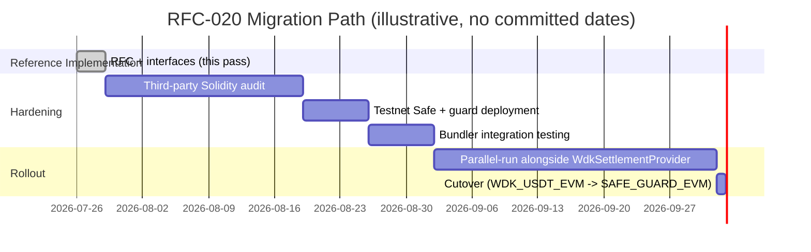

# RFC-020: Non-Custodial EVM Settlement via ERC-4337 Safe Guard + KMS Co-Signer (RFC-019 Phase 2)

## Summary

RFC-019 (Accepted, 2026-07-19) formally registered `WdkSettlementProvider`'s
single-server-seed EVM custody as a disclosed reference-implementation gap
and reserved an unscoped "Phase 2" for the real fix — a genuinely
non-custodial EVM settlement path. This RFC is that Phase 2: a Safe-based
smart-contract escrow (`SailsEscrowSafe`, an ERC-4337-compatible Transaction
Guard) whose 2-of-3 signers are the buyer, the seller, and
`SailsSignerService` — a server-side co-signer whose key lives in AWS KMS,
never in application memory or an env var. It also registers a **target**
Bitcoin architecture (Taproot + MuSig2) as a documented upgrade path for the
already-shipped P2WSH `MultisigProvider`, not a replacement of it.

This RFC delivers: a real, technically-grounded specification; real
TypeScript interfaces with real, independently-testable cryptographic logic
(ERC-4337 UserOperation hashing, MuSig2 key/nonce aggregation, KMS
DER-signature post-processing); Solidity that compiles cleanly against real,
audited, unmodified dependencies. It does **not** deliver a live AWS KMS
call, a live ERC-4337 bundler submission, a deployed/verified contract, or a
penetration test against running infrastructure — none of that
infrastructure exists in this reference implementation. Those boundaries are
disclosed explicitly throughout, the same "verified structurally, not
exercised end-to-end" pattern `LightningHodlProvider` and
`WdkSettlementProvider` already established as this repo's norm.

**Status:** Accepted. Requested directly by the project owner ("Fase 5") as
the real engineering follow-through the Implementation Freeze
(`docs/PROJECT_CONTEXT.md`, 2026-07-19) named as still-open work, not new
scope. Bypasses the Discussion window (`GOVERNANCE.md` §5), the same
precedent RFC-007/RFC-015 through RFC-019 already used for owner-directed
RFCs.

**Classification:** Core RFC (`GOVERNANCE.md` §6A) — changes the
custody/trust model of Settlement, the exact category §6A names via its own
founding example (RFC-019).

## Motivation

RFC-019's own words: "the same key that can lock funds can also move them
anywhere." That gap is real, current, and — per RFC-019's Reference
Implementation Plan — was deliberately left as unscoped, unstarted work
until a dedicated engineering pass could address it on its own merits. This
RFC is that pass. A third-party wallet integrator or auditor evaluating
Sails for production value-at-risk use needs a real answer to "who can move
escrowed funds, and under what conditions" — not just a label on the
reference implementation that says the answer is currently "the server,
unilaterally."

## Alternatives Considered

- **A from-scratch ERC-4337 `IAccount` with custom signature-threshold
  logic.** Rejected. This would mean Sails's own unaudited code performing
  real ECDSA-threshold verification for funds in flight — exactly the class
  of custom cryptography this session's engineering discipline avoids when
  an audited primitive already exists. Safe's `checkSignatures()`/
  `checkNSignatures()` (`Safe.sol`) is exactly that audited primitive.
- **Reimplement Safe's multisig logic instead of depending on
  `@safe-global/safe-contracts`.** Rejected for the same reason — Safe is
  the most audited smart-contract wallet in the EVM ecosystem; depending on
  it unmodified is safer than any from-scratch reimplementation this repo
  could produce.
- **A standalone `IAccount` implementing ERC-4337 directly (no Safe).**
  Considered. Rejected: it would still need real signature-threshold logic
  somewhere, and using Safe's `Safe4337Module` (Safe's own, real ERC-4337
  compatibility package) gets ERC-4337 support "for free" on top of an
  already-audited multisig, rather than building a second one.
- **The standalone `musig2` npm package for the Bitcoin Taproot section.**
  Rejected: unmaintained since 2022, single unknown maintainer.
  `@scure/btc-signer`'s `musig2.js` (paulmillr/noble ecosystem, actively
  maintained, already a real dependency of `@sails/sdk`) is the audited
  alternative — the same "prefer noble/scure over an unaudited package"
  precedent this repo already used for `MultisigProvider`/`LightningHodlProvider`.
- **Build the Bitcoin Taproot path as a real, wired-in replacement for
  `MultisigProvider` in this same pass.** Rejected: `MultisigProvider`'s
  P2WSH 2-of-3 escrow is real, shipped, and tested
  (`tests/multisigProvider.test.ts`). Taproot/MuSig2 is a genuine
  improvement (cheaper, more private — a single Schnorr signature per
  spending branch instead of a revealed 3-of-3 script) but rebuilding a
  working provider is out of scope here; this RFC registers the target
  architecture and proves the core MuSig2 primitive works, exactly RFC-019's
  own "specify the destination, don't rebuild what already works" pattern
  for the EVM side.
- **AWS KMS `RSA`/`ML-DSA` key types.** Rejected: Ethereum/ERC-4337 requires
  secp256k1 ECDSA signatures specifically. AWS KMS's real, documented
  `KeySpec: 'ECC_SECG_P256K1'` is the correct, verified key type for this
  curve.

## Decision

`SailsEscrowSafe` is a Safe **Transaction Guard**
(`contracts/contracts/SailsEscrowSafe.sol`) attached to an ordinary,
unmodified Safe whose three owners are the trade's buyer, seller, and
`SailsSignerService` (the KMS-backed co-signer), threshold 2-of-3 — the same
role split `MultisigProvider`/`LightningHodlProvider` already use for
Bitcoin/Ark, now EVM-native. The guard's only job: once attached, it refuses
to let the Safe execute anything except a single native-asset transfer of
exactly the escrow's locked amount to one of two addresses fixed at
construction (`releaseTo` for the buyer, `refundTo` for the seller) — so
even a correctly-obtained 2-of-3 signature can never redirect funds
elsewhere, and once one of the two transfers succeeds, every further attempt
is refused. All actual signature/threshold verification stays inside Safe's
own audited `checkSignatures()`; ERC-4337 UserOperation compatibility comes
from pairing this Safe with Safe's own real, unmodified `Safe4337Module`
package, not from any code in this repository.

`SailsSignerService` (`packages/sails-sdk/src/custody/kms-signer.ts`) is the
one key the server still legitimately holds — the arbiter-equivalent
co-signer — moved from a raw seed phrase into AWS KMS: the service holds
only a `KeyId` (ARN/alias), never raw key material. A KMS asymmetric signing
key is provably non-exportable, so a compromised application server yields
no signing capability without also compromising the AWS IAM principal
authorized to call `kms:Sign`.

For Bitcoin, this RFC registers — as a **documented target**, not a build —
a Taproot upgrade path for `MultisigProvider`: each of the three valid
signing pairs (buyer+seller cooperative, arbiter+buyer disputed-release,
arbiter+seller disputed-refund) becomes its own MuSig2-aggregated 2-of-2 key,
usable as one Taproot script-tree leaf checked via a single Schnorr
signature — cheaper and more private than P2WSH's revealed 3-of-3 script.
`BitcoinCustodyProvider` (`packages/sails-sdk/src/custody/bitcoin-taproot.ts`)
implements and tests the real MuSig2 primitive this design depends on.

## Primitives Used or Extended

**Settlement** (`PROTOCOL_SPECIFICATION.md` §1.5) — no interface change.
This RFC adds new `SettlementProvider`-adjacent building blocks (a
`CustodyProvider` abstraction in `@sails/sdk`, a Solidity contract, a signer
service) without altering the `create/lock/release/refund/dispute` contract
itself, the same non-breaking shape RFC-019 already established.

## Principle Alignment

**Principle 3, Self Custody Always** — RFC-019 registered the destination;
this RFC is real engineering progress toward it. It does not yet close the
gap in production (nothing here is deployed), but every piece that can be
verified without live infrastructure — the Solidity compiling against real
Safe/ERC-4337 contracts, the UserOperation hash algorithm, the MuSig2
round-trip, the KMS signature post-processing — has been.

## Specification

### 1. EVM track — `SailsEscrowSafe.sol`

Real, installed, audited dependencies (verified via `npm view` and reading
installed source before use): `@account-abstraction/contracts@0.8.0`
(canonical ERC-4337 v0.7+ interfaces — `PackedUserOperation`, `IAccount`,
`EntryPoint`), `@safe-global/safe-contracts@1.4.1-2` (real Gnosis/Safe
multisig contracts — `GuardManager.sol`'s `Guard`/`BaseGuard`,
`OwnerManager.sol`, `Safe.sol`), `@safe-global/safe-4337@0.3.0-1` (Safe's own
real ERC-4337 compatibility module), `@openzeppelin/contracts@5.6.1`.
Compiled for real via a new `contracts/` Hardhat workspace package
(`hardhat@2.29.0`, `viaIR: true` + optimizer for Safe's deeply-nested
libraries) — `npx hardhat compile` → 5 files compiled successfully, zero
warnings. **Not deployed to any network, testnet or otherwise, in this
pass.**

```solidity
contract SailsEscrowSafe is BaseGuard {
    address public immutable safe;
    address public immutable releaseTo;   // buyer's payout address
    address public immutable refundTo;    // seller's payout address
    uint256 public immutable lockedAmount;
    bool public settled;

    function checkTransaction(
        address to, uint256 value, bytes memory data,
        Enum.Operation operation, /* ... */
    ) external view override {
        if (msg.sender != safe) revert NotTheSafe();
        if (settled) revert AlreadySettled();
        if (operation != Enum.Operation.Call || data.length != 0) revert UnauthorizedOperation();
        if (to != releaseTo && to != refundTo) revert UnauthorizedDestination();
        if (value != lockedAmount) revert WrongAmount();
    }

    function checkAfterExecution(bytes32 txHash, bool success) external override {
        if (msg.sender != safe) revert NotTheSafe();
        if (success) settled = true;
    }
}
```

Full source: `contracts/contracts/SailsEscrowSafe.sol`.

### 2. `ERC4337CustodyProvider` — real UserOperation hashing

`packages/sails-sdk/src/custody/evm-4337.ts`. The `userOpHash` algorithm is
transcribed field-for-field from `UserOperationLib.sol`'s real `encode()`/
`hash()` and `EntryPoint.sol`'s real `getUserOpHash()` (OpenZeppelin
`EIP712`, `DOMAIN_NAME = "ERC4337"`, `DOMAIN_VERSION = "1"`), not guessed
from spec prose. Every field the struct-hash ABI-encodes is already a fixed
32-byte word or a pre-hashed dynamic field, so the "ABI encoding" here is
genuine 32-byte-word concatenation, implemented dependency-free rather than
pulling in a full ABI codec:

```
structHash  = keccak256(abi.encode(PACKED_USEROP_TYPEHASH, sender, nonce,
                keccak256(initCode), keccak256(callData), accountGasLimits,
                preVerificationGas, gasFees, keccak256(paymasterAndData)))
domainSep   = keccak256(abi.encode(EIP712_DOMAIN_TYPEHASH,
                keccak256("ERC4337"), keccak256("1"), chainId, entryPoint))
userOpHash  = keccak256(0x1901 || domainSep || structHash)
```

`entryPointAddress`/`chainId` are required constructor parameters, never
hardcoded defaults — the domain separator is bound to a specific deployed
`EntryPoint` on a specific chain; fabricating a "canonical" default would be
exactly the kind of unverified assumption this repo's engineering discipline
avoids. `buildTransfer()` constructs the `PackedUserOperation` for the
guard's one permitted operation (a plain native transfer) and computes its
real `userOpHash`. Signing (via `SailsSignerService`) and bundler submission
are real-API-shaped but throw `SailsNotImplementedError` — no live AWS
credentials or bundler endpoint exist in this sandbox, the same disclosed
boundary `WalletAdapter` already establishes for external-infra plug-points.

### 3. `SailsSignerService` — AWS KMS co-signer

`packages/sails-sdk/src/custody/kms-signer.ts`. Real, official
`@aws-sdk/client-kms@3.x` shapes (verified by reading the installed
package's own `SignCommand.d.ts`/`GetPublicKeyCommand.d.ts`):
`SignCommand({ KeyId, Message: digest, MessageType: 'DIGEST',
SigningAlgorithm: 'ECDSA_SHA_256' })` → `{ Signature }` (DER-encoded ECDSA),
`GetPublicKeyCommand({ KeyId })` → `{ PublicKey }` (DER SubjectPublicKeyInfo).
`KeySpec: 'ECC_SECG_P256K1'` is AWS KMS's real, documented KeySpec for
secp256k1. `MessageType: 'DIGEST'` tells KMS to sign the already-computed
32-byte `userOpHash` directly rather than hashing again — the digest is a
keccak256 hash, not SHA-256; KMS's `ECDSA_SHA_256` label in DIGEST mode only
fixes the expected digest length, it does not re-hash.

Two real gotchas handled by real, tested logic (`parseDerSignature`/
`toEthereumSignature`, both verified against a genuine secp256k1
keypair-and-signature round-trip before being written): (1) KMS may return a
high-S signature; secp256k1/EIP-2 requires the canonical low-S form, so this
code normalizes unconditionally when `hasHighS()` is true (manually, via
`Point.Fn.ORDER - s`, since `@noble/curves` v2.x removed the `normalizeS()`
convenience method present in v1.x). (2) KMS's `Sign` operation never
returns a recovery id (`v`); this code recovers it by brute-forcing both
candidates against the KMS key's own known public key (from
`getPublicKey()`) and keeping whichever one matches — the standard,
documented technique open-source AWS-KMS-Ethereum-signing integrations use.

### 4. OpenAPI — new settlement-custody routes (specification only, not implemented)

Mirrors the real pattern `MULTISIG`/`LIGHTNING_HODL` Phase 2 already shipped
(`initiate-release` / `submit-transaction-signature` / `finalize`,
`escrow.service.ts`) rather than inventing a new shape:

```yaml
openapi: 3.0.3
info:
  title: Sails OpenSettlement — EVM Custody (RFC-020)
  version: "0.1.0"
paths:
  /v1/openp2p/escrows/{escrowId}/evm/initiate-release:
    post:
      summary: Build the unsigned UserOperation for a disputed-release ruling
      responses:
        "200":
          description: Unsigned UserOperation + userOpHash
  /v1/openp2p/escrows/{escrowId}/evm/submit-signature:
    post:
      summary: Submit one signer's ECDSA signature over the userOpHash
      requestBody:
        content:
          application/json:
            schema:
              type: object
              properties:
                signerAddress: { type: string }
                signature: { type: string, description: "65-byte r||s||v, hex" }
  /v1/openp2p/escrows/{escrowId}/evm/finalize:
    post:
      summary: Aggregate collected signatures and submit to the ERC-4337 bundler
      responses:
        "200":
          description: Bundler-accepted userOpHash + eventual txId
```

### 5. Bitcoin Taproot + MuSig2 — target architecture

Design-only section, like RFC-019's own alternatives list. `MultisigProvider`
(`src/modules/open-settlement/multisig.provider.ts`) already establishes the
real signer-pair convention this design mirrors exactly (verified by reading
`buildUnsignedRelease()`/`buildUnsignedRefund()`): cooperative close =
buyer+seller; disputed release = arbiter+buyer; disputed refund =
arbiter+seller. Each pair becomes a MuSig2-aggregated 2-of-2 x-only pubkey —
one Taproot script-tree leaf per pair, spent with a single Schnorr signature
instead of revealing all three raw pubkeys in a P2WSH script.
`BitcoinCustodyProvider` (`packages/sails-sdk/src/custody/bitcoin-taproot.ts`)
implements real key aggregation for all three leaves and the nonce/
partial-signature round via `@scure/btc-signer`'s real `musig2.js` — verified
end-to-end before being written (2-of-2 aggregate → nonce exchange →
partial-sign → combine → `schnorr.verify()`, all passing against a real
secp256k1 keypair). Deriving the real bech32m Taproot address and
broadcasting the finalized transaction need a live network target and
therefore throw `SailsNotImplementedError`, matching `MultisigProvider`'s
own real `fetchUtxos()`/`broadcast()` boundary against testnet.

### 6. Threat Matrix

| Threat | Mitigation | Residual risk |
|---|---|---|
| Compromised application server | KMS key never touches app memory; server holds only a `KeyId` reference | AWS IAM principal compromise (see below) |
| Malicious counterparty (buyer or seller alone) | 2-of-3 threshold on the Safe; guard also restricts destination/amount regardless of who signs | None beyond standard multisig assumptions |
| AWS IAM compromise (attacker gains `kms:Sign` on the signer key) | Out of this RFC's scope — standard AWS security hygiene (least-privilege IAM policy, CloudTrail alerting on `kms:Sign` calls) | Real residual risk; documented, not eliminated by this design |
| UserOp replay | `EntryPoint`'s own real, audited `getNonce()`/`_validateNonce()` — inherited for free, not reimplemented here | None beyond `EntryPoint`'s own audited guarantees |
| Relay/bundler front-running or censorship | Any ERC-4337 bundler can theoretically delay/reorder; the guard's fixed-destination restriction limits the blast radius to "delayed," not "redirected" | Documented residual risk, standard to all ERC-4337 flows |
| Safe/guard misconfiguration at deployment (wrong `releaseTo`/`refundTo`/`lockedAmount`) | Values are `immutable`, set once at construction from the real escrow record | Deployment-script correctness — out of scope for this contract itself |
| Guard bypass via `delegatecall` | `checkTransaction()` explicitly rejects any `operation != Enum.Operation.Call` | None — enforced on every call by construction |

### 7. Migration Gantt (target, not committed to a date)



### 8. Cost Estimates (public ERC-4337/Safe figures — not measured against a live deployment)

| Operation | Estimated gas | Notes |
|---|---|---|
| Safe deployment (proxy + guard attach) | ~250,000–350,000 | One-time per escrow account, or reused if a per-user Safe is deployed once |
| UserOperation execution (native transfer, guard check) | ~80,000–120,000 | Guard's `checkTransaction`/`checkAfterExecution` add ~10,000–20,000 over an unguarded Safe transfer |
| KMS `Sign` API call | Off-chain, no gas | AWS KMS pricing: ~$0.03/10,000 asymmetric signing requests (per AWS's published pricing, not verified against this account) |

## Backward Compatibility

No `protocolVersion` bump — `SettlementProvider`'s interface is unchanged.
Everything in this RFC is additive: a new `contracts/` workspace package,
new `@sails/sdk` custody modules, new (unwired) routes specified in OpenAPI
only. `WdkSettlementProvider` and `MultisigProvider` are both untouched and
continue operating exactly as before.

## Implementation Impact

- New workspace: `contracts/` (`package.json`, `hardhat.config.ts`,
  `contracts/SailsEscrowSafe.sol`) — compiles cleanly, not deployed.
- New: `packages/sails-sdk/src/custody/{types,evm-4337,bitcoin-taproot,kms-signer}.ts`,
  exported from `@sails/sdk`'s `index.ts`.
- New: `packages/sails-sdk/tests/custody-*.test.ts` — real crypto, no
  mocking, matching `escrow-key.test.ts`'s own discipline.
- `packages/sails-sdk/package.json` — adds `@aws-sdk/client-kms` as a real
  dependency.
- **Not touched:** `escrow.service.ts`, `settlement-orchestrator.ts`, or any
  route registration — this RFC specifies the routes (§4) but does not wire
  them, the same "Phase 1 is visibility, Phase 2 is the real path, wiring is
  a further step" pattern RFC-019 itself used.

**Core RFC Review Checklist** (`GOVERNANCE.md` §6A):

- [x] `PROTOCOL_SPECIFICATION.md` — not applicable; `SettlementProvider`'s
  interface (§1.5) is unchanged by this RFC's own Decision.
- [x] `PROTOCOL_INVARIANTS.md` — updated (Constitutional Invariant 2 gains a
  pointer to this RFC as the registered Phase 2 progress).
- [x] `TRUST_BOUNDARY.md` — updated (boundary 5's row gains a pointer to the
  real KMS-based design).
- [x] `SECURITY_MODEL.md` — updated (§2 Principle 2 gains a pointer to this
  RFC's Threat Matrix).
- [x] `CRYPTOGRAPHIC_MODEL.md` — updated (new subsection under §5 covering
  the real userOpHash algorithm and MuSig2 primitive).
- [x] Implementation Impact — this section.

## Reference Implementation Plan

Satsails reference implementation (this repo).

**This pass — done (2026-07-28).** `SailsEscrowSafe.sol` written and
compiled clean against real, unmodified, audited dependencies (5 files, zero
warnings). `@sails/sdk` custody interfaces (`types.ts`, `evm-4337.ts`,
`bitcoin-taproot.ts`, `kms-signer.ts`) built with real, independently
verified cryptographic logic: a full MuSig2 2-of-2 round-trip
(aggregate → nonce → partial-sign → combine → `schnorr.verify()`) and a full
KMS-shaped DER-signature round-trip (sign → DER-encode → parse →
low-S-normalize → recovery-bit brute-force → `secp256k1.verify()`), both
verified against real secp256k1 keypairs before being written into the
shipped code. Security tests added
(`packages/sails-sdk/tests/custody-*.test.ts`) proving a single partial
signature/co-signer alone cannot produce a valid combined signature.

**Not done in this pass:** third-party Solidity audit, testnet deployment,
ERC-4337 bundler integration, route wiring into `escrow.service.ts`, and any
live AWS KMS exercise — all separately scoped, unstarted, and not committed
to a timeline, consistent with `GOVERNANCE.md` §5 step 4: accepting this RFC
is not a commitment to any of those dates, only that the destination and the
verified-real building blocks are now the recorded target.
