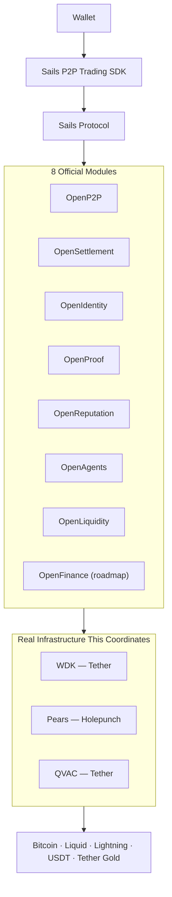
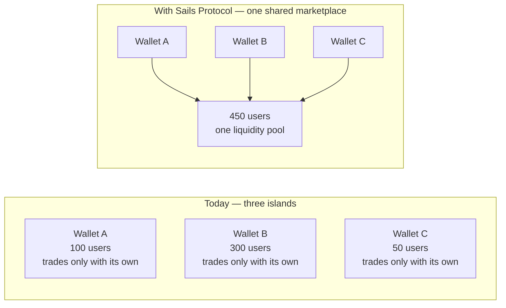

# Sails Protocol — Manifesto

### v1.0-draft · 2026-07-20

---

## Every wallet today is an island

Open any non-custodial wallet and it does exactly what it promises:
it holds your keys, signs your transactions, shows your balance. It is
yours, no one else's — and that is precisely the problem it never
solves.

The moment you want to actually *trade* with someone — swap crypto for
cash, one asset for another, with a person you've never met — your
wallet has nothing to offer. You leave it. You go to an exchange, a P2P
desk, an OTC contact, a bridge run by a company you have to trust with
your funds. The wallet that was supposed to make you sovereign quietly
hands you back to the very intermediaries it was built to remove.

And if you're the team building that wallet, the alternative isn't much
better: build the entire marketplace yourself. Discovery. Negotiation.
Escrow. Dispute resolution. Reputation. Fraud detection. Months of
engineering, for a marketplace that only your own users will ever use —
because nothing about what you built talks to anyone else's wallet.

Every team solves this problem alone. Every solution is an island. Every
island has less liquidity, less trust, and less reach than it would
have if it weren't alone.

This isn't a Bitcoin-only problem, or an Ethereum-only problem — it's
the shape of every non-custodial wallet, on every chain. A Bitcoin
wallet like Green Wallet or BlueWallet has it. A multi-asset wallet
handling stablecoins has it. An EVM wallet — MetaMask, Trust Wallet,
Exodus, or anything a user reaches via WalletConnect — has the exact
same one. *(Named here purely as illustrative examples of the kind of
wallet this problem affects — not as partners, integrators, or
endorsers of Sails Protocol; none of the above have any relationship
with this project today.)* It's the smaller, independent teams that
feel this hardest: they have the least room to absorb months of
unmonetized infrastructure work, and the most to gain from not having
to.

---

## What if it didn't have to be an island

**Sails Protocol is a shared economic layer for non-custodial
wallets** — not another wallet, another SDK feature, or another app to
compete with the ones already out there. It is open infrastructure that
lets any non-custodial wallet become part of one shared, interoperable
P2P financial marketplace — without giving up its brand, its users, or
a single key.

It does this by standardizing the one thing no wallet has ever had to
share before: the coordination layer. Not the wallet's identity, not
its custody, not its interface — just the shared language for how two
strangers, on two different wallets, discover each other, agree on
terms, prove what happened, and settle. Everything else stays exactly
where it already is: with the wallet, and with the user.

Think of it the way Kubernetes changed cloud infrastructure. Before
Kubernetes, every company that wanted to run containers at scale built
its own orchestration layer, badly, alone. Kubernetes didn't replace
any company's application — it standardized the layer underneath all
of them, and every team that adopted it stopped re-solving a problem
that had already been solved. Sails Protocol does the same thing for
P2P financial coordination: it is not another wallet, another exchange,
or another chain. It is the layer underneath all of them that none of
them have ever had to build alone before.

---

## The iPhone moment

Before the iPhone, a phone was a phone, a camera was a camera, and a
music player was a music player — each its own device, each requiring
its own manufacturer to build the whole thing from scratch. The App
Store didn't just add software to a phone. It turned a single-purpose
device into a platform that became whatever the next app made it —
without Apple building a camera company, a bank, or a game studio
itself.

That is the shift Sails Protocol is built for. A non-custodial wallet
today is single-purpose: it holds assets. With Sails, it doesn't stop
being a wallet — it gains a new capability the same way a phone gained
a camera app, not by rebuilding itself, but by enabling something that
already exists elsewhere in the ecosystem. This is **Capabilities as a
Protocol**: a wallet doesn't construct a marketplace, a chat system,
or an escrow engine feature by feature. It enables the capability —
P2P trading today, financial primitives like lending or swaps as the
protocol grows — and gets the whole thing, maintained and improved by
an ecosystem, not by its own engineering team alone.

And this isn't limited to one asset. The reference implementation
already discovers and negotiates trades across Bitcoin, USDT (on
Ethereum, Tron, Liquid, and Lightning rails), Lightning-native BTC, and
Liquid-native BTC — with real, automated settlement live today
specifically for USDT on Ethereum, and the rest already typed into the
protocol as the settlement side catches up, not invented on the spot to
pad a list.

That settlement side has real room to grow, and grows without
rearchitecting anything, because of what it's already standing on.
Settlement runs through WDK — the same wallet infrastructure Satsails
Wallet already depends on today — and WDK's own published network
support (`docs.wdk.tether.io`) already reaches well beyond what Sails
Protocol's settlement adapters have connected to so far: Bitcoin
Mainnet, EVM chains including Ethereum, TRON, TON, and Solana. Two of
those — TON and Solana — aren't even in Sails Protocol's own asset
list yet. Every network WDK already signs for is real infrastructure
capacity waiting on adapter work, not a promise invented for this
document; Satsails' own wallet stack separately reaches Liquid through
Breez's SDK, alongside WDK. WDK's multi-token support goes further
than chains, too: Tether's own WDK starter template lists **Tether
Gold (XAU₮)** as a supported token alongside BTC and USD₮, and it's
already load-bearing in production outside Sails — Tether's own
wallet app and Rumble's WDK-built tipping wallet both let users hold
and send XAU₮ today, not as a roadmap item. Digitized gold settling
over the same rails as BTC and USDT is exactly the kind of asset class
Sails Protocol has no adapter for yet, and exactly the kind WDK
already makes possible the moment one gets built. More assets arrive
as that adapter work lands, the same way new apps kept arriving after
the App Store opened — a real, extensible foundation standing on
infrastructure that already works, not a claim that Sails Protocol's
own settlement layer already covers all of it today.

---

## The same idea, a few different ways to see it

No single analogy lands for everyone. Kubernetes and the iPhone are the
two above because they explain the shift for a technical or
product-minded reader — here are a few more, each aimed at how a
different kind of reader already thinks. All are explanatory devices,
not factual claims about Sails Protocol itself.

- **For a developer:** it's Stripe Connect for P2P coordination. You
  don't build a payments processor to accept payments — you plug into
  rails that already move money for thousands of other platforms, and
  focus your engineering on your own product instead of reinventing
  infrastructure everyone needs the same version of.
- **For someone who's never heard the word "protocol":** it's your
  phone number. You can call anyone, on any carrier, in any country —
  not because every carrier merged into one company, but because they
  all agreed to speak the same connecting standard decades ago. Sails
  Protocol is that same idea for moving value between wallets that
  don't work for the same company.
- **For an investor:** it's Visa or Mastercard's original insight —
  don't try to be every bank; build the rails banks plug into, and
  capture a small piece of a very large amount of value moving through
  a network you don't have to operate alone. The difference here: no
  bank ever has to hand Visa custody of its customers' money to use the
  rails. Sails Protocol doesn't either.
- **For a journalist looking for one sentence:** Sails Protocol is
  trying to do for peer-to-peer crypto trading what email did for
  messaging — one shared, open standard, so any provider's users can
  reach any other provider's users, without every provider building
  its own private network first.

---

## This isn't a pitch for something that doesn't exist yet

The core mechanics — Intent-driven trade coordination, real-time
negotiation, non-custodial escrow, dispute resolution — are not a
whitepaper promise. They are running, today, inside **Satsails
Wallet**, a real non-custodial wallet that has been in production since
**September 2024**, monetized since **October 2025**, with
**$10M+ USD in processed volume and 12,000+ users**. That is not a
projection. It is what happens when the coordination mechanics this
protocol defines get used by real people trading real value.

What that first implementation is actually built from, concretely: real
peer-to-peer connectivity via **Pears**, real crypto settlement via
**WDK**, and a local AI agent via **QVAC** that assists with risk
assessment and negotiation on-device — no cloud call in the loop. Three
pieces of real infrastructure, coordinated by Sails Protocol, moving
real value. This is the proof this document leans on: not a diagram of
what could exist, a working system that already does.

What has not happened yet — and we want to be exactly as clear about
this as we are proud of what has — is a second wallet, built by someone
else, joining that same marketplace. **Sails P2P Trading SDK**, the
integration point any other wallet would use to do exactly that, has
its public API frozen, has been proven end-to-end through a real,
mock-free integration that found and fixed real bugs before anyone
outside this project ever touched it, and has passed a final audit
specifically checking that nothing half-finished leaked into what a new
integrator would see first. It is ready for the next wallet. The next
wallet just hasn't arrived yet — and that is the opportunity this
document is actually about.

---

## Why these three technologies, and why now

Every layer in the diagram below is real. Nothing is a placeholder box
drawn to look complete:

WDK and QVAC are Tether's own technology — real, serious infrastructure
Tether built for wallet signing/settlement and for private, on-device
AI, already carrying real value: WDK is what Tether's own wallet app
and third-party products like Rumble's tipping wallet run on today,
moving BTC, USDT, and Tether Gold (XAU₮) for real users. Pears is
Holepunch's real, production-grade peer-to-peer network stack — and
Tether has shipped its own product directly on it too (PearPass, a
P2P password manager), which is Tether treating Pears as
production-grade infrastructure worth building on, not a
speculative bet. Each of these three is genuinely capable of far more
than any single application has yet asked of it. Sails Protocol's
answer to that is deliberate, not incidental: **the first real use
case built on this stack was chosen specifically to put all three to
a real, practical test at once** — not a demo, not a hackathon
proof-of-concept, but a coordination layer processing real trades in a
wallet with real users today.

That is the honest version of the pitch this section exists to make:
these technologies deserve more real-world proof than they've gotten
so far, and Sails Protocol's ambition is to be the project that
provides it — not by building something new next to WDK, Pears, and
QVAC, but by proving, in production, exactly how much value the three
of them create when they're coordinated correctly.

This isn't a guess about what Tether wants to see, either. Tether runs
its own Developer Grants Program (`tether.dev`) — equity-free,
payment-on-completed-work, no cap on total payouts — funding exactly
four categories: core libraries for QVAC, MDK, WDK, and Pears;
documentation and onboarding; applications built on the stack; and
research into decentralization, edge AI, peer-to-peer networking, and
cryptography. Tether CEO Paolo Ardoino's own stated bar for what gets
funded: *"If you can build something that runs locally, holds value
directly, and doesn't rely on external providers, we'll fund it."*
Sails Protocol — a
coordination layer running on exactly WDK, Pears, and QVAC, holding no
custody of its own, depending on no external provider Tether or
Holepunch didn't already build — is not adjacent to that bar. It is a
direct fit for it, and it exists as a production system today, not a
grant application yet to be tested.

---

## The network effect no single wallet can build alone

Picture three wallets today, each with real users, each completely
isolated — and then the same three wallets, still fully independent,
still holding their own users' keys, still their own brand, but all
speaking the same coordination protocol:

No wallet lost anything. No wallet became a custodian for another
wallet's users. No wallet had to convince its users to leave. What
changed is that every one of Wallet A's users can now discover and
trade with Wallet B's and Wallet C's users too — and the next wallet
that joins doesn't just add its own users to the pool, it adds them to
*everyone's* pool at once.

This is the part every isolated marketplace structurally cannot offer,
no matter how well it's built: value that compounds with every new
participant, instead of value that's capped at whoever already uses
your app.

---

## From cost center to marketplace

Today, a non-custodial wallet makes money — if it makes money at all —
from a narrow set of levers: a swap spread, an affiliate fee, maybe
staking. Everything else about running a wallet is pure cost: security,
support, infrastructure, compliance, with no direct revenue line
attached.

A wallet that becomes a marketplace instead of just an interface has an
entirely different shape of business in front of it, with value capture
possible at four distinct layers — not yet realized anywhere, worth
building toward deliberately:

1. **Protocol** — a small, shared coordination fee on settled trades,
   sustaining the infrastructure everyone relies on.
2. **SDK** — the integration layer itself: today free and open, the
   foundation every wallet builds on without licensing it.
3. **Application** — the wallet's own layer: originating trades for
   other participants, premium visibility for sellers, its own
   relationship with its own users, unchanged.
4. **Services** — trusted-provider roles the protocol is designed
   around (dispute arbitration, compliance, liquidity provision),
   operated by whoever chooses to run them rather than outsourced to a
   single company by default.

None of this is available today — the protocol fee mechanism that would
fund layer 1 exists and is deliberately set to zero while the network is
still being built, and none of layers 3-4's revenue paths have a real
implementation behind them yet. We say this plainly because the honest
version of this opportunity is more convincing than an inflated one:
the infrastructure to capture this is real and running; the business
model on top of it is the part every early integrator gets to help
define.

---

## Still yours. Always.

None of this asks a wallet to become something it isn't. The user's
keys never leave the user's device. The wallet's brand stays the
wallet's brand. The relationship with the user stays the wallet's
relationship. Sails Protocol never custodies an asset, never
intermediates fiat, and never controls who a participant is — it
coordinates messages and events between sovereign participants, and
nothing more. Every integrator keeps its own regulatory
responsibilities, its own compliance posture, its own product — it
gains a marketplace it did not have to build, not a new master.

---

## Why now

A protocol whitepaper written before its architecture stabilizes is a
document of intentions — worth reading, but easy for a serious
evaluator to discount, because there's nothing yet to hold it
accountable to. That is not where this project is anymore.

The architecture is defined and has been stress-tested against its own
edge cases, not just designed on paper. The specification has gone
through nineteen numbered proposals, each reviewed, each — where it
touched real behavior — checked against the actual running code before
being accepted, not assumed correct because it sounded right. The
reference implementation's flagship module runs in production today,
processing real value for real users. Its SDK's public interface is
frozen, proven by a real integration test that found real bugs before
external release, and independently audited for exactly the kind of
half-finished detail that undermines trust in a new platform. And where
a real limitation exists — and one does, honestly disclosed in every
technical document this project publishes — it is named, tracked, and
scoped for a real fix, not hidden until someone else finds it first.

This is not a project asking you to trust a vision. It is a project
with a proven core, an honest account of exactly where the edges of
"proven" currently sit, and an open invitation to be the wallet that
proves the network effect works — not just the coordination mechanics
underneath it.

---

## What comes after this

Sails P2P Trading SDK is the first concrete product built on Sails
Protocol — deliberately, not accidentally, the first. The same
Identity, Reputation, Settlement, and Agent primitives that make this
SDK work are the foundation for what comes next: a general Wallet SDK
for any non-custodial application, a Portable Trust layer so
reputation and trust travel with a participant across every app they
use — the way your cloud account follows you across every device,
never locked to the one you happened to sign up on — and an
Agent-focused SDK for autonomous, on-device negotiation and risk
assessment at scale. Each layer reuses what the one before it already
proved, instead of asking the ecosystem to trust a new foundation every
time.

---

## The thesis

Sails Protocol does not want to build the next wallet, the next
exchange, or the next chain. It wants every wallet, exchange, and chain
that already exists to stop rebuilding the same infrastructure alone,
and start participating in one open, non-custodial financial economy —
where every new participant makes every existing one more valuable,
not less.

The core works. The first real numbers exist. The next chapter is
whichever wallet decides not to stay an island.

---

## Read next

This document made the case for *why*. Three companion documents go
deeper for whoever needs it: [`PROTOCOL_PAPER.md`](PROTOCOL_PAPER.md)
specifies *what* the protocol formally is, [`TECHNICAL_WHITEPAPER.md`](TECHNICAL_WHITEPAPER.md)
explains *how* the reference implementation actually works and why it
holds up, and [`SDK_PAPER.md`](SDK_PAPER.md) is the concrete, technical
answer to "how would my wallet actually integrate this." All four use
the same discipline: real claims cited, vision labeled as vision, never
mixed.
