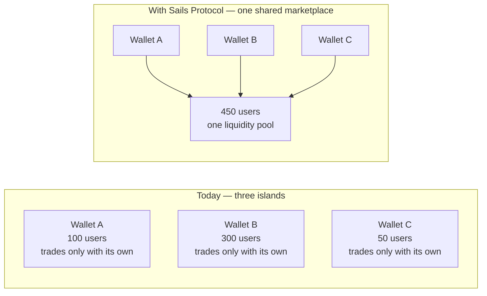

# Sails Protocol — Manifesto

### v1.0-draft · 2026-07-20

---

## Every wallet today is an island

Open any non-custodial wallet and it does exactly what it promises:
it holds your keys, signs your transactions, shows your balance. It is
yours, no one else's — and that is precisely the problem it never
solves.

The moment you want to actually *trade* with someone — swap crypto for
cash, one asset for another, with a person you've never met — your
wallet has nothing to offer. You leave it. You go to an exchange, a P2P
desk, an OTC contact, a bridge run by a company you have to trust with
your funds. The wallet that was supposed to make you sovereign quietly
hands you back to the very intermediaries it was built to remove.

And if you're the team building that wallet, the alternative isn't much
better: build the entire marketplace yourself. Discovery. Negotiation.
Escrow. Dispute resolution. Reputation. Fraud detection. Months of
engineering, for a marketplace that only your own users will ever use —
because nothing about what you built talks to anyone else's wallet.

Every team solves this problem alone. Every solution is an island. Every
island has less liquidity, less trust, and less reach than it would
have if it weren't alone.

---

## What if it didn't have to be an island

**Sails Protocol is a shared economic layer for non-custodial
wallets** — not another wallet, another SDK feature, or another app to
compete with the ones already out there. It is open infrastructure that
lets any non-custodial wallet become part of one shared, interoperable
P2P financial marketplace — without giving up its brand, its users, or
a single key.

It does this by standardizing the one thing no wallet has ever had to
share before: the coordination layer. Not the wallet's identity, not
its custody, not its interface — just the shared language for how two
strangers, on two different wallets, discover each other, agree on
terms, prove what happened, and settle. Everything else stays exactly
where it already is: with the wallet, and with the user.

Think of it the way Kubernetes changed cloud infrastructure. Before
Kubernetes, every company that wanted to run containers at scale built
its own orchestration layer, badly, alone. Kubernetes didn't replace
any company's application — it standardized the layer underneath all
of them, and every team that adopted it stopped re-solving a problem
that had already been solved. Sails Protocol does the same thing for
P2P financial coordination: it is not another wallet, another exchange,
or another chain. It is the layer underneath all of them that none of
them have ever had to build alone before.

---

## This isn't a pitch for something that doesn't exist yet

The core mechanics — Intent-driven trade coordination, real-time
negotiation, non-custodial escrow, dispute resolution — are not a
whitepaper promise. They are running, today, inside **Satsails
Wallet**, a real non-custodial wallet that has been in production since
**September 2024**, monetized since **October 2025**, with
**$10M+ USD in processed volume and 12,000+ users**. That is not a
projection. It is what happens when the coordination mechanics this
protocol defines get used by real people trading real value.

What has not happened yet — and we want to be exactly as clear about
this as we are proud of what has — is a second wallet, built by someone
else, joining that same marketplace. **Sails P2P Trading SDK**, the
integration point any other wallet would use to do exactly that, has
its public API frozen, has been proven end-to-end through a real,
mock-free integration that found and fixed real bugs before anyone
outside this project ever touched it, and has passed a final audit
specifically checking that nothing half-finished leaked into what a new
integrator would see first. It is ready for the next wallet. The next
wallet just hasn't arrived yet — and that is the opportunity this
document is actually about.

---

## The network effect no single wallet can build alone

Picture three wallets today, each with real users, each completely
isolated — and then the same three wallets, still fully independent,
still holding their own users' keys, still their own brand, but all
speaking the same coordination protocol:

No wallet lost anything. No wallet became a custodian for another
wallet's users. No wallet had to convince its users to leave. What
changed is that every one of Wallet A's users can now discover and
trade with Wallet B's and Wallet C's users too — and the next wallet
that joins doesn't just add its own users to the pool, it adds them to
*everyone's* pool at once.

This is the part every isolated marketplace structurally cannot offer,
no matter how well it's built: value that compounds with every new
participant, instead of value that's capped at whoever already uses
your app.

---

## From cost center to marketplace

Today, a non-custodial wallet makes money — if it makes money at all —
from a narrow set of levers: a swap spread, an affiliate fee, maybe
staking. Everything else about running a wallet is pure cost: security,
support, infrastructure, compliance, with no direct revenue line
attached.

A wallet that becomes a marketplace instead of just an interface has an
entirely different shape of business in front of it — not yet realized
anywhere, worth building toward deliberately: originating trades for
other participants, offering premium visibility to sellers, operating
one of the trusted-provider roles the protocol is designed around
(dispute arbitration, compliance, liquidity provision) rather than
outsourcing all of it. None of this is available today — the protocol
fee mechanism that would fund it exists and is deliberately set to zero
while the network is still being built, and none of these revenue paths
have a real implementation behind them yet. We say this plainly because
the honest version of this opportunity is more convincing than an
inflated one: the infrastructure to capture this is real and running;
the business model on top of it is the part every early integrator
gets to help define.

---

## Still yours. Always.

None of this asks a wallet to become something it isn't. The user's
keys never leave the user's device. The wallet's brand stays the
wallet's brand. The relationship with the user stays the wallet's
relationship. Sails Protocol never custodies an asset, never
intermediates fiat, and never controls who a participant is — it
coordinates messages and events between sovereign participants, and
nothing more. Every integrator keeps its own regulatory
responsibilities, its own compliance posture, its own product — it
gains a marketplace it did not have to build, not a new master.

---

## Why now

A protocol whitepaper written before its architecture stabilizes is a
document of intentions — worth reading, but easy for a serious
evaluator to discount, because there's nothing yet to hold it
accountable to. That is not where this project is anymore.

The architecture is defined and has been stress-tested against its own
edge cases, not just designed on paper. The specification has gone
through nineteen numbered proposals, each reviewed, each — where it
touched real behavior — checked against the actual running code before
being accepted, not assumed correct because it sounded right. The
reference implementation's flagship module runs in production today,
processing real value for real users. Its SDK's public interface is
frozen, proven by a real integration test that found real bugs before
external release, and independently audited for exactly the kind of
half-finished detail that undermines trust in a new platform. And where
a real limitation exists — and one does, honestly disclosed in every
technical document this project publishes — it is named, tracked, and
scoped for a real fix, not hidden until someone else finds it first.

This is not a project asking you to trust a vision. It is a project
with a proven core, an honest account of exactly where the edges of
"proven" currently sit, and an open invitation to be the wallet that
proves the network effect works — not just the coordination mechanics
underneath it.

---

## What comes after this

Sails P2P Trading SDK is the first concrete product built on Sails
Protocol — deliberately, not accidentally, the first. The same
Identity, Reputation, Settlement, and Agent primitives that make this
SDK work are the foundation for what comes next: a general Wallet SDK
for any non-custodial application, a Portable Trust layer so
reputation and trust travel with a participant across every app they
use — the way your cloud account follows you across every device,
never locked to the one you happened to sign up on — and an
Agent-focused SDK for autonomous, on-device negotiation and risk
assessment at scale. Each layer reuses what the one before it already
proved, instead of asking the ecosystem to trust a new foundation every
time.

---

## The thesis

Sails Protocol does not want to build the next wallet, the next
exchange, or the next chain. It wants every wallet, exchange, and chain
that already exists to stop rebuilding the same infrastructure alone,
and start participating in one open, non-custodial financial economy —
where every new participant makes every existing one more valuable,
not less.

The core works. The first real numbers exist. The next chapter is
whichever wallet decides not to stay an island.
