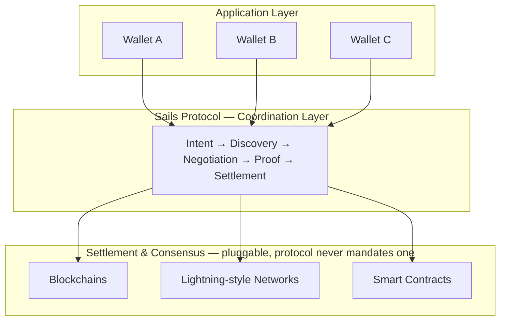
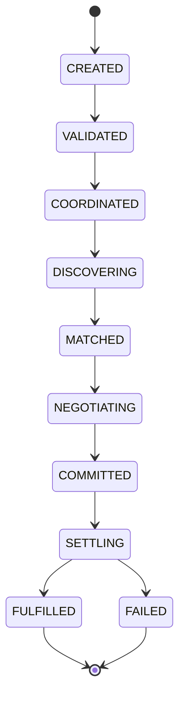
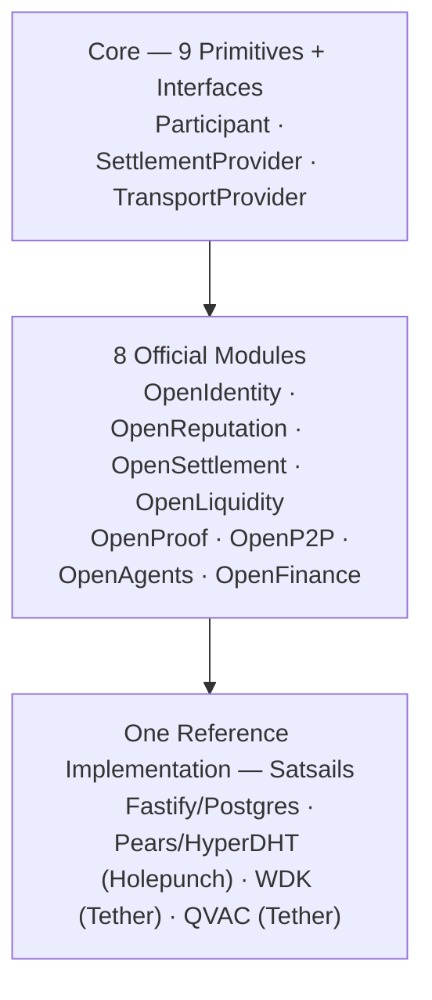

# Sails Protocol — Protocol Paper

### v1.0-draft · 2026-07-20

> **Reading this document:** Every claim below is labeled. ✅ **Proven**
> means real, tested code exists and has been verified (build, test
> suite, or a live run) — cited with the file or test that proves it.
> 📜 **Commitment** means a rule the protocol and its reference
> implementation bind themselves to, independent of whether every piece
> of code satisfies it yet. 📋 **Planned** means designed, not built —
> a real RFC exists, no running code does. Where the reference
> implementation currently falls short of a commitment it makes, that
> gap is stated plainly in this document, not smoothed over. This
> labeling discipline is not a caveat bolted onto a marketing document —
> it is inherited directly from how this project's own internal
> engineering documentation has been written from the start.

---

## 0. Conformance Language

The key words **MUST**, **MUST NOT**, **SHOULD**, **SHOULD NOT**, and
**MAY** in this document are to be interpreted as described in
[RFC 2119](https://www.ietf.org/rfc/rfc2119.txt). **MUST**/**MUST NOT**
is an absolute requirement or prohibition — an implementation that
violates one is not a conforming implementation of Sails Protocol.
**SHOULD**/**SHOULD NOT** is a strong recommendation that may be
overridden with justification. **MAY** is genuinely optional.

---

## 1. Abstract

Blockchains solve consensus. Lightning-style networks solve fast
payment settlement. Smart contracts solve deterministic execution.
None of them solve **coordination** — the problem of getting two
parties who don't know or trust each other to agree on terms, exchange
proof, and settle, across whatever assets, rails, and networks they
each actually use.

**Sails Protocol is a non-custodial coordination layer for peer-to-peer
financial interactions.** It does not custody assets, does not
intermediate fiat, and does not require both parties to use the same
wallet, chain, or company. It defines a small set of primitives —
Identity, Intent, Discovery, Negotiation, Settlement, Reputation,
Agent, Proof, Dispute — and a reference implementation, **Sails P2P
Trading SDK**, that any non-custodial wallet can integrate to become a
participant in a shared, interoperable P2P marketplace, instead of
building that infrastructure alone.

The SDK is the entry point, not the product. What a wallet actually
gains by integrating is not a library — it is standing access to a
shared economic layer: liquidity, counterparties, and portable
reputation that compound with every other wallet that integrates,
instead of capping out at that one wallet's own user base. This document specifies
the protocol that layer is built on; [`SDK_PAPER.md`](SDK_PAPER.md)
makes the economic case for joining it in full, and
[`MARKETING_WHITEPAPER.md`](MARKETING_WHITEPAPER.md) makes that same
case without the normative language, for a non-technical reader.

This document is 📜 the normative specification: what any
implementation, in any language, on any network, MUST respect to
correctly call itself Sails Protocol — independent of the one reference
implementation described in Section 9.

---

## 2. The Coordination Gap

Every non-custodial wallet today faces the same problem. It can hold
keys, sign transactions, and show a balance — but the moment a user
wants to actually **transact with another person** (not swap on a DEX,
not send to a known address, but negotiate a P2P trade with a stranger:
crypto for fiat, asset for asset, service for payment), the wallet has
nothing to offer. It has to either integrate a centralized third party
(an exchange's P2P desk, an OTC counterparty, a custodial bridge) or
build the entire stack itself: discovery, negotiation, escrow,
dispute resolution, reputation, anti-fraud — from scratch, in
isolation, with no liquidity beyond its own user base.

This is the gap none of the existing layers close:

| Layer | Solves | Does not solve |
|---|---|---|
| Blockchains (Bitcoin, Ethereum, …) | Consensus on state | Who two strangers are to each other, or what they agreed to |
| Lightning / payment channels | Fast, cheap settlement | Discovery, negotiation, dispute |
| Smart contracts | Deterministic execution of pre-agreed logic | The human/agent negotiation that produces the terms in the first place |
| Centralized P2P desks (Binance P2P, LocalBitcoins-style) | Discovery + escrow + dispute, in one place | Non-custodial guarantees, interoperability across wallets, portable reputation |

Sails Protocol's position is specific: it is **not** a blockchain, a
settlement network, or an exchange. It is the coordination layer that
sits above all of them — Intent → Discovery → Negotiation → Proof →
Settlement — leaving consensus to whatever chain the parties actually
use, and settlement finality to whatever `SettlementProvider` they
choose.

---

## 3. Design Principles

📜 **Commitment** — nine principles the protocol and every conforming
implementation are held to. These are not aspirational marketing
language: each exists because violating it breaks something specific
about what makes the protocol trustworthy.

1. **Protocol First** — never optimize one implementation at the
   protocol's expense.
2. **Intent Driven** — every interaction starts from an `Intent`, never
   from a direct API call describing a specific action.
3. **Self Custody Always** — the protocol never holds funds, never
   controls keys, and no server can initiate a transaction on a user's
   behalf, with no exception. *(Section 8 discloses the one place the
   current reference implementation does not yet fully satisfy this —
   read it before assuming this is unconditionally true today.)*
4. **Fiat Off-Protocol** — fiat is always settled directly between
   participants; the protocol never intermediates it.
5. **Capability Based** — what an actor may do is granted explicitly
   (`CapabilityGrant`), never assumed from role or platform.
6. **Infrastructure Neutral** — no transport, settlement network, or
   AI provider is protocol-mandated; every one is a pluggable Adapter.
7. **Open Integrations** — any wallet, exchange, or application may
   integrate without permission from a central authority.
8. **Privacy Preserving** — counterparty communication is end-to-end
   encrypted, never logged by protocol infrastructure.
9. **Interface Agnostic** — the protocol defines behavior, not UI; any
   presentation layer is legitimate.

---

## 4. Core Primitives

📜 **Commitment / 📋 partially Planned** — nine primitives form the
protocol's complete vocabulary. A primitive is irreducible (cannot be
expressed in terms of the others), orthogonal (doesn't overlap another
primitive's job), and has its own participant-facing lifecycle. Two
related concepts — **Capability** and **Policy** — were evaluated
against this same test during the protocol's design review and did
**not** qualify as primitives (no participant-facing lifecycle of their
own); they are real, named **Core components** instead (the Capability
Registry, the Policy Engine), not primitives.

| Primitive | Answers | Status |
|---|---|---|
| **Identity** | WHO is participating | ✅ Ed25519 keypair, challenge-response, no central registry |
| **Intent** | WHAT someone wants to happen | ✅ `TradeIntent` real and wired end-to-end (Section 5); `PaymentIntent`/`SwapIntent`/`LoanIntent`/`EarnIntent`/`AgentIntent` 📋 planned |
| **Discovery** | WHO ELSE this could happen with | ✅ Order-book discovery via OpenLiquidity |
| **Negotiation** | HOW terms get agreed | ✅ Real-time chat over an encrypted channel; typed structured negotiation events 📋 planned for agent-to-agent use |
| **Settlement** | HOW value actually moves | ✅ Real (testnet) escrow via a pluggable `SettlementProvider` — see Section 8 for the current custody caveat |
| **Reputation** | WHY to trust a counterparty | ✅ Outcome-based scoring, portable across applications, tied to the keypair not the platform |
| **Agent** | WHO (or what) acts on someone's behalf | ✅ Local, on-device inference for risk assessment and negotiation assistance; never holds a signing key of its own |
| **Proof** | HOW a claim gets verified by someone else | 🟡 `Claim`/`Proof`/`Verification` real (`proof.service.ts`) with server-side hash recompute, single-use verification nonces, and submission-window time-lock; duplicate-evidence detection and external media storage adapters 📋 planned |
| **Dispute** | HOW a disagreement gets formally resolved | ✅ Real, persisted, with an escalation order (assigned arbitrator today; automated pre-arbitration stages 📋 planned) |

**Identity is built on an abstract `Participant` interface**, not a
concrete key shape — any implementation MAY represent a Participant
however it can prove control of it (an Ed25519 keypair today; a
multisig organizational identity is a documented, not-yet-built,
second implementation). A `Wallet` MUST NOT implement `Participant`
directly (it has no identity of its own to prove); an `Agent` MUST NOT
either (it acts strictly under a delegating Participant's authority —
this restriction exists specifically to protect Principle 3).

---

## 5. The Intent Lifecycle

📜 **Commitment, ✅ Proven wiring** — every trade in a conforming
implementation MUST originate from a real `Intent`, not a direct
create-a-trade call. The canonical state sequence:

`VALIDATED`/`COORDINATED` are structural gates (payload shape,
financial sanity, target-module routing) an Intent MUST pass before
becoming discoverable. This is not aspirational sequencing described
for future implementations to aim at: in the reference implementation,
every `Offer` and `Trade` is now created from, and permanently
correlated to, a real `Intent` row — wired end-to-end, verified across
three separate same-day passes that each found and fixed a real bug
(an Intent that could get stuck mid-lifecycle when its Trade was
cancelled pre-escrow; a dispute-resolution race that let a real
settlement move funds before the Dispute record reflected it). This
history matters for a protocol spec: the lifecycle wasn't just
designed correctly on paper, it was built, then stress-tested against
its own edge cases, and the bugs that surfaced were fixed rather than
left as known issues.

---

## 6. The Eight Official Modules

📜 **Commitment** — a conforming implementation is not required to
implement every module (Principle: **Every Module Is Optional**), but
any module it does implement MUST conform to that module's contract in
this specification.

None of the three — WDK, Pears, QVAC — is protocol-mandated: Principle 3
and Constitutional Invariant 6 (Section 8, **Infrastructure Neutral**)
both require every Core interface (`SettlementProvider`,
`TransportProvider`) to stay swappable in principle. What's true today,
without weakening that neutrality, is that this reference
implementation is a real, in-production case of coordinating serious
infrastructure two different companies built — WDK and QVAC from
Tether, Pears from Holepunch — rather than any of it being simulated or
placeholder. Tether CEO Paolo Ardoino has put a public bar on the kind
of work Tether wants to see built on this stack: *"If you can build
something that runs locally, holds value directly, and doesn't rely
on external providers, we'll fund it."* A protocol whose Constitutional
Invariants already forbid custody and mandate infrastructure
neutrality is not a stretch fit for that bar. The business case for why
that specific combination matters is in
[`MARKETING_WHITEPAPER.md`](MARKETING_WHITEPAPER.md#why-these-three-technologies-and-why-now).

| Module | Role | Status |
|---|---|---|
| **OpenIdentity** | Portable identity for every participant — one Identity, usable across every application module. | ✅ Proven |
| **OpenReputation** | Portable, outcome-based reputation tied to the keypair, not the platform. | ✅ Proven |
| **OpenSettlement** | Pluggable escrow (`SettlementProvider`: Mock → Multisig → Lightning HODL → Liquid Covenant) and dispute resolution. | ✅ Proven in testnet — see Section 8 for the real custody caveat on the one live provider |
| **OpenLiquidity** | Discovery and routing — the order book lives here, not in OpenP2P, so future modules can reuse discovery without rebuilding it. | ✅ Proven |
| **OpenProof** | Standardized `Claim → Proof → Verification` evidence — one format every other module's disputes and negotiations consume instead of inventing their own. | 🟡 Core service real (hash recompute, nonce anti-replay, time-lock); duplicate-evidence detection and external media adapters 📋 planned |
| **OpenP2P** | Orchestrates the full trade lifecycle using every module above; owns the negotiation/chat channel. | ✅ Proven — the reference implementation's most complete module, and the one running in production today (Section 9) |
| **OpenAgents** | Local, on-device AI for negotiation assistance, risk assessment, and fraud-pattern detection in chat — never touches fiat rails, only acts on digital assets it's explicitly capable of. | 🟡 First real capabilities live; detection is advisory-only, never blocking, and off by default |
| **OpenFinance** | Reserved for future financial primitives (`LoanIntent`, `SwapIntent`, `EarnIntent`) reusing OpenSettlement/OpenLiquidity/OpenReputation without duplicating them. | 📋 Planned — no code exists |

There is no separate "escrow module" or "key-management module" —
escrow is OpenSettlement's responsibility; key custody is the
Participant's own, never the protocol's, by Principle 3.

**The Capability Registry**, referenced by Principle 5, is the Core
component every module consults before letting an actor do something
consequential: not a module itself, but the shared authorization layer
underneath all eight. A `CapabilityGrant` is explicit, scoped, and
revocable — no module assumes an actor may act just because it
authenticated. ✅ Proven and enforced today at the Intent-creation and
settlement-release choke points; how it works internally is detailed in
the companion [`TECHNICAL_WHITEPAPER.md`](TECHNICAL_WHITEPAPER.md).

---

## 7. The Trust Model — Why a Stranger Should Trust a Stranger

📜 **Commitment, ✅ Proven mechanisms.** "Non-custodial" by itself does
not answer why two strangers would transact. Four concrete mechanisms
do:

1. **Escrow, not trust.** Neither party releases value until the
   agreed condition is met — the protocol's job is making that
   condition enforceable, not asking either side to go first on faith.
2. **Portable reputation.** A counterparty's history is visible before
   a trade starts, and follows their keypair across every application
   that implements OpenReputation — not siloed to one platform's
   internal rating system.
3. **Formal dispute resolution.** Disagreements escalate through a
   defined path (today: an assigned Trusted Arbitrator; automated
   pre-arbitration stages via Policy/Agent are 📋 planned) rather than
   being left to the two parties to resolve unilaterally.
4. **Two-person control on release.** Both counterparties may be
   required to independently approve an escrow release before it
   executes — an application-layer maker-checker control, off by
   default, that raises the bar beyond a single party's word even
   before any dispute is raised.

**A fifth, real mechanism worth its own note: the Timeline read-model
and social-engineering detection (RFC-017).** Every state change in a
trade is written to a `correlationId`-keyed Timeline — real,
hash-chained for tamper-evidence where it applies to `IntentEvent`
specifically (Section 5). An Agent watches this Timeline, alongside
real chat content, for known fraud precursors — off-channel migration
away from the protocol's own chat, and suspicious last-minute changes
to payment instructions — and raises a warning directly in the trade's
chat. ✅ Proven, live, and deliberately scoped: this is detection only,
never automated blocking or fund-locking, and is off by default. A
third named fraud pattern (unexpected deviation from a trade's expected
flow) needs a more state-aware component than this pass built, and is
tracked as 📋 planned rather than claimed done.

---

## 8. Constitutional Invariants

📜 **Commitment — the protocol's actual constitution.** These six
rules are stricter than the nine principles in Section 3: a violation
means the resulting system is no longer conformant, not merely
imperfect.

1. **The Core Never Knows Concrete Implementations** — Core primitives
   depend only on interfaces (`Participant`, `SettlementProvider`,
   `TransportProvider`), never on a specific vendor or technology.
2. **The Protocol Never Custodies Assets** — no Sails Protocol
   component ever holds a private key or controls an asset on a user's
   behalf.
3. **Fiat Always Settles Outside the Protocol** — the protocol
   coordinates; it never touches a banking rail. Verified structurally:
   no code path in the reference implementation calls a fiat or banking
   API anywhere, by construction, not by configuration.
4. **Every Module Is Optional** — an implementation may pick any subset
   of the eight modules.
5. **Every Implementation Respects the Protocol Principles** — Section
   3's nine principles bind every conformant deployment.
6. **The Protocol Remains Infrastructure-Neutral** — no transport,
   chain, or AI vendor is load-bearing to the spec itself.

### The one place the reference implementation does not yet satisfy Invariant 2 — stated plainly, not hidden

The only real, tested `SettlementProvider` beyond a pure mock —
`WdkSettlementProvider`, the one that actually signs and broadcasts
testnet transactions — signs every escrow lock and release from a
**single, server-held seed phrase**. No user-supplied signature or
credential is required for a release to succeed; the server signs
unilaterally. This is a genuine, current violation of Invariant 2 in
the one settlement path that moves real (testnet) value today — not a
documentation gap, a custody gap.

This is disclosed here for the same reason it is disclosed at the code
level, in four separate internal engineering documents, and in the RFC
that formally registers it (RFC-019): the project's own position is
that **a real limitation, hidden, is worse than the same limitation,
stated.** RFC-019 reclassifies this provider explicitly as a
**reference/testnet-only implementation**, never the protocol's
normative target, and registers — without committing to a delivery
date — the real target architecture: on-chain multisig or a
user-co-signing flow, so that no single party can ever move funds
alone. Two-person control (Section 7, item 4) already ships today as a
real, tested gate in front of this custody model, specifically because
the underlying signing gap exists — it is a mitigation for a disclosed
problem, not a claim that the problem is solved.

A conforming implementation that ships a `SettlementProvider` with this
shape MUST label it as such — server-custodial, reference-only — and
MUST NOT represent it as satisfying Invariant 2.

---

## 9. Reference Implementation — Proof, Not Just Theory

This specification is not a paper protocol. Its most complete module,
**OpenP2P**, is the coordination layer underneath **Satsails Wallet**, a
non-custodial wallet that has been **in production since September
2024 and monetized since October 2025**, with confirmed figures of
**$10M+ USD in processed volume and 12,000+ users**. This is real
evidence the protocol's core mechanics — Intent-driven trade
coordination, escrow, chat, dispute — work under real usage, not only
in specification.

One precision worth stating exactly, because conflating it would be
the same kind of overclaim this document is built to avoid: that figure
is Satsails Wallet's own product-level volume, using Sails OpenP2P as
one proven module inside a broader wallet application — it is not yet
evidence of the protocol operating as a formalized, fee-generating,
multi-integrator layer with independent third-party wallets connected
to it. **Sails P2P Trading SDK** (`@sails/sdk`) — the standalone,
publicly-integrable package any *other* wallet would install to reach
this same coordination layer — has its public API frozen as of
`v1.0.0-rc1`, verified end-to-end via a real, mock-free integration
test that found and fixed two real bugs before anyone outside this
project ever touched it. It has not yet been integrated by a real
external, non-Satsails wallet. That is the honest current line between
proven and next: **the coordination mechanics are proven in
production; the multi-integrator network effect is not yet
demonstrated, because the first integrator beyond the reference
implementation itself has not yet connected.**

---

## 10. Relationship to Existing Systems

| System | What it solves | What Sails Protocol adds |
|---|---|---|
| Centralized P2P desks (Binance P2P and similar) | Discovery, escrow, dispute — but custodially, and siloed to one platform | The same coordination mechanics, non-custodially, and portable across every integrating wallet |
| DEXs / AMMs | On-chain asset swaps between known token pairs | Coordination for interactions a smart contract can't express alone — fiat-for-crypto, service-for-payment, anything requiring human negotiation and off-chain proof |
| Cross-chain bridges | Moving an asset from one chain to another | Nothing directly — bridges are a settlement-layer concern; a `SettlementProvider` MAY use one, Sails Protocol is agnostic to which |
| Lightning-style payment networks | Fast, cheap final settlement of an already-agreed amount | The negotiation and trust-building that determines what gets settled and to whom, before any payment channel is touched |
| Traditional smart contracts | Deterministic execution of pre-agreed logic | The Intent → Negotiation → Proof pipeline that produces the terms a contract then executes — Sails Protocol is upstream of contract execution, not a replacement for it |

Sails Protocol does not compete with any of these. It is the
coordination layer that can sit above all of them at once, because it
is deliberately agnostic to which one any given implementation chooses.

---

## 11. Legal and Regulatory Posture

The protocol's Core coordinates messages and events between
participants; it does not custody assets, does not operate a market
maker function, and does not control who participates. This narrows,
but does not eliminate, regulatory surface — it does not eliminate it
for whoever *integrates* the protocol. Every integrating wallet or
application remains responsible for its own KYC/AML, licensing, and
consumer-protection obligations in whatever jurisdiction it operates.
This document makes no claim that using Sails Protocol removes any
integrator's regulatory obligations, and any external-facing material
derived from it MUST NOT imply otherwise.

The regulatory boundary is architectural, not incidental: `OpenAgents`
(Section 6) is constitutionally restricted from ever calling a
banking or fiat-rail API — verified structurally, not by
configuration — specifically because the moment an autonomous agent
could plausibly touch a banking rail, its regulatory classification
changes from coordination software to something closer to a
money-transmission actor. Keeping that line architecturally
un-crossable, rather than policy-enforced, is a deliberate design
choice.

---

## 12. Governance and Evolution

📜 **Stated plainly, not softened.** Today, the protocol specification
is governed by a single company (Satsails), through an internally
disciplined RFC process — anyone may propose a change (an RFC), but
approval authority sits with Satsails during the current bootstrap
phase. Nineteen RFCs have been accepted into the canonical
specification to date, each numbered, dated, and — where it changed
real behavior — cross-referenced against the actual code, not merely
the design intent. A **Core RFC** classification exists for changes
that touch the trust/custody model specifically (RFC-018, RFC-019 are
the first two), requiring a documented review against every relevant
trust/security document before acceptance.

A transition to multi-stakeholder governance — a **Governance Layer**
composed of recognized ecosystem participants, using a multi-signature
or delegated-representative process — is a stated destination, tied to
that layer actually shipping, not to a calendar date. It does not exist
today. No "Sails Foundation" is currently a formed legal entity; that
name, where it appears in planning material, describes a target
structure, not a present fact. Any external-facing material claiming
decentralized or neutral governance today would misstate this.

---

## 13. Status and Roadmap

**Implemented and proven** (production or thoroughly tested, per
Sections 4-9 above): the Identity, Intent, Discovery, Negotiation,
Settlement, Reputation, Agent, and Dispute primitives; six of eight
modules at meaningful maturity (OpenIdentity, OpenReputation,
OpenSettlement, OpenLiquidity, OpenP2P, first capabilities of
OpenAgents); the Intent lifecycle wired end-to-end; Sails P2P Trading
SDK's public API frozen at `v1.0.0-rc1`.

**Designed, registered, not yet built:** the real non-custodial
settlement target (RFC-019 Phase 2 — on-chain multisig or user
co-signing); OpenProof's real service layer; OpenFinance's financial
primitives; a multi-stakeholder Governance Layer; a durable, crash-safe
event store backend (`RedisStreamsEventStore` exists as an interface
implementation that intentionally throws "not yet implemented" rather
than silently succeeding); a proactive timeout/refund sweep for
abandoned trades; an independent third-party security audit.

**Not yet started at all:** any real integration by a wallet other than
the reference implementation itself.

The roadmap ahead is expressed relative to funding milestones, not
fixed calendar dates — a deliberate choice, since a roadmap with fixed
dates goes stale the moment execution or funding timing shifts, and
that staleness reads as a red flag to any serious technical evaluator.

---

## 14. Conclusion

Sails Protocol's thesis is narrow and, we think, correct: the internet
already has consensus layers, payment networks, and execution engines.
What it does not have is a shared, non-custodial way for two strangers
— human or agent, on any wallet, on any asset — to find each other,
agree on terms, prove what happened, and settle, without a platform
sitting in the middle taking custody or taking a cut by default.

The protocol does not ask any wallet to give up its brand, its users,
or its keys. It asks it to speak one shared coordination language.
Every wallet that does gains access to liquidity, counterparties, and
trust history it did not have to build alone — and every wallet that
already joined benefits from the next one that does, in the same way
any coordination protocol's value compounds with its participants,
not its features.

That network effect has not been demonstrated yet — this document has
been explicit about exactly where the line between proven and planned
sits. What has been demonstrated is that the mechanics work, in
production, under real usage, and that the protocol's own discipline —
disclosing a real gap the moment it's found, rather than after it's
discovered externally — is itself part of what makes it worth trusting
with the next one.
