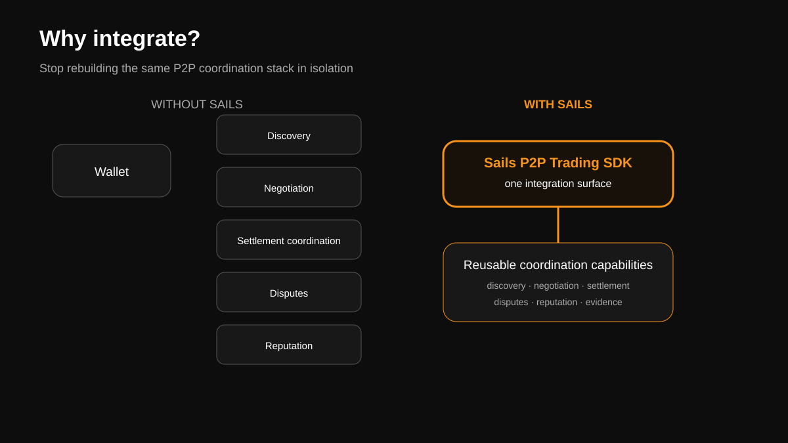
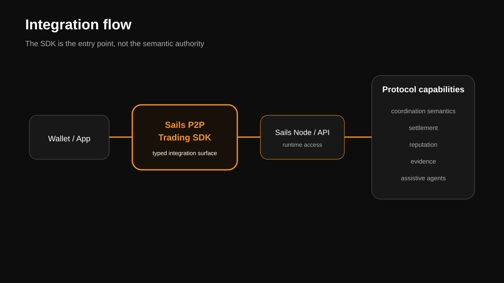

# Sails P2P Trading SDK Paper — Visual Companion

> **NON-CANONICAL VISUAL TRANSLATION.** `API_STABLE.md` governs the frozen public contract. `SDK_GUIDE.md` and the institutional architecture sources govern current implementation meaning.
>
> **Documents define the architecture. Diagrams represent it. If a diagram conflicts with canonical documentation, the documentation governs.**

## 1. Why Integrate?

Editable source: [`assets/sdk/why-integrate.mmd`](assets/sdk/why-integrate.mmd)

Use for: sales conversations, wallet partnerships, pitch decks and the opening of the SDK Paper.

## 2. Integration Flow

Editable source: [`assets/sdk/integration-flow.mmd`](assets/sdk/integration-flow.mmd)

The SDK is shown as the integration surface, never as semantic authority.

## 3. Ecosystem Flywheel

Editable source: [`assets/sdk/ecosystem-flywheel.mmd`](assets/sdk/ecosystem-flywheel.mmd)

**Status: Future Vision / network-effect hypothesis.** This diagram intentionally does not imply that independent-wallet network effects have already been demonstrated.
