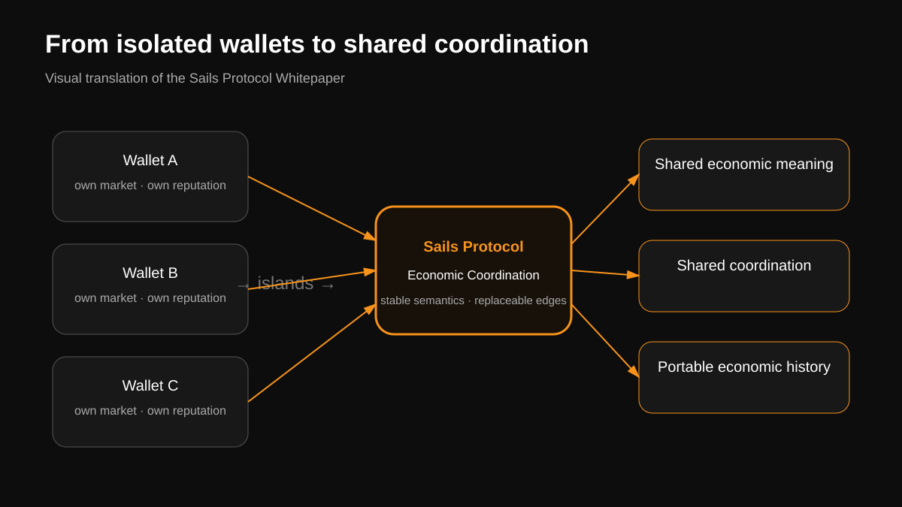
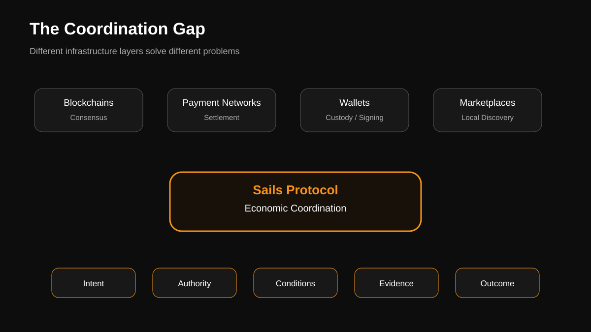
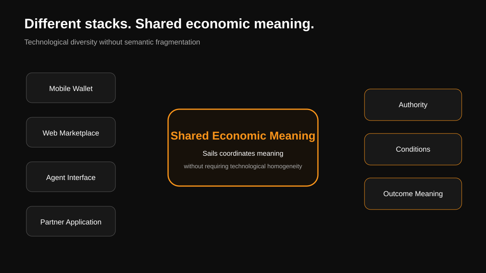

# Sails Protocol Whitepaper — Visual Companion

> **NON-CANONICAL VISUAL TRANSLATION.** The Sails Protocol Whitepaper and its canonical sources govern. These diagrams introduce no protocol or architecture truth.
>
> **Documents define the architecture. Diagrams represent it. If a diagram conflicts with canonical documentation, the documentation governs.**

## 1. From Isolated Wallets to Shared Coordination

Editable source: [`assets/protocol/islands-to-coordination.mmd`](assets/protocol/islands-to-coordination.mmd)

Use for: opening slides, landing pages, non-technical explanation of the island problem.

## 2. The Coordination Gap

Editable source: [`assets/protocol/coordination-gap.mmd`](assets/protocol/coordination-gap.mmd)

Use for: explaining where an Economic Coordination Protocol fits relative to consensus, settlement, custody/signing and local marketplace discovery.

## 3. Different Stacks. Shared Economic Meaning.

Editable source: [`assets/protocol/shared-economic-meaning.mmd`](assets/protocol/shared-economic-meaning.mmd)

Use for: category narrative, partner decks and the central semantic-interoperability thesis.
