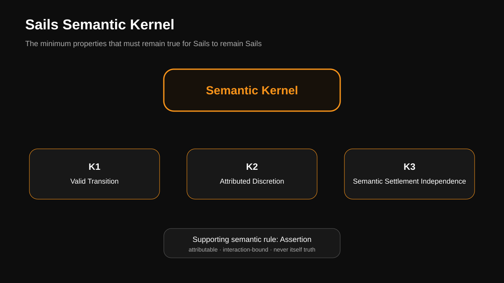
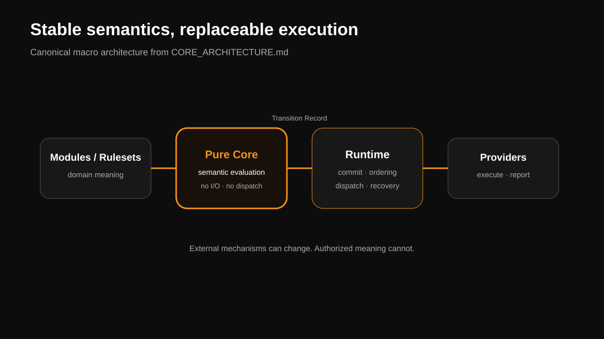
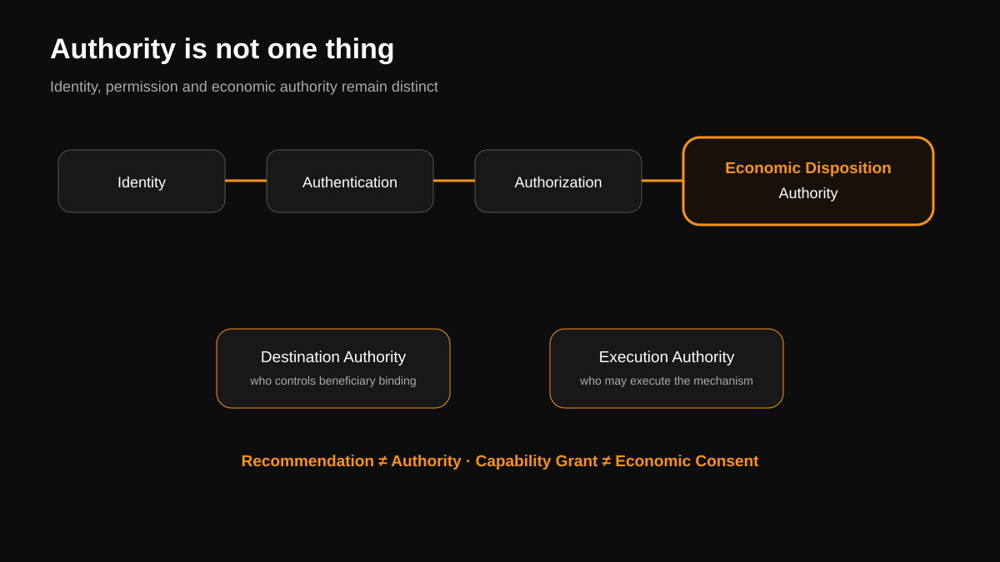
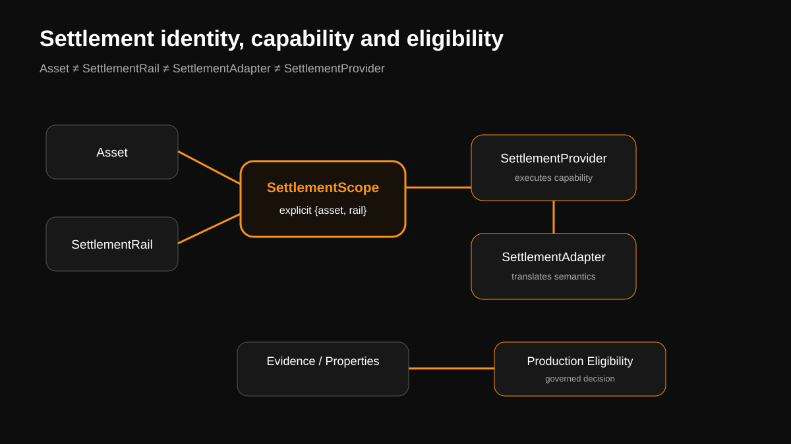

# Sails Technical Paper — Visual Companion

> **NON-CANONICAL VISUAL TRANSLATION.** Canonical architecture remains in `SEMANTIC_KERNEL.md`, `CORE_ARCHITECTURE.md`, accepted ADRs/RFCs and the other institutional sources cited below.
>
> **Documents define the architecture. Diagrams represent it. If a diagram conflicts with canonical documentation, the documentation governs.**

## 1. Semantic Kernel

Editable source: [`assets/technical/semantic-kernel.mmd`](assets/technical/semantic-kernel.mmd)

Canonical source: [`../SEMANTIC_KERNEL.md`](../SEMANTIC_KERNEL.md), especially K1/K2/K3 and the supporting Assertion rule.

## 2. Pure Core, Runtime and Providers

Editable source: [`assets/technical/core-runtime-providers.mmd`](assets/technical/core-runtime-providers.mmd)

Canonical source: [`../CORE_ARCHITECTURE.md`](../CORE_ARCHITECTURE.md) §7.

## 3. Authority Boundaries

Editable source: [`assets/technical/authority-boundaries.mmd`](assets/technical/authority-boundaries.mmd)

Canonical basis: [`../AUTHORITY_MODEL_DISCOVERY.md`](../AUTHORITY_MODEL_DISCOVERY.md) and `DESTINATION_AUTHORITY_ARCHITECTURE.md`. This visual deliberately preserves the separation between economic disposition, destination and execution authority.

## 4. Settlement Architecture

Editable source: [`assets/technical/settlement-architecture.mmd`](assets/technical/settlement-architecture.mmd)

Canonical source: [`../adr/ADR-002-asset-settlement-rail-adapter-provider-architecture.md`](../adr/ADR-002-asset-settlement-rail-adapter-provider-architecture.md). Product scope, implementation and production eligibility remain separate facts/decisions.
