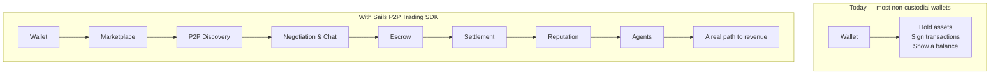
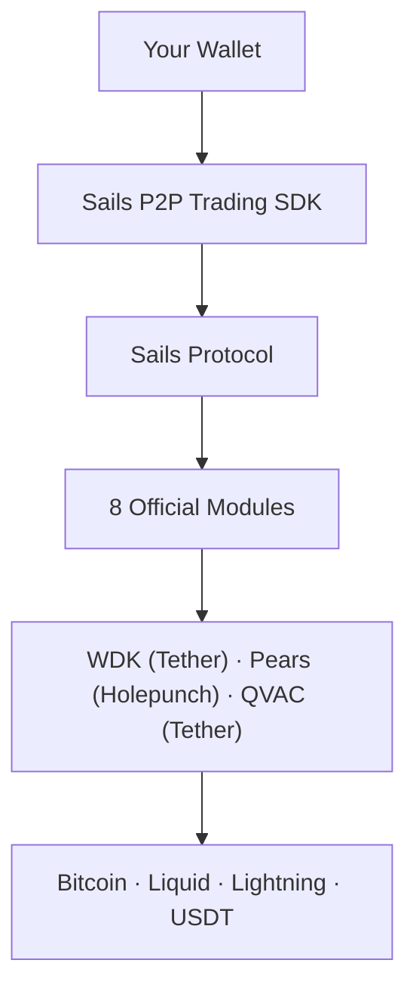
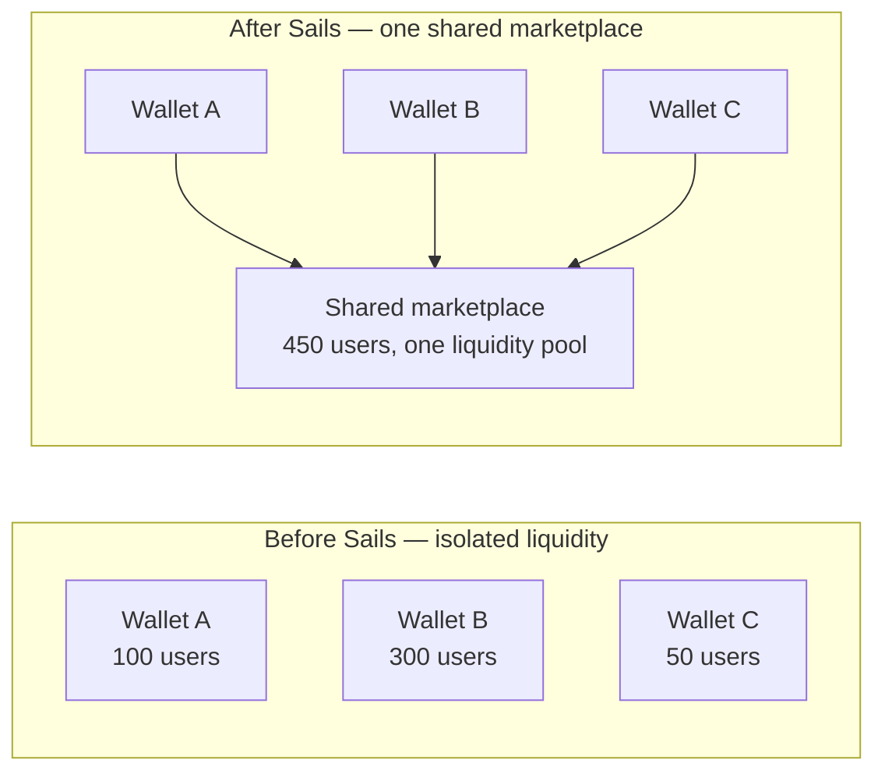

# Sails P2P Trading SDK — Reference Implementation Paper

### v1.0-draft · 2026-07-20

> **This document is not just a technical guide.** It exists to answer
> one question a non-custodial wallet's decision-maker actually asks:
> *why would I integrate this?* Every technical claim below carries the
> same labeling as the companion papers — ✅ **Proven**, 📜
> **Commitment**, 📋 **Planned/Vision** — because the strategic argument
> is only as strong as the honesty underneath it. A "why integrate"
> pitch that quietly overclaims what's already true is a weaker pitch,
> not a stronger one.

> **One-sentence pitch:** *P2P infrastructure that lets any
> non-custodial wallet become a financial marketplace, using an SDK,
> local AI agents, and real crypto settlement — without building any
> of it from scratch.*

> **The Sails P2P Trading SDK is not an isolated product.** It is the
> reference implementation of Sails Protocol — the first concrete proof
> that the protocol's coordination layer works, and the door any other
> wallet walks through to join it. The SDK is the entry point. The
> product a wallet actually gains by integrating is standing
> participation in a shared economic layer — liquidity, counterparties,
> and trust that no single wallet can build alone. Everything in this
> document builds toward that one point.

---

## 1. Every Non-Custodial Wallet Has the Same Problem

A wallet is good at three things: holding keys, signing transactions,
showing a balance. It is not, by itself, a place where two strangers
transact. The moment a user wants to actually trade — crypto for fiat,
asset for asset, with someone they don't already know — the wallet has
nothing to offer. It either sends the user to a centralized third party
(an exchange's P2P desk, an OTC counterparty), or the team behind it
builds the entire stack alone: discovery, negotiation, escrow, dispute
resolution, reputation, fraud detection — in isolation, with no
liquidity beyond that one wallet's own user base.

The result: the wallet stays an interface. The actual economic activity
— the trades, the fees, the relationships — happens somewhere else, on
someone else's platform.



One integration point (`new SailsClient(...)`, Section 2) — not six
separate systems to design, build, and operate.

What that one integration point stands on is not a toy stack, either:



WDK and QVAC are Tether's own infrastructure — real settlement signing
and real on-device AI, not something this project built from scratch.
Pears is Holepunch's production P2P network stack. Integrating this SDK
means standing on infrastructure already built and maintained at a
scale no individual wallet team would build alone, coordinated by a
protocol whose only job is making the three of them work together for
one real use case. It also means inheriting headroom: WDK already
signs for assets and networks — Tether Gold (XAU₮), TON, Solana —
that Sails Protocol has no adapter for yet, so integrating early puts
a wallet in line for that breadth as adapter work lands, rather than
waiting for someone else to build it first.

Tether CEO Paolo Ardoino has said plainly what Tether wants built on
this stack: *"If you can build something that runs locally, holds
value directly, and doesn't rely on external providers, we'll fund
it."* A non-custodial wallet integrating a non-custodial coordination
layer is exactly that kind of build — which is as much a signal for
where this ecosystem is headed as it is a fact about Sails Protocol
itself.

---

## 2. What Integration Actually Looks Like — ✅ Real Code, Not a Mockup

This is not a conceptual diagram. It is the literal shape of
`@sails/sdk`, verified end-to-end in `examples/simple-wallet` — a
mock-free integration using only this package's public exports:

```typescript
import { SailsClient } from '@sails/sdk'

const wallet = new SailsClient({ baseUrl: 'https://your-sails-node' })

// Register + authenticate — real Ed25519 challenge-response, no password
const { keypair } = await wallet.identity.create(undefined, 'My Wallet User')
await wallet.identity.authenticate(keypair)

// Publish or discover offers — real order book, real liquidity
const offer = await wallet.liquidity.publish({
  asset: 'USDT_ERC20', side: 'SELL', priceUsd: '1.00',
  minAmount: '10', maxAmount: '500',
  paymentMethod: 'PIX', paymentDetails: 'seller-pix-key',
})

// Open a trade, chat in real time, move funds through escrow
const trade = await wallet.trades.trade(offer.id, '50')
const chat = wallet.trades.chat(trade.id)
chat.send({ content: 'Sending payment now.' })

const escrow = await wallet.escrow.create({ tradeId: trade.id, lockedAmount: '50', asset: 'USDT_ERC20' })
await wallet.escrow.lock(escrow.id)
// ... buyer marks payment sent, seller releases ...
await wallet.escrow.release(escrow.id, buyerPayoutAddress)
```

Every method above is real, tested, and frozen — no breaking changes
until a real v1.0 (`docs/API_STABLE.md`). Note the two vocabularies on
the same object: `wallet.trades`/`wallet.escrow` and
`wallet.openp2p`/`wallet.settlement` resolve to the exact same
instances — a P2P-trading-specific developer and a general
wallet/fintech developer each reach for the name that matches how they
already think, without either being the "wrong" one.

There is no `sdk.enable([...])` call, and no separate marketplace,
chat server, escrow contract, or matching engine for the integrating
wallet to build or run. The client above talks to one Sails node and
gets back a fully working P2P marketplace.

**What actually settles for real today, stated precisely:** the escrow
lifecycle above (`create`/`lock`/`release`) is real against every
`asset` type the SDK exposes, but which of those actually broadcast a
real transaction depends on the `SettlementProvider` configured behind
it. `USDT_ERC20` settles for real, on testnet, via a real
`@tetherto/wdk-wallet-evm` signature and broadcast — not a simulation.
Lightning HODL and Liquid Covenant escrow are typed and named in the
protocol but not yet backed by a working provider; calling them today
resolves to a mock. A wallet integrating for real should know exactly
which asset path it's testing against before assuming production
readiness — this SDK is honest about that distinction by design, not by
omission.

---

## 3. The Thesis: Integration Is a Business Decision, Not Just a Technical One

📋 **Vision — stated as vision, because it has not happened yet.** A
wallet that integrates Sails does not just add a feature. It stops
competing alone and starts participating in a shared network:



Each wallet keeps its own brand, its own users, and custody of every
key — nothing above changes that. What changes is that every wallet's
users can discover and trade with every other integrated wallet's
users too.

**This is a real, honest 📋, not a ✅.** Today, exactly one product uses
Sails OpenP2P at meaningful scale — Satsails Wallet, the reference
implementation itself, in production since September 2024 with
$10M+ in processed volume and 12,000+ users. That is strong evidence
the underlying mechanics work under real usage. It is not yet evidence
of the network effect above, because no second, independent wallet has
connected to the same marketplace yet. The value of the network effect
argument is exactly proportional to how many wallets actually join it
— which is precisely why this is the pitch for the *next* integrator,
not a claim about today.

---

## 4. What a Wallet Stops Having to Build

| Capability | Without Sails | With Sails |
|---|---|---|
| P2P discovery & order book | Build and operate your own | `wallet.liquidity.discover(...)` — real order book, real routing |
| Real-time negotiation | Build your own chat infra | `wallet.trades.chat(tradeId)` — encrypted, real-time, already built |
| Escrow | Build your own custody/release logic, or trust a third party | `wallet.escrow.*` — pluggable `SettlementProvider`, atomic and concurrency-safe (Technical Whitepaper §4) |
| Dispute resolution | Build an arbitration flow from scratch | Real, persisted `Dispute` primitive with an escalation path |
| Reputation | Build your own rating system, siloed to your own users | Portable score tied to the counterparty's keypair, not to your platform — visible before either side ever transacted with the other |
| Fraud/risk signals | Build your own detection, or skip it | Local, on-device agent risk assessment (QVAC) — no cloud dependency, no per-call API cost |

None of this requires a wallet to give up anything. The user's keys,
the wallet's brand, and the wallet's own user relationship all stay
exactly where they are — Sails Protocol never custodies an asset and
never intermediates the wallet-to-user relationship. What a wallet
gains is a marketplace it didn't have to build, populated with
liquidity it didn't have to bootstrap alone.

---

## 5. Monetization: What's Real Today vs. What's Designed

This split matters more here than anywhere else in this document set,
because a business case built on an unshipped revenue mechanism is not
a business case yet.

**✅ Real today:** the protocol fee mechanism exists in the reference
implementation's design and is **currently set to 0%** — a deliberate
choice to prioritize adoption over extraction during the bootstrap
phase (`docs/PROTOCOL_ECONOMY.md`). No fee has ever actually been
charged to a real user through this mechanism.

**📋 Designed, architecture-ready, not implemented** (`PROTOCOL_ECONOMY.md`'s
own explicit label — quoted directly, not paraphrased into something
stronger): future revenue paths for an integrating wallet include
originator rebates on trades their users bring to the marketplace,
premium placement for offers, and — as the ecosystem of
`SettlementProvider`/`ArbitrationProvider`/`EvidenceProvider`
implementations grows — a role for wallets or partners to operate one
of those provider roles themselves. None of this is charged, wired, or
committed to a date today.

The honest version of the pitch: integrating today is a bet on where
this goes, backed by real, working infrastructure and a real production
track record on the coordination mechanics themselves — not a claim of
revenue that already exists.

---

## 6. Portable Reputation Today, Portable Trust Tomorrow

**✅ Real today:** a `ReputationScore` is tied to a Participant's
keypair, not to any one wallet's database. If OpenReputation is the
module a second wallet implements, its users' trade history and
outcome-based score are visible to that wallet too — reputation earned
in one place is legible in another, by construction, not by a data
-sharing agreement between two companies.

**📋 Vision — the next layer, not this one:** a fuller "Portable
Trust" layer — reputation, verified credentials, and trust signals
following a Participant across every application they use, the way an
iCloud account follows a device change — is the named next step in
this project's own roadmap sequence, after this SDK: Sails P2P Trading
SDK first, then a Wallet SDK, then a dedicated Portable Trust SDK, then
an OpenAgents/QVAC SDK. It builds directly on what OpenReputation
already proves works today; it is not built yet.

---

## 7. This Is the Reference Implementation, Not the Whole Protocol

Sails P2P Trading SDK is deliberately the *first* concrete product on
top of Sails Protocol, not the only one planned. The sequencing is
intentional: prove the coordination mechanics work for one real use
case (P2P trading) before generalizing. Once this layer is genuinely
solid — and the release-candidate audit in Section 8 is the evidence
that bar has been met — the same primitives (Identity, Intent,
Settlement, Reputation, Agent) are what a Wallet SDK, a Portable Trust
SDK, and an Agent-focused SDK all reuse, rather than each reinventing
its own version of identity or escrow.

The protocol these primitives belong to, independent of this one SDK,
is specified in full in [`PROTOCOL_PAPER.md`](PROTOCOL_PAPER.md). How
the reference implementation actually engineers all of this — the
architecture, the cryptography, the concurrency-safety work — is in
[`TECHNICAL_WHITEPAPER.md`](TECHNICAL_WHITEPAPER.md). This document
stays deliberately scoped to one question: why integrating is worth it.

---

## 8. Proof This Is Real, Not a Pitch Deck

Every claim in this section is independently verifiable in the
repository, not asserted:

- **API frozen.** `docs/API_STABLE.md` — every module, both naming
  vocabularies, a stated no-breaking-changes commitment until a real
  v1.0.
- **Proven by using it, not just testing it.** `examples/simple-wallet`
  drives the full golden path using only the public SDK — and found a
  real bug on its first run (a pagination gap that made a normally
  -priced offer invisible), which was fixed at the SDK layer, the
  route layer, and — traced further — inside the actual production
  Marketplace UI, which had the same gap live.
- **Verified as a real, standalone package.** Packed
  (`npm pack`: 22.3 kB, 31 files) and installed into a folder with zero
  relation to this repository — no workspace symlinks, no shared
  dependencies — and every module, alias, and error class worked
  identically to running inside the monorepo.
- **Audited specifically for what an outside developer would see
  first.** A final pass looking for internal implementation details
  leaking onto the public surface found and fixed two real issues (two
  internal classes that shouldn't have been publicly exported) and one
  stale piece of onboarding documentation that no longer matched the
  real method signatures — corrected before anyone outside this
  project used it as a reference.
- **226/226 automated tests green**, including tests that fire
  genuinely concurrent requests against the real backend to prove the
  escrow-release race-condition fix holds under real parallel load, not
  just in a mocked unit test.

---

## 9. The Closing Argument

A wallet does not need Sails Protocol to hold keys, sign transactions,
or show a balance — it already does all three. It needs Sails Protocol
for the one thing every wallet has quietly outsourced or never built at
all: a real marketplace where its users can transact with someone they
don't already know, without the wallet becoming a custodian, an
exchange, or a company that has to build and operate P2P
infrastructure from scratch.

Sails Protocol is not trying to become the next wallet. It is trying to
make every wallet that already exists a participant in one shared
economy instead of an island — where the value of joining is not a
feature added to one app, but liquidity, trust, and reach that compound
with every wallet that joins after it.
