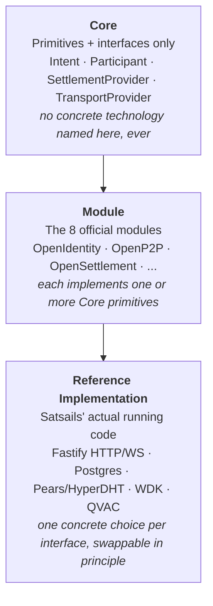
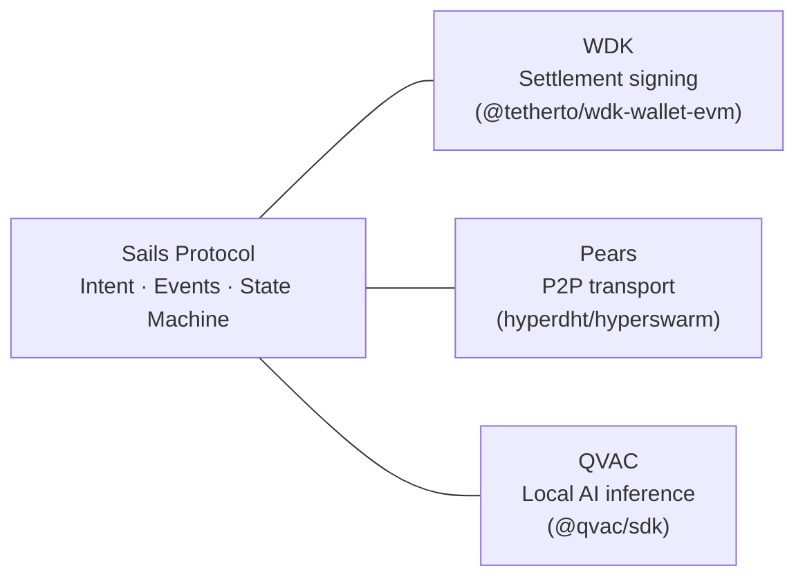
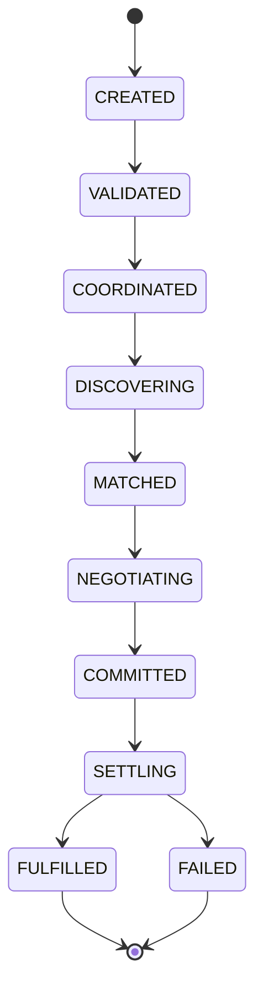
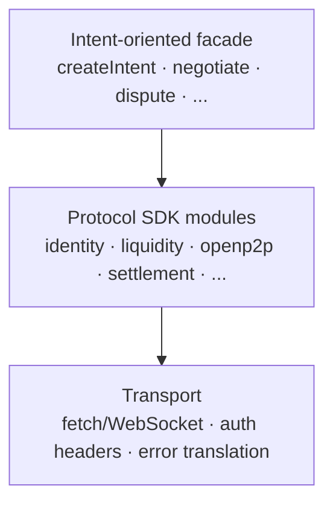

# Sails Protocol — Technical Whitepaper

### v1.0-draft · 2026-07-20

> **Audience:** software architects, CTOs, and engineers evaluating
> whether to build on Sails Protocol. Where the companion
> [`PROTOCOL_PAPER.md`](PROTOCOL_PAPER.md) defines what any conforming
> implementation MUST do, this document explains how the reference
> implementation actually does it — real files, real mechanisms, real
> test results. The same labeling discipline applies: ✅ **Proven**
> (built, tested, cited), 📜 **Commitment** (a rule the system is held
> to), 📋 **Planned** (designed, not built).

---

## 1. Architecture: Three Layers, One Rule

Sails Protocol is organized in three strict layers, and the rule that
makes the separation real (not aspirational) is simple: **a lower
layer never knows about a specific implementation of the layer above
it.**



This is not a diagram drawn after the fact to look clean. It was
enforced, once, against a real violation: an earlier version of
`escrow.service.ts` (OpenSettlement) reached directly into the `Trade`
and `User` tables — tables OpenP2P and OpenReputation own — instead of
emitting an event and letting those modules react. Found in code
review, fixed by making `escrow.service.ts` emit
`settlement.escrow.locked`/`settlement.escrow.released` and moving the
Trade/User writes into event handlers each owning module registers for
itself. The boundary is enforced by a real fix to a real violation, not
just stated in a document.

---

## 2. What Sails Actually Coordinates

Three genuinely separate pieces of infrastructure have to work together
for one P2P trade to complete, and none of them know about the other
two:

- **Settlement signing** — the reference implementation's
  `WdkSettlementProvider` uses `@tetherto/wdk-wallet-evm` to actually
  sign and broadcast a testnet USDT (ERC-20) transfer when an escrow
  releases. It has no idea a chat message or a QVAC risk score exists.
- **P2P transport** — `PearsTransportProvider` wraps real
  `hyperdht`/`hyperswarm` calls: topic derivation, hole-punching,
  message delivery. It has no idea what's inside the encrypted payload
  it's moving — that's the Negotiation primitive's job, not Transport's.
- **Local AI inference** — `QvacAgentProvider` runs a real,
  on-device LLM (`@qvac/sdk`, local model — no cloud API call in the
  reachable code path) for risk assessment and negotiation assistance.
  It has no signing key, no custody, and — by architectural
  construction, not configuration — no code path that can call a
  banking or fiat-rail API (RFC-016).

Sails Protocol's actual engineering job is the layer that makes these
three genuinely independent systems cooperate on one Intent, through
typed events and a shared state machine, without any one of them
needing to know the other two exist. That coordination layer — not any
one of the three technologies — is what the protocol adds.



Each of the three has no edge to either of the other two directly —
every line in this diagram passes through Sails, by construction.

---

## 3. The Intent State Machine — Implementation Detail

✅ **Proven, with a real bug-finding history worth stating plainly.**
The canonical lifecycle:



is enforced by `core/intent-engine.ts`'s `transition()`, which checks
every requested move against a `VALID_TRANSITIONS` table before writing
it — an illegal transition throws, it does not silently succeed. Every
transition writes an `IntentEvent` row with a computed
`entryHash`/`prevHash` (Section 6), so the sequence of state changes is
itself tamper-evident, not just enforced in the moment.

Wiring this lifecycle to real `Offer`/`Trade` rows (RFC-018) was done
and independently re-verified across three passes on the same day, and
each pass found a real bug that the previous one's tests had not
caught:

1. **First pass:** basic wiring — `Offer.intentId` and
   `Trade.intentId` foreign keys, `createOffer()`/`createTrade()`
   calling `intentEngine.create()` for real instead of leaving them
   uncorrelated rows.
2. **Second pass**, testing failure scenarios specifically: found that
   cancelling a Trade before escrow left its Intent permanently stuck
   at `NEGOTIATING` (no transition path out) — fixed by adding the
   missing edge. Separately found `Trade.escrowId` was never actually
   being persisted, which meant `dispute.service.ts`'s
   `raiseDispute()` rejected every dispute unconditionally against a
   real database, a bug unrelated to RFC-018 itself that this
   verification pass happened to surface.
3. **Third pass:** a new integration test (`fullTradeLifecycle.test.ts`)
   chaining the real service layer with the real event bus (not
   individually mocked pieces) caught a genuine race condition —
   `resolveDispute()` moved funds *before* marking the `Dispute` row
   `RESOLVED`, meaning every disputed resolution was silently scored by
   the reputation system as a plain no-dispute outcome. Fixed.

This history is included deliberately. A single "it works" claim is
weak evidence. A record of the specific bugs that testing found, and
the fact that testing kept getting more adversarial across each pass
rather than stopping at the first green run, is what actually earns
confidence in a financial coordination system.

---

## 4. The Eight Modules — How Each One Actually Works

### OpenIdentity — ✅ Proven
An Ed25519 keypair *is* the identity — no central registry, no email,
no password. Authentication is real challenge-response: the server
issues a one-time nonce, the client signs it, the server verifies the
signature against the claimed public key and immediately invalidates
the nonce (replay protection — Section 6 has the exact mechanics).

### OpenReputation — ✅ Proven
`recordOutcome()` is the *only* code path that can change a
`ReputationScore` — an internal Outcome Engine, driven by real
settlement events, not by the star-rating endpoint. `rate()` is
explicitly informational: a counterparty can leave a 1-5 star review
with a comment, and it is stored and displayed, but it never touches
the score. This distinction is enforced at the type level, not just
documented: `rate()`'s return type carries no path back into
`ReputationScore`.

### OpenSettlement — ✅ Proven in testnet, with a disclosed limit (Section 9)
Escrow is abstracted behind a `SettlementProvider` interface:

```typescript
interface SettlementProvider {
  name: string
  lockFunds(escrow): Promise<{ txId; address }>
  releaseFunds(escrow, toAddress): Promise<{ txId }>
  refundFunds(escrow): Promise<{ txId }>
  verifyLock(escrow): Promise<boolean>
}
```

`MOCK` and `WDK_USDT_EVM` are the two real implementations today;
`LIGHTNING_HODL` and `LIQUID_COVENANT` are named, typed, and stubbed —
present in the enum, not yet backed by working code.
Every state-changing method (`lockFunds`/`releaseFunds`/`refundFunds`)
claims its transition **atomically** via a conditional database update
(`WHERE id = X AND status = <the status just read>`) before ever
calling the provider — a fix applied deliberately after a robustness
audit found that two concurrent calls to the same method (a
double-click, a retried request) could both pass an in-memory status
check before either write landed, and both would then call a real,
side-effecting provider. Proven under genuine concurrent load, not just
unit-tested in isolation: a Playwright test firing 10 truly-simultaneous
release requests against the same escrow confirms exactly 1 succeeds
and 9 are rejected cleanly, with the final state showing one real
`txReleaseId`, never two.

### OpenLiquidity — ✅ Proven
Discovery and the order book (`Offer`) live here, deliberately separate
from OpenP2P — so a future OpenFinance module can reuse the same
discovery mechanism for loan/swap offers without duplicating it. A
`LiquidityRouter` aggregates across pluggable providers (an internal
order book today; HodlHodl-style external liquidity is interfaced but
disabled pending an API key) and ranks by price.

### OpenProof — 🟡 Interfaces real, service layer planned
`Claim → Proof → Verification` — a deliberate three-way split mirroring
the W3C Verifiable Credentials model, so evidence (a payment
screenshot, a delivery confirmation) has a standard shape every other
module's dispute/negotiation flow can consume instead of inventing its
own. Real Prisma types exist; the service layer that actually verifies
and aggregates evidence (`getEvidenceBundle(intentId)`) is designed
(RFC-006/RFC-007) but not yet built.

### OpenP2P — ✅ Proven — the most complete module, running in production
Orchestrates the full trade lifecycle using every module above: opens
a Trade from a real Intent, owns the encrypted negotiation channel,
and reconciles state on peer reconnect (Section 5). This is the module
underneath Satsails Wallet's real production trading flow.

### OpenAgents — 🟡 First real capabilities live
`QvacAgentProvider` does real, on-device LLM inference for two
purposes today: structured risk assessment on a proposed trade, and
generating a `TradeIntentPayload` autonomously on a Participant's
behalf under an explicit, bounded mandate. A `SocialEngineeringAgent`
(RFC-017) watches real chat messages via the Timeline read-model for
two of three named fraud-precursor patterns (off-channel migration,
suspicious payment-instruction changes) and raises a `RISK_WARNING` —
detection only, it never blocks a message or cancels a trade, and it's
off by default. The third pattern (unexpected flow deviation) needs a
state-machine-aware component this pass didn't build, and is named
explicitly as not built rather than faked.

### OpenFinance — 📋 Planned
No code exists. Reserved for `LoanIntent`/`SwapIntent`/`EarnIntent`,
reusing OpenSettlement/OpenLiquidity/OpenReputation.

---

## 5. Transport: Real P2P, With a Real Fixed Bug

`PearsTransportProvider` wraps `HyperDHT`/`Hyperswarm` for real
peer-to-peer connectivity, topic-scoped via a deterministic
`sha256('sails:v1:' + topic)` derivation so peers discover each other
without a central directory. One real, historically-relevant bug: an
earlier singleton `PearPeerManager` shared one keypair/DHT/swarm
instance across every user on a multi-tenant server — two users calling
`start()` silently clobbered each other's connection. Fixed by
splitting into `PearNode` (per-user) and `PearNodeRegistry` (the sole
remaining singleton, managing the map of active nodes) — a real
architectural bug that became a real security issue in a multi-tenant
system, caught in code review, not left as a known issue.

**Reconciliation on reconnect** (RFC-011): a dropped P2P connection
never actually loses data — every message and state change is already
persisted to Postgres first — it only loses real-time notification.
`ReconciliationService` triggers on a real `peer.connected` handshake
and replays what changed against the authoritative database state.
Shipped and verified against build/tests; the actual query correctness
against live production data has not been verified in this environment
(no reachable production Postgres to test against) — disclosed here
rather than assumed fine.

---

## 6. The Cryptographic Model

✅ **Proven, verified against actual code, not assumed:**

- **One Ed25519 keypair, two roles, confirmed not to collide:** the
  same key signs identity challenges and — separately — the transport
  layer's own connection identity. Confirmed by direct code inspection
  that no second keypair is generated for transport identity anywhere
  in the codebase.
- **Challenge-response replay protection:** a one-time server-issued
  nonce, deleted immediately on first successful verification —
  `common/middleware/auth.ts`'s `verifySignedChallenge()`. A precise,
  non-obvious detail worth stating for anyone re-implementing this: the
  signed message is the UTF-8 byte representation of the challenge
  *string itself* (re-encoded through `Buffer.from(challenge).toString('hex')`
  before verification), not the raw random bytes the string represents
  — an SDK or client implementation that signs the raw bytes instead
  will fail verification against this server.
- **End-to-end payload encryption:** Noise_XX at the transport layer,
  plus an explicit application-layer `crypto_box_seal` (libsodium
  sealed-box) on top — unit-verified with a real encrypt/decrypt round
  trip, not just typed as present.
- **Tamper-evident event history:** every `IntentEvent` computes
  `entryHash = sha256(fromStatus | toStatus | triggeredBy | prevHash)`
  and chains to the previous entry — real and enforced for
  `IntentEvent` specifically. The general `Timeline` read-model (across
  all event types) has this mechanism designed (RFC-008) but not yet
  wired in — only `IntentEvent` has it today. `verifyChain()` treats a
  `null` `prevHash` as "chain starts here," not a break — meaning the
  tamper-evidence guarantee covers entries written after the mechanism
  shipped, not retroactively. Stated plainly rather than implied to
  cover history it cannot possibly cover.
- **What is explicitly NOT provided:** no forward secrecy on sealed-box
  payloads (a compromised secret key retroactively decrypts every
  message ever sent to that key) and no non-repudiation for payload
  content. Neither is hidden behind "the system uses encryption" —
  both are named gaps.

---

## 7. Capabilities as a Protocol

📜 **Commitment, ✅ Proven registry + enforcement.** What an actor may
do is never assumed from role or platform — it's granted explicitly.
Two related concepts that shared one ambiguous name early in the
project's design were formally split (RFC-005):

- **`Capability`** — an abstract functional category a module
  implements (e.g., "settlement," "arbitration").
- **`CapabilityGrant`** — a real, persisted permission grant to a
  specific Participant or Agent, scoped and revocable.

The Capability Registry (`core/capability-registry.ts`) is real,
persisted, tested — but a working permission system with zero real
callers checking it is not a security control, it's a component that
happens to have unit tests. This gap was found and closed directly: real
enforcement call sites now exist at `intentEngine.create()` and the
settlement release path, gated behind `config.features.enforceCapabilities`
(off by default — unconditional enforcement the moment it shipped
would have rejected every existing trade in the system; that's not
"secure by default," it's "broken by default," and is disclosed as a
deliberate, not accidental, tradeoff).

From an SDK-integrator's point of view, this is what makes "enabling a
capability" a real, checkable act rather than a documentation promise —
a wallet integrating Sails doesn't get implicit trust; it gets exactly
the `CapabilityGrant`s it's been issued.

---

## 8. Security Engineering Beyond the Custody Model

Distinct from the custody gap (Section 9), several security controls
are real, tested, and worth detailing because they show the pattern of
how this project finds and closes gaps:

- **Two-person control on escrow release (RFC-015)** — both
  counterparties may be required to independently call
  `approve-release` before a normal (non-disputed) release proceeds.
  Explicitly named "two-person control," never "multisig," anywhere in
  the code or docs — the underlying blockchain transaction is still one
  signature; this is an application-layer gate in front of that
  signature, not a cryptographic threshold scheme. Off by default,
  13 tests covering both this and the capability check it complements.
- **IDOR/ownership audit** — a general gap-audit found that none of
  OpenSettlement's mutating methods verified the caller was actually a
  party to the trade before this fix — any authenticated user could
  lock, confirm, release, refund, or dispute *any other user's* escrow.
  Closed across every mutating method, with 11 dedicated tests.
- **Rate limiting** — real, global plus a tighter tier on auth routes
  (`@fastify/rate-limit`), not a placeholder.
- **Decimal, not float, on every financial field** — a pre-existing
  `Float` typing bug on every price/amount column (verified independently
  against the real Prisma schema before treating an external audit's
  claim as fact) was corrected to `Decimal(24,8)`, with a project-wide
  convention that financial amounts cross module boundaries as decimal
  strings, never JS numbers.

---

## 9. The One Disclosed Custody Gap

The Protocol Paper's Section 8 covers this normatively; the engineering
version: the only real, tested `SettlementProvider` beyond a pure mock
— `WdkSettlementProvider` — derives every escrow's signing sub-account
from **one server-held seed phrase**. `releaseFunds()` needs no
caller-supplied signature at all; the server signs unilaterally. The
file's own header comment states this without prompting: *"a
single-seed, two-hop escrow, not a trustless multisig — the same key
that can lock funds can also move them anywhere."*

This is registered (RFC-019) as a reference/testnet-only implementation,
explicitly not the protocol's normative target, with the real target
(on-chain multisig or user co-signing) named but not built or scheduled.
Two-person control (Section 8) is a real, shipped mitigation *in front
of* this gap — not a claim that the gap is closed.

---

## 10. Reference Implementation: Sails P2P Trading SDK

✅ **Proven — the concrete proof this isn't paper architecture.**
`@sails/sdk` is a single TypeScript client (`SailsClient`) layered as:



Its public API is frozen as of `v1.0.0-rc1` (`docs/API_STABLE.md`) —
every module has both a protocol-accurate name (`identity`,
`liquidity`, ...) and a friendly alias (`auth`, `offers`, ...) that
resolve to the exact same instance, chosen after weighing that two
integrator audiences (P2P-trading-specific developers vs. general
wallet/fintech developers) reach for different vocabulary. Not
included: `reputation` deliberately has no `profile` alias, because
that module only returns a numeric trust score, not full profile data
— naming it `profile` would have shipped a permanently-frozen public
name that overpromises.

**Proven by dogfooding, not just by unit tests:** `examples/simple-wallet`
is a real, mock-free integration — roughly 140 lines, using only the
SDK's public exports — that drives the entire golden path (register →
publish → discover → trade → chat → escrow → release) against a real
running node. It found a real bug on its first run: `discover()` had a
hardcoded 10-result cap with no pagination, meaning a normally-priced
offer could be silently invisible on any sufficiently active
marketplace. Fixed across the SDK, the route, and — traced further —
the actual production Marketplace UI, which had the identical gap live.

**Verified as a standalone package, not just inside the monorepo:**
`npm pack` produces a 22.3 kB tarball (31 files); installed into a
folder with zero relation to this repository (no workspace symlinks),
every module, alias, and error class worked identically to running
inside the workspace.

**A final audit, specifically for internal leakage, before handoff:**
looking for exactly what an external developer's first `import` would
see that shouldn't be there. Found and fixed: two internal
implementation classes (`SailsTransport`, `SailsIntentFacade`) were
re-exported from the public package root despite zero real external
usage and, in the second case, direct contradiction with the class's
own `private` field elsewhere in the same file. Also found: the SDK's
own onboarding documentation had drifted from the real implemented
method signatures across several modules — corrected to match the real
code exactly, with a note pointing future readers to `API_STABLE.md` as
the actual source of truth if the two ever disagree again.

No breaking changes are committed to anything in `API_STABLE.md` until
a real v1.0 — which, per this project's own definition, requires real
external usage, not an internal decision to bump a version number.

---

## 11. What This Document Does Not Claim

Two honest limits, stated the same way the rest of this document states
everything else:

- **Tree-shaking does not work today.** The SDK ships CommonJS only —
  no `module`/`exports`/`sideEffects` fields, no ESM build. A bundler
  cannot meaningfully tree-shake a CommonJS-only package regardless of
  how a consumer writes their `import`. Not fixed — a dual CJS/ESM
  build is new packaging infrastructure, deliberately out of scope for
  the current hardening phase.
- **No independent security audit has been performed.** Every finding
  in this document comes from this project's own internal review
  process. That process has repeatedly found and disclosed real bugs
  rather than assuming correctness — which is real evidence of rigor —
  but it is not a substitute for third-party review before any
  production deployment handling real value at meaningful scale.

---

## 12. Summary Table — Proven vs. Designed, By Layer

| Layer | Proven | Designed, not built |
|---|---|---|
| Core primitives | Identity, Intent, Discovery, Negotiation, Settlement, Reputation, Agent, Dispute | Proof's full service layer |
| Modules | OpenIdentity, OpenReputation, OpenSettlement (testnet), OpenLiquidity, OpenP2P; OpenAgents' first capabilities | OpenFinance entirely; OpenAgents' full fraud-detection surface |
| Transport | Pears/HyperDHT real connectivity, reconciliation on reconnect | A second `TransportProvider` implementation (interface allows one, none built) |
| Settlement | Mock + one real testnet provider (WDK), two-person control, atomic concurrency-safe transitions | Real non-custodial multisig/co-signing settlement; Lightning HODL and Liquid Covenant providers |
| Crypto | Ed25519 auth, sealed-box payload encryption, IntentEvent hash-chaining | General Timeline hash-chaining, verifiable timestamp anchoring |
| SDK | `v1.0.0-rc1`, frozen API, real dogfooding, standalone-verified package | ESM/tree-shaking support, `negotiate`/`submitProof`/`releaseAsset` |
| Security | Rate limiting, IDOR fixes, two-person control, Decimal precision, capability enforcement | Independent third-party audit, proactive timeout/refund sweep |
